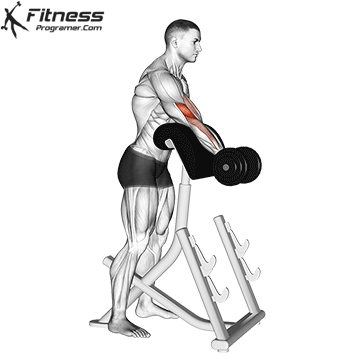
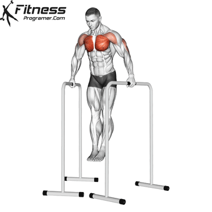
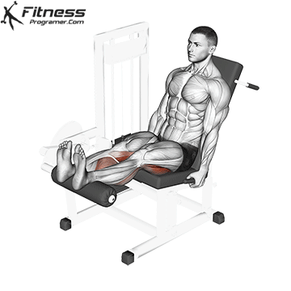

# FIT：按肌群选择训练动作

> 当前版本只完成第一部分：先建立“肌群 → 动作”的地图。下一版再用这些动作编排每周五练的 `P / P / L / 休 / P / P / 休` 计划。

## 怎么理解“王牌动作”

这里的“王牌”不是唯一正确答案，也不是某次肌电测试中数值最高的动作，而是同时满足以下条件的优先选择：目标肌群能在较大活动范围内有效发力、容易稳定加重量或次数、疲劳成本合理，并且多数健身房都能长期执行。

- **★ 王牌**：优先练，通常每个部位 1–2 个。
- **备选**：器械占用、动作不适或需要变化时替换；不是要求一次全部做完。
- 复合动作会同时训练多个部位。例如卧推也练三头和肩前束，深蹲也练臀和内收肌。下文按它最值得服务的**主要目标肌群**归类，不代表它只练这一块。
- 动作做到可控的完整幅度；如果完整幅度引起关节疼痛，应调整动作、幅度或请专业人士评估，不要硬顶。

---

## 1. 手臂

### 肱二头肌与肘屈肌群

肱二头负责屈肘和旋后；肱肌、肱桡肌也会参与。没有可靠证据证明某一种弯举能“孤立雕刻”出特定形状，动作选择应覆盖旋后弯举和中立握弯举。

#### ★ 牧师凳弯举

容易固定肩和上臂、减少借力，并在肘接近伸直的区间保持有效训练。近年的长期研究支持牧师凳弯举带来的肱二头增长，且长肌位区间值得重视。

#### ★ 上斜哑铃弯举

肩位于身体后方，肱二头长头在起始位被拉长；哑铃允许两侧独立完成旋后，适合作为第二种弯举模式。

**备选：锤式弯举**（更强调肱肌、肱桡肌）

### 肱三头肌

三头三束都会伸肘；其中长头跨过肩关节。只做推举或下压并不算完整覆盖，最好同时保留“手臂在身体两侧”和“手臂过头”两个位置。

#### ★ 绳索过头臂屈伸

过头位让三头长头处于更长肌长。直接长期研究发现，过头臂屈伸带来的三头增长高于手臂自然下垂位的臂屈伸，差异在长头尤其明显。

#### ★ 绳索下压

动作稳定、容易渐进，对三头外侧头和内侧头是实用的直接训练，也适合在卧推、肩推之后低成本补量。

**备选：EZ 杆仰卧臂屈伸**（同样能在较长肌位训练三头，但需选择让肘舒服的下放轨迹）

---

## 2. 胸

胸大肌主要分为**锁骨部（常说的上胸）**和**胸肋部**。所谓“中胸、下胸”是便于交流的区域偏重，不是三块能完全隔离的肌肉。卧推角度可以改变刺激分布，但任何推胸动作都会有重叠。

### 上胸（锁骨部）

#### ★ 低角度上斜哑铃卧推

建议凳面约 15–30° 起步。上斜推更偏向锁骨部；角度过高会让肩前束承担更多。哑铃提供较大活动范围，也方便找到舒适握法。

**备选：上斜杠铃卧推**（更容易标准化加重）

### 中部／整体胸厚度（胸肋部为主）

#### ★ 杠铃平板卧推

最容易长期记录并渐进的水平推，能高效覆盖胸大肌，同时训练三头和肩前束。它是整体胸部与卧推力量的主项，不等于只练“中胸”。

#### ★ 平板哑铃卧推

活动范围和左右侧独立性更好，是不追求杠铃专项力量时的优秀主项，或作为杠铃卧推后的第二动作。

### 下胸偏重（胸肋部下方纤维）

#### ★ 双杠臂屈伸（身体前倾）

在肩部耐受良好的前提下，前倾并让肘自然向后，可把它作为下胸偏重的复合推；三头仍会大量参与。不要为了追求深度让肩前侧被迫进入疼痛位置。

**备选：下斜杠铃卧推**（更稳定，也更容易精确渐进）

---

## 3. 肩

肩前束在各种卧推中已经获得很多训练；肩中束和后束通常更需要直接动作。肩袖负责稳定肩关节，不应和三角肌后束混为一谈。

### 三角肌前束

#### ★ 坐姿哑铃推举

你已经在做的主力动作。它能稳定渐进并覆盖前束，也会训练中束和三头。若一周已有较多卧推，通常不必再堆前平举。

**备选：站姿杠铃推举**（全身稳定要求更高）

### 三角肌中束

#### ★ 哑铃侧平举

器械要求最低，动作容易学习。以肘带动上臂在肩胛平面抬起，不需要刻意耸肩或把手抬得远高于肩。

#### ★ 绳索侧平举

能提供与哑铃不同的阻力曲线。2025 年的直接训练研究显示，在活动范围匹配时，绳索和哑铃侧平举的中束增肌效果相近，因此选更舒服、方便渐进的一种即可。

### 三角肌后束

#### ★ 俯身反向飞鸟

直接完成肩水平外展，减少背阔肌主导。胸部支撑或坐姿俯身都可以，重点是上臂向两侧展开而不是向腰部划。

#### ★ 绳索面拉

兼顾后束、肩外旋肌和中下斜方肌，适合作为推拉训练的肩部补充；它不是用于大重量甩动的划船。

---

## 4. 背

“背”不是一块肌肉。垂直拉主要解决背阔肌与大圆肌，水平划船更多覆盖菱形肌、斜方肌和后束；握法和肘路径只会改变偏重，无法完全隔离某一块。

### 背阔肌与大圆肌（背宽、肩内收／伸展）

#### ★ 引体向上

高价值垂直拉，覆盖背阔肌、大圆肌、肱二头和前臂。能在全程控制肩胛和躯干后再加负重；暂时做不到时用高位下拉建立力量。

#### ★ 高位下拉

更容易控制负重和接近力竭。把肘拉向身体两侧或略向前，不必用超宽握距，也不要把横杆拉到颈后。

**备选：直臂下拉**（减少肘屈肌限制，用作背阔肌孤立补量）

### 菱形肌、斜方肌中下部与整体上背（背厚）

#### ★ T 杠划船

便于持续加重，能同时覆盖背阔肌、菱形肌、斜方肌和后束。若下背先疲劳，优先使用胸托 T 杠版本。

#### ★ 坐姿绳索划船

稳定、负重可控。肘靠近身体会更偏背阔肌；肘稍展开、向上腹或下胸拉会更偏上背。

**备选：单臂哑铃划船**（允许单侧调整肘路径和活动范围）

### 竖脊肌与髋后侧链

#### ★ 罗马尼亚硬拉

它的主要动态目标是腘绳肌和臀，竖脊肌负责强力等长稳定；因此这里把它视为“下背承重能力＋髋后侧链”的复合王牌，而不是孤立下背动作。

**备选：传统硬拉**（适合发展整体拉力，但全身疲劳高，不是单纯为了背部增肌必须做的动作）

---

## 5. 腿与臀

腿部至少要覆盖膝伸、髋伸和屈膝。深蹲很全面，但不能充分替代腿弯举；罗马尼亚硬拉也不能完整替代屈膝训练。

### 股四头肌

#### ★ 杠铃深蹲

你已经在做的下肢主项。用自己能稳定控制的站距和深度，膝盖与脚尖方向一致；在不疼痛且躯干可控的前提下，较完整幅度通常更有利于全面发展。

#### ★ 腿屈伸

直接训练膝伸，能补足深蹲中刺激相对不足的股直肌，也是低全身疲劳的股四头补量动作。膝关节健康者不必因为“孤立动作伤膝”的笼统说法一概回避。

**备选：倒蹬机**（稳定地增加股四头训练量）

### 腘绳肌（俗称股后肌群）

#### ★ 罗马尼亚硬拉

覆盖腘绳肌的髋伸功能，并在拉长位置承受高张力；保持脊柱稳定，以髋向后移动，而不是追求杠铃碰地。

#### ★ 坐姿腿弯举

覆盖腘绳肌的屈膝功能。直接长期研究中，坐姿腿弯举比俯卧腿弯举带来更大的整体腘绳肌增长，合理解释是髋屈曲让双关节腘绳肌在更长位置训练。

**备选：俯卧腿弯举**（仍然有效，器械更合适或坐姿不舒服时使用）

### 臀大肌

#### ★ 深幅深蹲

兼顾臀和股四头，单位时间覆盖面很高。长期研究显示，深蹲与臀推都能显著增加臀大肌；深蹲还能带来更多大腿肌群增长。

#### ★ 杠铃臀推

稳定、容易加重，适合在不继续增加股四头训练量的情况下直接补臀。它不是“肌电更高所以一定长得更多”；长期研究中，它与深蹲的臀部增肌可以相近。

### 内收肌群

深幅深蹲已经会训练大收肌；只有内收肌是明确短板或需要额外容量时，再加器械内收。

#### ★ 大腿内收机

稳定、动作学习成本低，可直接增加髋内收训练量。保持骨盆稳定，不要用反弹追求幅度。

### 小腿（腓肠肌与比目鱼肌）

#### ★ 站姿提踵

膝伸直时更偏腓肠肌；底部停顿并让脚踝充分背屈，不要用弹震完成次数。

#### ★ 坐姿提踵

屈膝会缩短腓肠肌，使比目鱼肌承担更多。它与站姿提踵是互补关系，而不是二选一的同义动作。

---

## 证据与使用边界

本清单优先参考长期训练研究；只有缺少长期结果时，才用解剖、生物力学或肌电研究辅助判断。肌电能说明一次动作中的肌肉兴奋分布，**不能单独证明长期增肌冠军**。

- [过头臂屈伸与自然下垂位臂屈伸的三头增肌比较（2023）](https://pubmed.ncbi.nlm.nih.gov/35819335/)
- [牧师凳弯举与上斜弯举的区域增肌研究（2023）](https://pubmed.ncbi.nlm.nih.gov/37559762/)
- [牧师凳弯举与 Bayesian 绳索弯举比较（2025）](https://pubmed.ncbi.nlm.nih.gov/40082069/)
- [平板与上斜卧推的胸大肌区域兴奋研究（2022）](https://pubmed.ncbi.nlm.nih.gov/34644424/)
- [平板、上斜及组合卧推的长期适应（2020）](https://pubmed.ncbi.nlm.nih.gov/32922646/)
- [哑铃与绳索侧平举的中束增肌比较（2025）](https://pubmed.ncbi.nlm.nih.gov/40692697/)
- [坐姿与俯卧腿弯举的腘绳肌增肌比较（2021）](https://pubmed.ncbi.nlm.nih.gov/33009197/)
- [深蹲与臀推的臀部和大腿增肌比较（2023）](https://pubmed.ncbi.nlm.nih.gov/37877099/)
- [阻力训练动作技术与长肌位综述（2024）](https://pubmed.ncbi.nlm.nih.gov/38249086/)

GIF 均来自仓库现有素材，并已按画面逐项核对动作类型；图片只用于帮助辨认动作，不代替现场技术指导。

## 下一步

下一部分将从上述动作中取舍，生成一周五练的 PPL：`Push / Pull / Legs / 休息 / Push / Pull / 休息`。腿只练一次，因此会用一次完整腿日覆盖股四头、腘绳肌、臀和小腿，同时控制总组数与恢复压力。
