# FIT：按肌群选动作

> 当前只做肌群地图，不编排 PPL。图中**红色是目标肌群**，灰色是位置参照。每个动作仍会有协同肌群；表格按主要目标归类。

## 分类原则

- 只在对选动作有实际意义且图库能可靠显示时继续细分，不把一块肌肉凭空切成“上中下”。
- `王牌动作` 是长期可渐进、目标肌肉受力明确、疲劳成本合理的优先动作；不是只看肌电排名。
- `区域偏重` 不等于完全孤立。例如上斜卧推偏锁骨部，但胸肋部、肩前束和三头仍参与。

## 1. 肩膀

| 精确肌群 | 解剖位置 | 主要功能 | 王牌动作 | 说明 |
|---|---|---|---|---|
| 三角肌前束（锁骨部） | 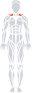 | 肩屈、水平内收、内旋 | 坐姿哑铃推举；上斜卧推 | 卧推量高时通常无需前平举 |
| 三角肌中束（肩峰部） | 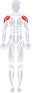 | 肩外展 | 绳索侧平举；哑铃侧平举 | 两者长期增肌效果相近，选更易稳定渐进者 |
| 三角肌后束（肩胛冈部） | 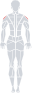 | 肩伸、水平外展、外旋 | 反向飞鸟；后束划船 | 面拉可作肩袖与上背综合补充 |

> 三角肌的三部分已经是训练层面的有效细分；再按视觉位置切“前束上部/下部”缺乏可靠的动作处方价值，因此不继续硬拆。

## 2. 手臂

| 精确肌群 | 解剖位置 | 主要功能 | 王牌动作 | 说明 |
|---|---|---|---|---|
| 肱二头肌（长头＋短头） | 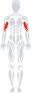 | 屈肘、前臂旋后 | 牧师凳弯举；上斜哑铃弯举 | 当前图库不能可信地分画长短头，故不伪造两张图；握距也不能真正隔离某一头 |
| 肱肌／肱桡肌 | — | 屈肘 | 锤式弯举 | 肱肌较深层，正背面表浅图无法准确展示 |
| 肱三头长头 | 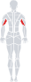 | 伸肘、协助肩伸 | 绳索过头臂屈伸 | 跨肩关节，过头位让长头处于更长肌位 |
| 肱三头外侧头 | 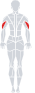 | 伸肘 | 绳索下压；窄距卧推 | 下压稳定，窄距卧推便于大重量渐进 |
| 肱三头内侧头 | — | 伸肘、全程稳定 | 反握下压；常规下压 | 位于较深层，本图库未独立显示；所有伸肘动作都会参与 |

## 3. 胸廓前侧

| 精确肌群 | 解剖位置 | 主要功能 | 王牌动作 | 说明 |
|---|---|---|---|---|
| 胸大肌锁骨部（上胸） | 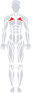 | 肩屈、水平内收 | 15–30° 上斜哑铃卧推；上斜杠铃卧推 | 角度过高会明显增加肩前束占比 |
| 胸大肌胸肋部 | 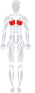 | 水平内收、肩内收 | 平板杠铃卧推；平板哑铃卧推 | 俗称“中胸、下胸”的区域都属于这一大部，不是两块独立肌肉 |
| 胸肋部下方纤维偏重 | 同上 | 肩内收、伸展位推起 | 前倾双杠臂屈伸；下斜卧推 | 这是区域偏重，不另造一个“下胸肌” |
| 前锯肌 | 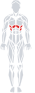 | 肩胛前伸、上回旋 | Push-up plus；健腹轮 | 各类上举动作中也负责肩胛稳定 |

## 4. 背部

| 精确肌群 | 解剖位置 | 主要功能 | 王牌动作 | 说明 |
|---|---|---|---|---|
| 背阔肌 | 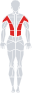 | 肩伸、内收 | 中立／反握高位下拉；单臂绳索下拉 | 引体向上同样优秀；肘向髋部移动比追求超宽握距重要 |
| 大圆肌 | — | 肩内收、伸展、内旋 | 引体向上；高位下拉 | 与背阔肌功能相近且位置较深，本图库不独立显示 |
| 斜方肌上束 | 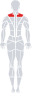 | 肩胛上提、上回旋 | 哑铃耸肩；过头推举 | 耸肩顶部停顿，不用肩关节画圈 |
| 斜方肌中束＋菱形肌 | 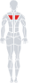 | 肩胛后缩 | 胸托划船；坐姿宽肘划船 | 菱形肌位于斜方肌深面，表浅图无法单独展示 |
| 斜方肌下束 | 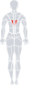 | 肩胛下压、上回旋 | 绳索 Y 举；俯卧 Y 举 | 轻重量、保持肩胛控制 |
| 竖脊肌 | 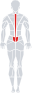 | 脊柱伸展、抗屈曲 | 罗马尼亚硬拉；山羊挺身 | 硬拉中主要承担等长稳定，不是孤立下背动作 |
| 腰方肌 | 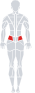 | 躯干侧屈、骨盆稳定 | 单侧农夫走；侧桥 | 深层稳定肌，不需追求大幅度负重侧屈 |

## 5. 腿与臀

| 精确肌群 | 解剖位置 | 主要功能 | 王牌动作 | 说明 |
|---|---|---|---|---|
| 股四头肌（股直肌＋股外/内/中间肌） |  | 膝伸；股直肌兼髋屈 | 深幅深蹲；腿屈伸 | 图源只提供整体股四头；腿屈伸可补深蹲中相对不足的股直肌 |
| 腘绳肌内侧（半腱肌＋半膜肌） | 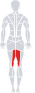 | 髋伸、屈膝、胫骨内旋 | 坐姿腿弯举；罗马尼亚硬拉 | 同时覆盖屈膝和髋伸功能 |
| 腘绳肌外侧（股二头肌长／短头） | 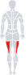 | 髋伸、屈膝、胫骨外旋 | 坐姿腿弯举；罗马尼亚硬拉 | 股二头短头只跨膝，硬拉不能完整覆盖它 |
| 髋内收肌群 | 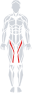 | 髋内收；大收肌协助髋伸 | 深幅深蹲；髋内收机 | 包含大收肌、长/短收肌等；图库以整体显示 |
| 臀大肌 | 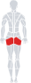 | 髋伸、外旋 | 深幅深蹲；臀推 | 两者均有效；深蹲兼顾更多大腿，臀推更专注臀部 |
| 臀中肌（臀小肌位于深层） | 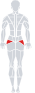 | 髋外展、单腿骨盆稳定 | 绳索髋外展；侧卧髋外展 | 不把“膝内扣”简单归因于臀中肌弱，技术与负荷也会影响 |
| 髂腰肌等髋屈肌 | 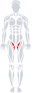 | 髋屈 | 负重抬膝；悬垂屈髋 | 腹部训练中的举腿也会大量使用髋屈肌 |

## 6. 小腿

| 精确肌群 | 解剖位置 | 主要功能 | 王牌动作 | 说明 |
|---|---|---|---|---|
| 腓肠肌内侧头 | 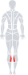 | 跖屈、协助屈膝 | 站姿提踵 | 膝伸直、底部充分拉长 |
| 腓肠肌外侧头 | 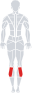 | 跖屈、协助屈膝 | 站姿提踵 | 脚尖朝向不能可靠隔离内外侧头 |
| 比目鱼肌 | 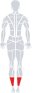 | 跖屈 | 坐姿提踵 | 屈膝会缩短腓肠肌，使比目鱼肌相对承担更多 |
| 胫骨前肌 |  | 踝背屈 | 靠墙胫骨前肌抬脚；背屈机 | 是小腿前侧，不应在腿部地图中遗漏 |

## 7. 核心

| 精确肌群 | 解剖位置 | 主要功能 | 王牌动作 | 说明 |
|---|---|---|---|---|
| 腹直肌 | 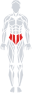 | 躯干屈曲、骨盆后倾、抗伸展 | 绳索卷腹；健腹轮 | “上腹/下腹”是同一块肌肉的区域偏重，不能真正分离训练 |
| 腹外斜肌（腹内斜肌较深） | 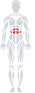 | 躯干旋转、侧屈、抗旋转 | 绳索伐木；Pallof press | 旋转应来自躯干控制，不用大重量快速甩动 |
| 腹横肌 | — | 增加腹压、稳定躯干 | 死虫式；负重行走 | 深层肌，本图库无法从表面准确标红 |

## 图库与许可证

静态 SVG 改编自 [Body Muscles](https://github.com/vulovix/body-muscles)，Copyright 2024 Ivan Vulović，按 Apache-2.0 使用。仓库中的版本把目标区域改为红色、非目标区域改为灰色；详见 [`NOTICE`](NOTICE) 和 [`LICENSE-body-muscles`](LICENSE-body-muscles)。

图是训练用途的表浅肌肉位置索引，不代替医学解剖图。深层肌或源图库无法可靠拆分的肌头统一用 `—`，避免为了“看起来精细”而标错。
