# FIT：肌群动作库、热身与五练 PPL

## 第零节：怎么看这份计划

| 标记 | 含义 |
|---|---|
| 解剖图红色 | 当前行的目标肌肉 |
| 解剖图灰色 | 骨骼与周围肌肉的位置参照 |
| #1 → #4 | 动作综合推荐顺序；按需选用，不是把同行全部做完 |
| 工作组 | 真正用于记录和渐进的正式组；递增热身组不计算在内 |
| RIR | 一组结束时估计还能规范完成的次数；例如 2 RIR 表示还能再做约 2 次 |

# 第一节：精确肌群与动作库

<h2>肩膀</h2>
<table><thead><tr><th width="12%">精确肌群</th><th width="14%">解剖定位</th><th>动作（按优先级）</th></tr></thead><tbody>
<tr><th valign="top">三角肌前束</th><td valign="top" align="center">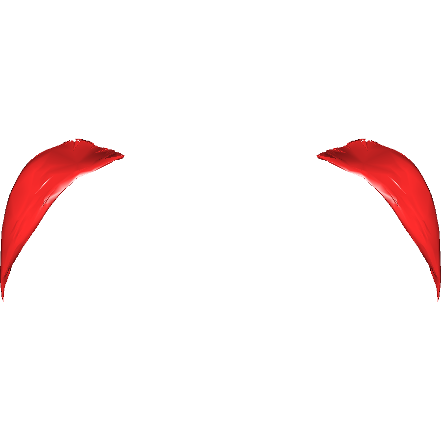</td><td><table><tbody><tr><td width="25%" valign="top"><table><tbody><tr><th>#1 坐姿哑铃推举 Seated dumbbell shoulder press</th></tr><tr><td align="center"></td></tr><tr><td><b>建议：</b>3–4 组 × 6–12 <b>组间休息：</b>90–180 秒 <b>主要：</b>Shoulders <b>次要：</b>Triceps <b>定位：</b>综合首选：稳定、易渐进且目标肌肉受力明确</td></tr></tbody></table></td><td width="25%" valign="top"><table><tbody><tr><th>#2 杠铃推举 Barbell overhead press</th></tr><tr><td align="center"></td></tr><tr><td><b>建议：</b>3–4 组 × 6–10 <b>组间休息：</b>2–3 分钟 <b>主要：</b>Shoulders <b>次要：</b>Triceps <b>定位：</b>优先替代：兼顾刺激与训练舒适度</td></tr></tbody></table></td><td width="25%" valign="top"><table><tbody><tr><th>#3 器械肩推 Machine shoulder press</th></tr><tr><td align="center"></td></tr><tr><td><b>建议：</b>3–4 组 × 6–12 <b>组间休息：</b>90–180 秒 <b>主要：</b>Shoulders <b>次要：</b>Triceps <b>定位：</b>器械或动作偏好不同时的可靠选择</td></tr></tbody></table></td><td width="25%" valign="top"><table><tbody><tr><th>#4 绳索前平举 Cable front raise</th></tr><tr><td align="center"></td></tr><tr><td><b>建议：</b>2–4 组 × 10–20 <b>组间休息：</b>60–90 秒 <b>主要：</b>Shoulders <b>次要：</b>— <b>定位：</b>用于补充不同阻力曲线或训练角度</td></tr></tbody></table></td></tr></tbody></table></td></tr>
<tr><th valign="top">三角肌中束</th><td valign="top" align="center">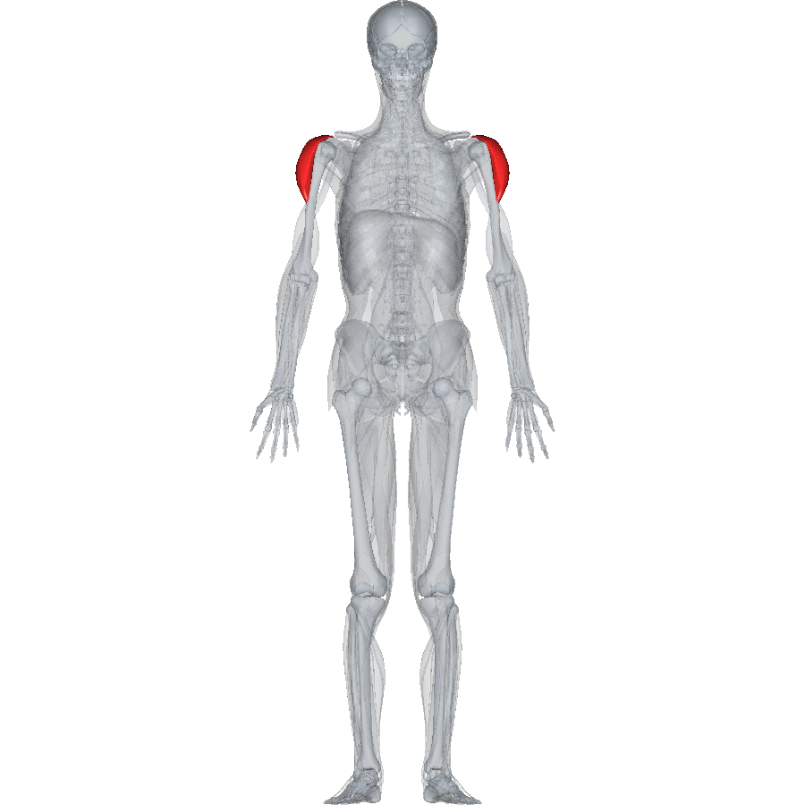</td><td><table><tbody><tr><td width="25%" valign="top"><table><tbody><tr><th>#1 绳索侧平举 Cable lateral raises</th></tr><tr><td align="center"></td></tr><tr><td><b>建议：</b>2–4 组 × 10–20 <b>组间休息：</b>60–90 秒 <b>主要：</b>Shoulders <b>次要：</b>— <b>定位：</b>综合首选：稳定、易渐进且目标肌肉受力明确</td></tr></tbody></table></td><td width="25%" valign="top"><table><tbody><tr><th>#2 哑铃侧平举 Dumbbell lateral raises</th></tr><tr><td align="center"></td></tr><tr><td><b>建议：</b>2–4 组 × 10–20 <b>组间休息：</b>60–90 秒 <b>主要：</b>Shoulders <b>次要：</b>— <b>定位：</b>优先替代：兼顾刺激与训练舒适度</td></tr></tbody></table></td><td width="25%" valign="top"><table><tbody><tr><th>#3 器械肩推 Machine shoulder press</th></tr><tr><td align="center"></td></tr><tr><td><b>建议：</b>3–4 组 × 6–12 <b>组间休息：</b>90–180 秒 <b>主要：</b>Shoulders <b>次要：</b>Triceps <b>定位：</b>器械或动作偏好不同时的可靠选择</td></tr></tbody></table></td><td width="25%" valign="top"><table><tbody><tr><th>#4 绳索直立划船 Cable upright row</th></tr><tr><td align="center"></td></tr><tr><td><b>建议：</b>2–4 组 × 10–20 <b>组间休息：</b>60–90 秒 <b>主要：</b>Shoulders <b>次要：</b>Trapezius、Biceps <b>定位：</b>用于补充不同阻力曲线或训练角度</td></tr></tbody></table></td></tr></tbody></table></td></tr>
<tr><th valign="top">三角肌后束</th><td valign="top" align="center">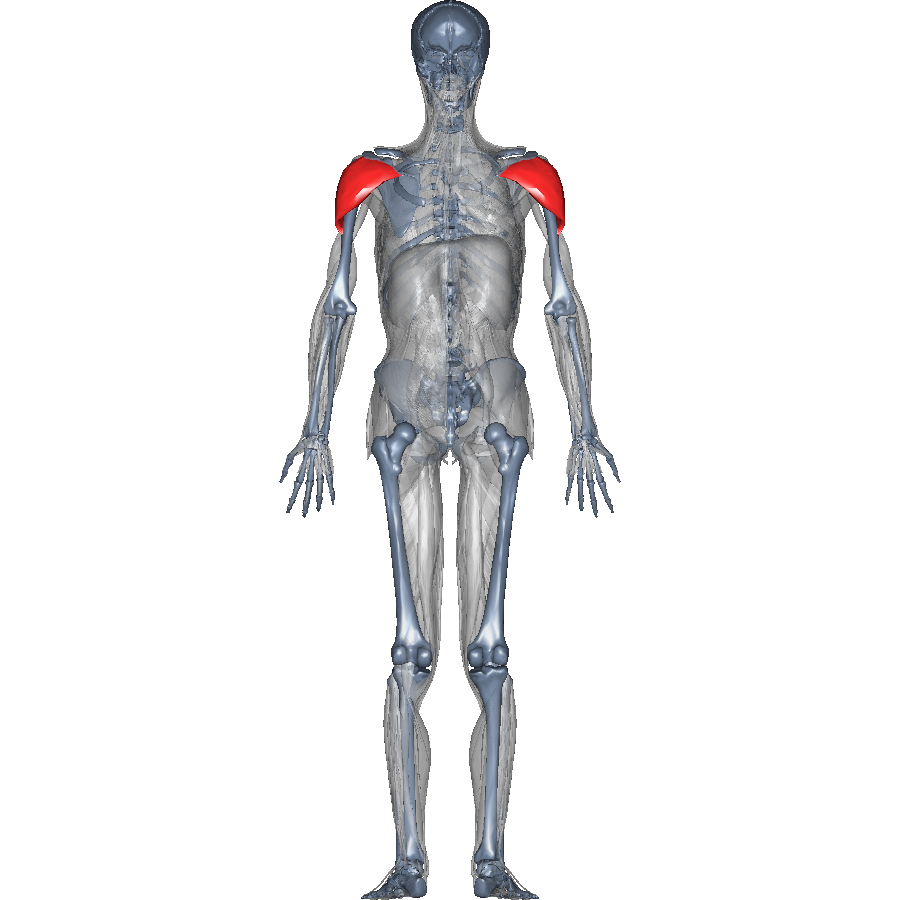</td><td><table><tbody><tr><td width="25%" valign="top"><table><tbody><tr><th>#1 反向飞鸟 Reverse fly</th></tr><tr><td align="center"></td></tr><tr><td><b>建议：</b>2–4 组 × 10–20 <b>组间休息：</b>60–90 秒 <b>主要：</b>Shoulders <b>次要：</b>Upper back、Trapezius <b>定位：</b>综合首选：稳定、易渐进且目标肌肉受力明确</td></tr></tbody></table></td><td width="25%" valign="top"><table><tbody><tr><th>#2 绳索面拉 Face pull</th></tr><tr><td align="center"></td></tr><tr><td><b>建议：</b>2–4 组 × 10–20 <b>组间休息：</b>60–90 秒 <b>主要：</b>Shoulders、Trapezius <b>次要：</b>Upper back <b>定位：</b>优先替代：兼顾刺激与训练舒适度</td></tr></tbody></table></td><td width="25%" valign="top"><table><tbody><tr><th>#3 上斜凳 Y-T-W 举 Y-T-W raise on incline bench</th></tr><tr><td align="center"></td></tr><tr><td><b>建议：</b>2–4 组 × 10–20 <b>组间休息：</b>60–90 秒 <b>主要：</b>Shoulders <b>次要：</b>Upper back、Trapezius <b>定位：</b>器械或动作偏好不同时的可靠选择</td></tr></tbody></table></td><td width="25%" valign="top"><table><tbody><tr><th>#4 宽肘反向划船 Inverted row</th></tr><tr><td align="center"></td></tr><tr><td><b>建议：</b>3–4 组 × 6–12 <b>组间休息：</b>90–180 秒 <b>主要：</b>Upper back <b>次要：</b>Biceps、Forearm <b>定位：</b>用于补充不同阻力曲线或训练角度</td></tr></tbody></table></td></tr></tbody></table></td></tr>
</tbody></table>

<h2>胸</h2>
<table><thead><tr><th width="12%">精确肌群</th><th width="14%">解剖定位</th><th>动作（按优先级）</th></tr></thead><tbody>
<tr><th valign="top">胸大肌锁骨部（上胸）</th><td valign="top" align="center">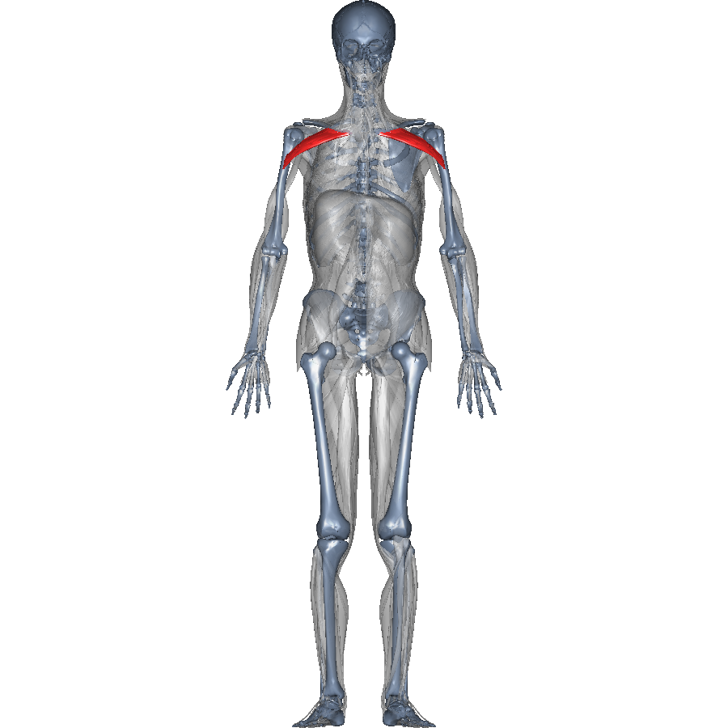</td><td><table><tbody><tr><td width="25%" valign="top"><table><tbody><tr><th>#1 上斜哑铃卧推 Incline dumbbell press</th></tr><tr><td align="center"></td></tr><tr><td><b>建议：</b>3–4 组 × 6–12 <b>组间休息：</b>90–180 秒 <b>主要：</b>Chest <b>次要：</b>Shoulders、Triceps <b>定位：</b>综合首选：稳定、易渐进且目标肌肉受力明确</td></tr></tbody></table></td><td width="25%" valign="top"><table><tbody><tr><th>#2 上斜杠铃卧推 Incline barbell bench press</th></tr><tr><td align="center"></td></tr><tr><td><b>建议：</b>3–4 组 × 6–12 <b>组间休息：</b>90–180 秒 <b>主要：</b>Chest <b>次要：</b>Shoulders、Triceps <b>定位：</b>优先替代：兼顾刺激与训练舒适度</td></tr></tbody></table></td><td width="25%" valign="top"><table><tbody><tr><th>#3 低位绳索夹胸 Low cable fly (low-to-high)</th></tr><tr><td align="center"></td></tr><tr><td><b>建议：</b>2–4 组 × 10–20 <b>组间休息：</b>60–90 秒 <b>主要：</b>Chest <b>次要：</b>Shoulders <b>定位：</b>器械或动作偏好不同时的可靠选择</td></tr></tbody></table></td><td width="25%" valign="top"><table><tbody><tr><th>#4 上斜器械推胸 Incline chest press machine</th></tr><tr><td align="center"></td></tr><tr><td><b>建议：</b>3–4 组 × 6–12 <b>组间休息：</b>90–180 秒 <b>主要：</b>Chest <b>次要：</b>Shoulders、Triceps <b>定位：</b>用于补充不同阻力曲线或训练角度</td></tr></tbody></table></td></tr></tbody></table></td></tr>
<tr><th valign="top">胸大肌胸肋部（整体／中部偏重）</th><td valign="top" align="center">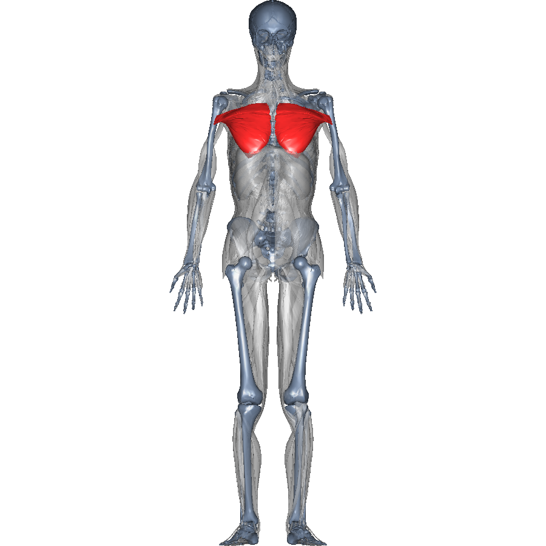</td><td><table><tbody><tr><td width="25%" valign="top"><table><tbody><tr><th>#1 杠铃平板卧推 Barbell bench press</th></tr><tr><td align="center"></td></tr><tr><td><b>建议：</b>3–4 组 × 5–10 <b>组间休息：</b>2–3 分钟 <b>主要：</b>Chest <b>次要：</b>Shoulders、Triceps <b>定位：</b>综合首选：稳定、易渐进且目标肌肉受力明确</td></tr></tbody></table></td><td width="25%" valign="top"><table><tbody><tr><th>#2 哑铃平板卧推 Dumbbell bench press</th></tr><tr><td align="center"></td></tr><tr><td><b>建议：</b>3–4 组 × 6–12 <b>组间休息：</b>90–180 秒 <b>主要：</b>Chest <b>次要：</b>Shoulders、Triceps <b>定位：</b>优先替代：兼顾刺激与训练舒适度</td></tr></tbody></table></td><td width="25%" valign="top"><table><tbody><tr><th>#3 蝴蝶机夹胸 Machine chest fly (pec deck)</th></tr><tr><td align="center"></td></tr><tr><td><b>建议：</b>2–4 组 × 10–20 <b>组间休息：</b>60–90 秒 <b>主要：</b>Chest <b>次要：</b>Shoulders <b>定位：</b>器械或动作偏好不同时的可靠选择</td></tr></tbody></table></td><td width="25%" valign="top"><table><tbody><tr><th>#4 绳索推胸 Cable chest press</th></tr><tr><td align="center"></td></tr><tr><td><b>建议：</b>3–4 组 × 6–12 <b>组间休息：</b>90–180 秒 <b>主要：</b>Chest <b>次要：</b>Shoulders、Triceps <b>定位：</b>用于补充不同阻力曲线或训练角度</td></tr></tbody></table></td></tr></tbody></table></td></tr>
<tr><th valign="top">胸大肌胸肋部下方纤维偏重</th><td valign="top" align="center">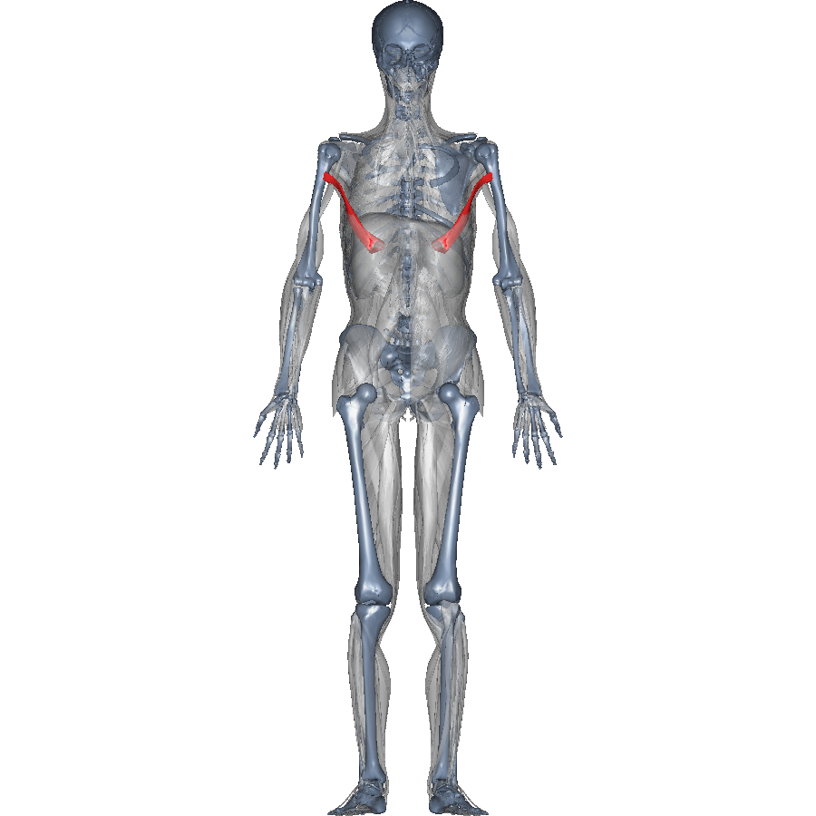</td><td><table><tbody><tr><td width="25%" valign="top"><table><tbody><tr><th>#1 前倾双杠臂屈伸 Chest dips</th></tr><tr><td align="center"></td></tr><tr><td><b>建议：</b>3–4 组 × 6–12 <b>组间休息：</b>90–180 秒 <b>主要：</b>Chest <b>次要：</b>Triceps、Shoulders <b>定位：</b>综合首选：稳定、易渐进且目标肌肉受力明确</td></tr></tbody></table></td><td width="25%" valign="top"><table><tbody><tr><th>#2 下斜杠铃卧推 Decline barbell bench press</th></tr><tr><td align="center"></td></tr><tr><td><b>建议：</b>3–4 组 × 6–12 <b>组间休息：</b>90–180 秒 <b>主要：</b>Chest <b>次要：</b>Triceps <b>定位：</b>优先替代：兼顾刺激与训练舒适度</td></tr></tbody></table></td><td width="25%" valign="top"><table><tbody><tr><th>#3 高位绳索夹胸 Cable crossover</th></tr><tr><td align="center"></td></tr><tr><td><b>建议：</b>2–4 组 × 10–20 <b>组间休息：</b>60–90 秒 <b>主要：</b>Chest <b>次要：</b>Shoulders <b>定位：</b>器械或动作偏好不同时的可靠选择</td></tr></tbody></table></td><td width="25%" valign="top"><table><tbody><tr><th>#4 俯卧撑 Push-ups</th></tr><tr><td align="center"></td></tr><tr><td><b>建议：</b>3–4 组 × 6–12 <b>组间休息：</b>90–180 秒 <b>主要：</b>Chest <b>次要：</b>Shoulders、Triceps <b>定位：</b>用于补充不同阻力曲线或训练角度</td></tr></tbody></table></td></tr></tbody></table></td></tr>
</tbody></table>

<h2>手臂</h2>
<table><thead><tr><th width="12%">精确肌群</th><th width="14%">解剖定位</th><th>动作（按优先级）</th></tr></thead><tbody>
<tr><th valign="top">肱二头肌</th><td valign="top" align="center">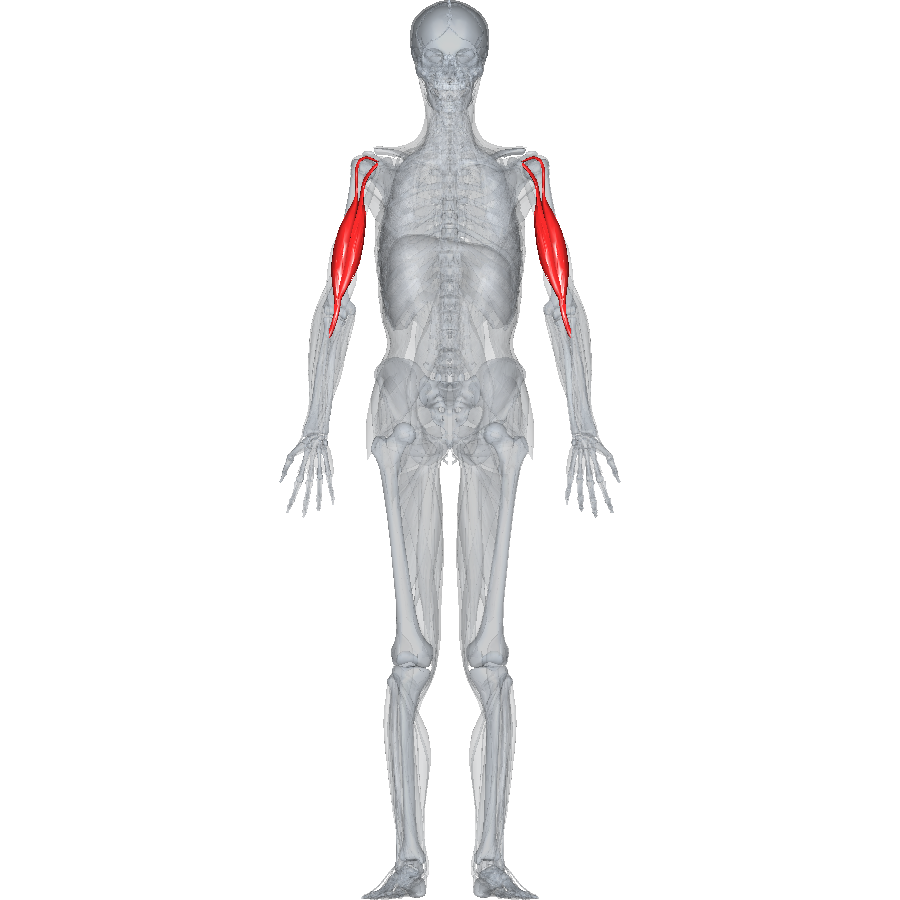</td><td><table><tbody><tr><td width="25%" valign="top"><table><tbody><tr><th>#1 牧师凳弯举 Preacher curl</th></tr><tr><td align="center"></td></tr><tr><td><b>建议：</b>2–4 组 × 10–20 <b>组间休息：</b>60–90 秒 <b>主要：</b>Biceps <b>次要：</b>Forearm <b>定位：</b>综合首选：稳定、易渐进且目标肌肉受力明确</td></tr></tbody></table></td><td width="25%" valign="top"><table><tbody><tr><th>#2 上斜哑铃弯举 Incline dumbbell curl</th></tr><tr><td align="center"></td></tr><tr><td><b>建议：</b>2–4 组 × 10–20 <b>组间休息：</b>60–90 秒 <b>主要：</b>Biceps <b>次要：</b>Forearm <b>定位：</b>优先替代：兼顾刺激与训练舒适度</td></tr></tbody></table></td><td width="25%" valign="top"><table><tbody><tr><th>#3 绳索弯举 Cable curl</th></tr><tr><td align="center"></td></tr><tr><td><b>建议：</b>2–4 组 × 10–20 <b>组间休息：</b>60–90 秒 <b>主要：</b>Biceps <b>次要：</b>Forearm <b>定位：</b>器械或动作偏好不同时的可靠选择</td></tr></tbody></table></td><td width="25%" valign="top"><table><tbody><tr><th>#4 杠铃弯举 Barbell biceps curl</th></tr><tr><td align="center"></td></tr><tr><td><b>建议：</b>2–4 组 × 10–20 <b>组间休息：</b>60–90 秒 <b>主要：</b>Biceps <b>次要：</b>Forearm <b>定位：</b>用于补充不同阻力曲线或训练角度</td></tr></tbody></table></td></tr></tbody></table></td></tr>
<tr><th valign="top">肱肌／肱桡肌</th><td valign="top" align="center">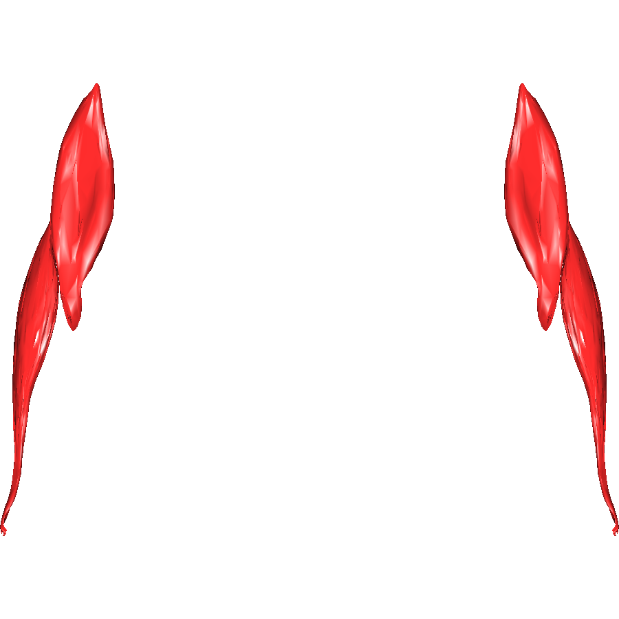</td><td><table><tbody><tr><td width="25%" valign="top"><table><tbody><tr><th>#1 哑铃锤式弯举 Dumbbell hammer curl</th></tr><tr><td align="center"></td></tr><tr><td><b>建议：</b>2–4 组 × 10–20 <b>组间休息：</b>60–90 秒 <b>主要：</b>Biceps <b>次要：</b>Forearm <b>定位：</b>综合首选：稳定、易渐进且目标肌肉受力明确</td></tr></tbody></table></td><td width="25%" valign="top"><table><tbody><tr><th>#2 交替哑铃弯举 Alternating dumbbell biceps curl</th></tr><tr><td align="center"></td></tr><tr><td><b>建议：</b>2–4 组 × 10–20 <b>组间休息：</b>60–90 秒 <b>主要：</b>Biceps <b>次要：</b>Forearm <b>定位：</b>优先替代：兼顾刺激与训练舒适度</td></tr></tbody></table></td><td width="25%" valign="top"><table><tbody><tr><th>#3 农夫走 Farmer's walk</th></tr><tr><td align="center"></td></tr><tr><td><b>建议：</b>3 组 × 30–60 秒 <b>组间休息：</b>90–120 秒 <b>主要：</b>Obliques <b>次要：</b>Trapezius、Forearm <b>定位：</b>器械或动作偏好不同时的可靠选择</td></tr></tbody></table></td></tr></tbody></table></td></tr>
<tr><th valign="top">肱三头长头</th><td valign="top" align="center">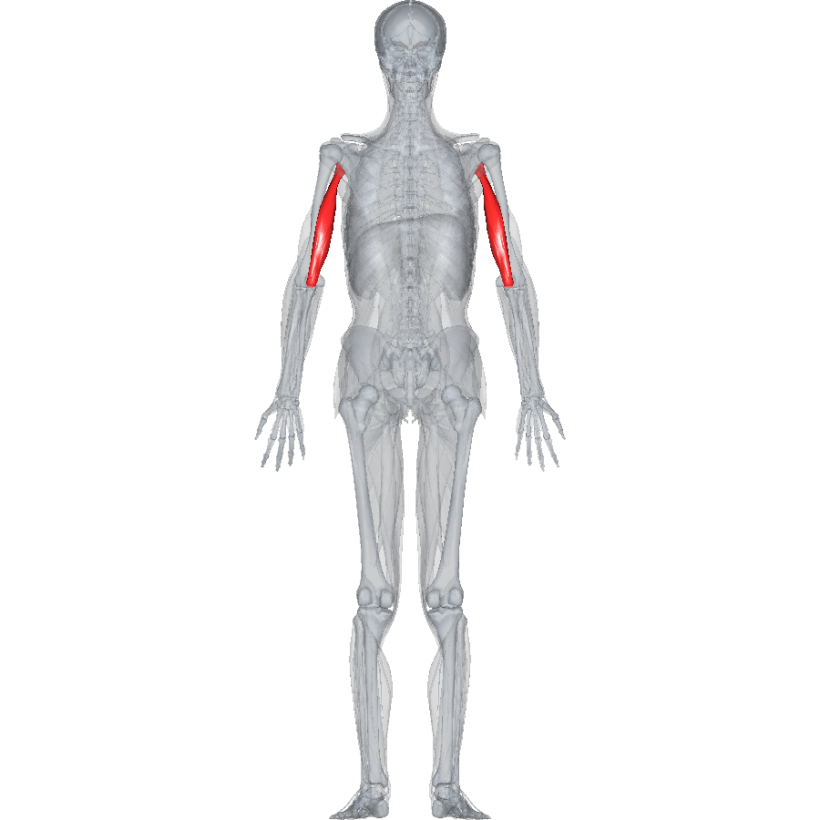</td><td><table><tbody><tr><td width="25%" valign="top"><table><tbody><tr><th>#1 绳索过头臂屈伸 Cable overhead triceps extension</th></tr><tr><td align="center"></td></tr><tr><td><b>建议：</b>2–4 组 × 10–20 <b>组间休息：</b>60–90 秒 <b>主要：</b>Triceps <b>次要：</b>— <b>定位：</b>综合首选：稳定、易渐进且目标肌肉受力明确</td></tr></tbody></table></td><td width="25%" valign="top"><table><tbody><tr><th>#2 哑铃过头臂屈伸 Overhead triceps extension</th></tr><tr><td align="center"></td></tr><tr><td><b>建议：</b>2–4 组 × 10–20 <b>组间休息：</b>60–90 秒 <b>主要：</b>Triceps <b>次要：</b>— <b>定位：</b>优先替代：兼顾刺激与训练舒适度</td></tr></tbody></table></td><td width="25%" valign="top"><table><tbody><tr><th>#3 仰卧臂屈伸 Lying triceps extension (skull crusher)</th></tr><tr><td align="center"></td></tr><tr><td><b>建议：</b>2–4 组 × 10–20 <b>组间休息：</b>60–90 秒 <b>主要：</b>Triceps <b>次要：</b>— <b>定位：</b>器械或动作偏好不同时的可靠选择</td></tr></tbody></table></td><td width="25%" valign="top"><table><tbody><tr><th>#4 窄距卧推 Close-grip bench press</th></tr><tr><td align="center"></td></tr><tr><td><b>建议：</b>3–4 组 × 6–12 <b>组间休息：</b>90–180 秒 <b>主要：</b>Triceps <b>次要：</b>Chest、Shoulders <b>定位：</b>用于补充不同阻力曲线或训练角度</td></tr></tbody></table></td></tr></tbody></table></td></tr>
<tr><th valign="top">肱三头外侧头／内侧头</th><td valign="top" align="center">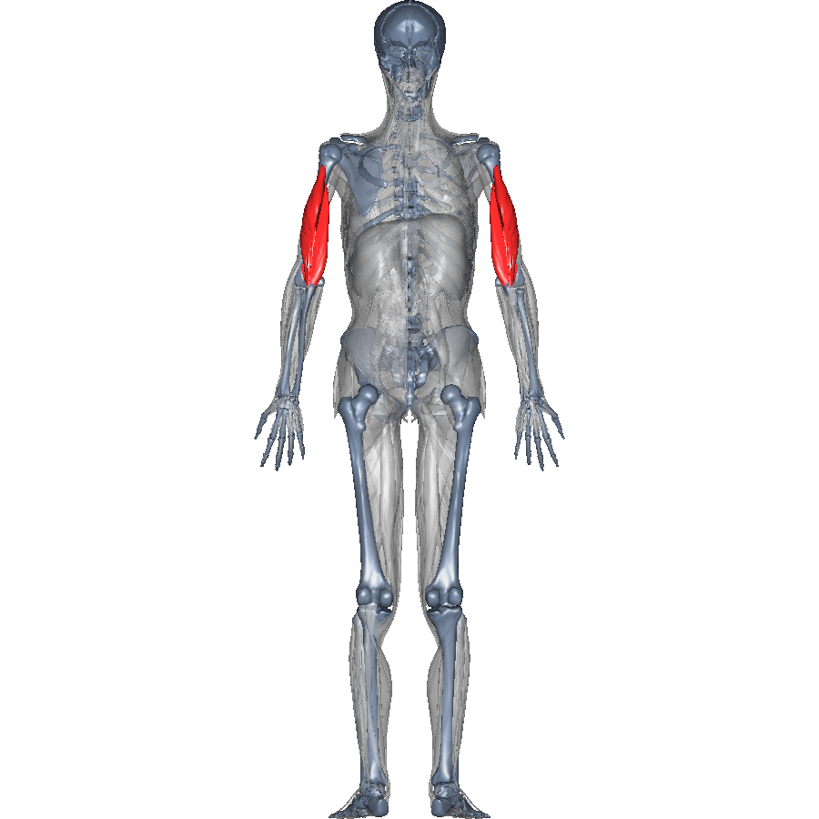</td><td><table><tbody><tr><td width="25%" valign="top"><table><tbody><tr><th>#1 绳索下压 Triceps pushdown</th></tr><tr><td align="center"></td></tr><tr><td><b>建议：</b>2–4 组 × 10–20 <b>组间休息：</b>60–90 秒 <b>主要：</b>Triceps <b>次要：</b>— <b>定位：</b>综合首选：稳定、易渐进且目标肌肉受力明确</td></tr></tbody></table></td><td width="25%" valign="top"><table><tbody><tr><th>#2 窄距卧推 Close-grip bench press</th></tr><tr><td align="center"></td></tr><tr><td><b>建议：</b>3–4 组 × 6–12 <b>组间休息：</b>90–180 秒 <b>主要：</b>Triceps <b>次要：</b>Chest、Shoulders <b>定位：</b>优先替代：兼顾刺激与训练舒适度</td></tr></tbody></table></td><td width="25%" valign="top"><table><tbody><tr><th>#3 器械臂屈伸 Dips machine</th></tr><tr><td align="center"></td></tr><tr><td><b>建议：</b>3–4 组 × 6–12 <b>组间休息：</b>90–180 秒 <b>主要：</b>Triceps <b>次要：</b>Chest、Shoulders <b>定位：</b>器械或动作偏好不同时的可靠选择</td></tr></tbody></table></td><td width="25%" valign="top"><table><tbody><tr><th>#4 钻石俯卧撑 Diamond push-up</th></tr><tr><td align="center"></td></tr><tr><td><b>建议：</b>3–4 组 × 6–12 <b>组间休息：</b>90–180 秒 <b>主要：</b>Triceps <b>次要：</b>Chest、Shoulders <b>定位：</b>用于补充不同阻力曲线或训练角度</td></tr></tbody></table></td></tr></tbody></table></td></tr>
</tbody></table>

<h2>背</h2>
<table><thead><tr><th width="12%">精确肌群</th><th width="14%">解剖定位</th><th>动作（按优先级）</th></tr></thead><tbody>
<tr><th valign="top">背阔肌／大圆肌（背宽）</th><td valign="top" align="center"></td><td><table><tbody><tr><td width="25%" valign="top"><table><tbody><tr><th>#1 引体向上 Pull-ups</th></tr><tr><td align="center"></td></tr><tr><td><b>建议：</b>3–4 组 × 6–12 <b>组间休息：</b>90–180 秒 <b>主要：</b>Upper back <b>次要：</b>Biceps、Forearm <b>定位：</b>综合首选：稳定、易渐进且目标肌肉受力明确</td></tr></tbody></table></td><td width="25%" valign="top"><table><tbody><tr><th>#2 中立握高位下拉 Neutral-grip lat pulldown</th></tr><tr><td align="center"></td></tr><tr><td><b>建议：</b>3–4 组 × 6–12 <b>组间休息：</b>90–180 秒 <b>主要：</b>Upper back <b>次要：</b>Biceps <b>定位：</b>优先替代：兼顾刺激与训练舒适度</td></tr></tbody></table></td><td width="25%" valign="top"><table><tbody><tr><th>#3 直臂下拉 Straight-arm pulldown</th></tr><tr><td align="center"></td></tr><tr><td><b>建议：</b>2–4 组 × 10–20 <b>组间休息：</b>60–90 秒 <b>主要：</b>Upper back <b>次要：</b>Triceps <b>定位：</b>器械或动作偏好不同时的可靠选择</td></tr></tbody></table></td><td width="25%" valign="top"><table><tbody><tr><th>#4 绳索屈臂上拉 Cable pullover</th></tr><tr><td align="center"></td></tr><tr><td><b>建议：</b>2–4 组 × 10–20 <b>组间休息：</b>60–90 秒 <b>主要：</b>Upper back <b>次要：</b>Chest、Triceps <b>定位：</b>用于补充不同阻力曲线或训练角度</td></tr></tbody></table></td></tr></tbody></table></td></tr>
<tr><th valign="top">斜方肌中下束／菱形肌（背厚）</th><td valign="top" align="center">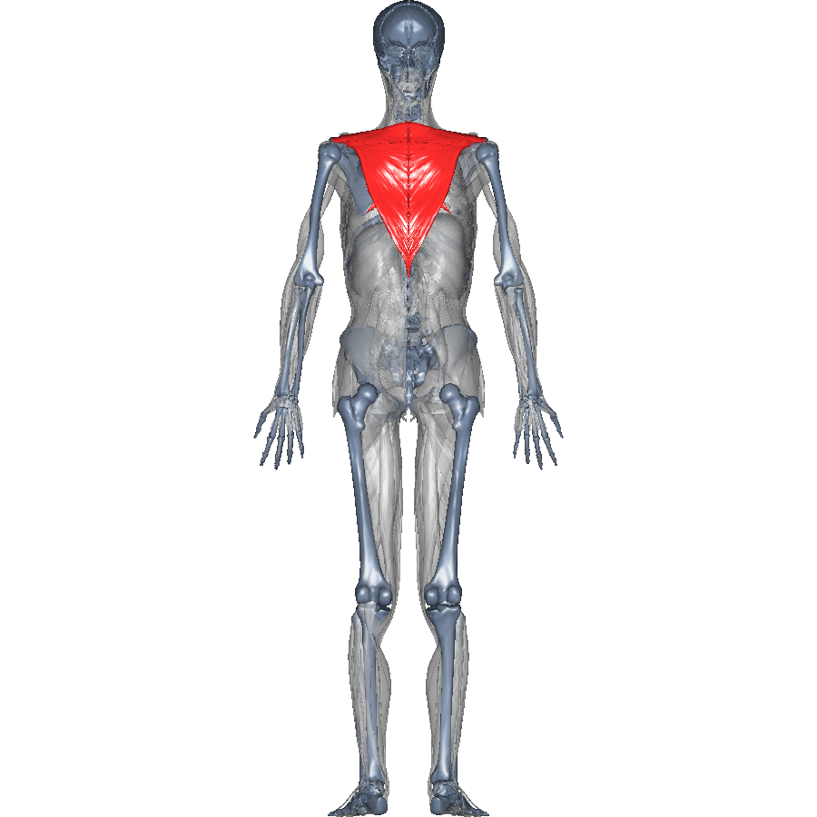</td><td><table><tbody><tr><td width="25%" valign="top"><table><tbody><tr><th>#1 坐姿绳索划船 Seated cable row</th></tr><tr><td align="center"></td></tr><tr><td><b>建议：</b>3–4 组 × 6–12 <b>组间休息：</b>90–180 秒 <b>主要：</b>Upper back、Trapezius <b>次要：</b>Biceps <b>定位：</b>综合首选：稳定、易渐进且目标肌肉受力明确</td></tr></tbody></table></td><td width="25%" valign="top"><table><tbody><tr><th>#2 T 杠划船 T-bar row</th></tr><tr><td align="center"></td></tr><tr><td><b>建议：</b>3–4 组 × 6–12 <b>组间休息：</b>90–180 秒 <b>主要：</b>Upper back <b>次要：</b>Biceps、Forearm、Trapezius <b>定位：</b>优先替代：兼顾刺激与训练舒适度</td></tr></tbody></table></td><td width="25%" valign="top"><table><tbody><tr><th>#3 器械划船 Seated row machine</th></tr><tr><td align="center"></td></tr><tr><td><b>建议：</b>3–4 组 × 6–12 <b>组间休息：</b>90–180 秒 <b>主要：</b>Upper back、Trapezius <b>次要：</b>Biceps <b>定位：</b>器械或动作偏好不同时的可靠选择</td></tr></tbody></table></td><td width="25%" valign="top"><table><tbody><tr><th>#4 杠铃俯身划船 Bent-over barbell row</th></tr><tr><td align="center"></td></tr><tr><td><b>建议：</b>3–4 组 × 6–12 <b>组间休息：</b>90–180 秒 <b>主要：</b>Upper back、Trapezius <b>次要：</b>Biceps <b>定位：</b>用于补充不同阻力曲线或训练角度</td></tr></tbody></table></td></tr></tbody></table></td></tr>
<tr><th valign="top">斜方肌上束</th><td valign="top" align="center">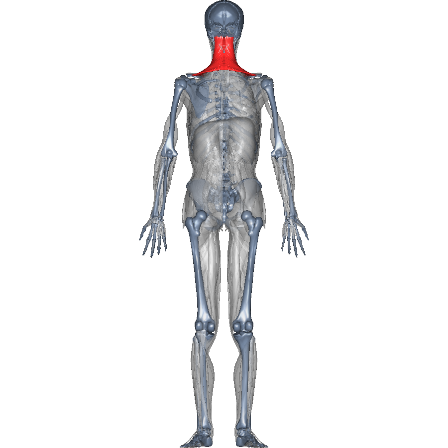</td><td><table><tbody><tr><td width="25%" valign="top"><table><tbody><tr><th>#1 哑铃耸肩 Dumbbell shrug</th></tr><tr><td align="center"></td></tr><tr><td><b>建议：</b>2–4 组 × 10–20 <b>组间休息：</b>60–90 秒 <b>主要：</b>Trapezius <b>次要：</b>Shoulders <b>定位：</b>综合首选：稳定、易渐进且目标肌肉受力明确</td></tr></tbody></table></td><td width="25%" valign="top"><table><tbody><tr><th>#2 杠铃耸肩 Barbell shrug</th></tr><tr><td align="center"></td></tr><tr><td><b>建议：</b>2–4 组 × 10–20 <b>组间休息：</b>60–90 秒 <b>主要：</b>Trapezius <b>次要：</b>Forearm <b>定位：</b>优先替代：兼顾刺激与训练舒适度</td></tr></tbody></table></td><td width="25%" valign="top"><table><tbody><tr><th>#3 农夫走 Farmer's walk</th></tr><tr><td align="center"></td></tr><tr><td><b>建议：</b>3 组 × 30–60 秒 <b>组间休息：</b>90–120 秒 <b>主要：</b>Obliques <b>次要：</b>Trapezius、Forearm <b>定位：</b>器械或动作偏好不同时的可靠选择</td></tr></tbody></table></td><td width="25%" valign="top"><table><tbody><tr><th>#4 传统硬拉 Deadlift</th></tr><tr><td align="center"></td></tr><tr><td><b>建议：</b>2–3 组 × 3–6 <b>组间休息：</b>3–4 分钟 <b>主要：</b>Glutes、Hamstrings、Lower back <b>次要：</b>Quadriceps、Trapezius、Upper back、Forearm <b>定位：</b>用于补充不同阻力曲线或训练角度</td></tr></tbody></table></td></tr></tbody></table></td></tr>
<tr><th valign="top">竖脊肌／腰背稳定肌</th><td valign="top" align="center"></td><td><table><tbody><tr><td width="25%" valign="top"><table><tbody><tr><th>#1 罗马尼亚硬拉 Romanian deadlift</th></tr><tr><td align="center"></td></tr><tr><td><b>建议：</b>3–4 组 × 6–10 <b>组间休息：</b>2–3 分钟 <b>主要：</b>Hamstrings、Glutes <b>次要：</b>Lower back、Forearm <b>定位：</b>综合首选：稳定、易渐进且目标肌肉受力明确</td></tr></tbody></table></td><td width="25%" valign="top"><table><tbody><tr><th>#2 山羊挺身 Back extension</th></tr><tr><td align="center"></td></tr><tr><td><b>建议：</b>2–4 组 × 10–20 <b>组间休息：</b>60–90 秒 <b>主要：</b>Lower back <b>次要：</b>Glutes、Hamstrings <b>定位：</b>优先替代：兼顾刺激与训练舒适度</td></tr></tbody></table></td><td width="25%" valign="top"><table><tbody><tr><th>#3 杠铃早安式 Good morning</th></tr><tr><td align="center"></td></tr><tr><td><b>建议：</b>3–4 组 × 6–12 <b>组间休息：</b>90–180 秒 <b>主要：</b>Hamstrings <b>次要：</b>Glutes、Lower back <b>定位：</b>器械或动作偏好不同时的可靠选择</td></tr></tbody></table></td><td width="25%" valign="top"><table><tbody><tr><th>#4 传统硬拉 Deadlift</th></tr><tr><td align="center"></td></tr><tr><td><b>建议：</b>2–3 组 × 3–6 <b>组间休息：</b>3–4 分钟 <b>主要：</b>Glutes、Hamstrings、Lower back <b>次要：</b>Quadriceps、Trapezius、Upper back、Forearm <b>定位：</b>用于补充不同阻力曲线或训练角度</td></tr></tbody></table></td></tr></tbody></table></td></tr>
</tbody></table>

<h2>腿与臀</h2>
<table><thead><tr><th width="12%">精确肌群</th><th width="14%">解剖定位</th><th>动作（按优先级）</th></tr></thead><tbody>
<tr><th valign="top">股四头肌</th><td valign="top" align="center">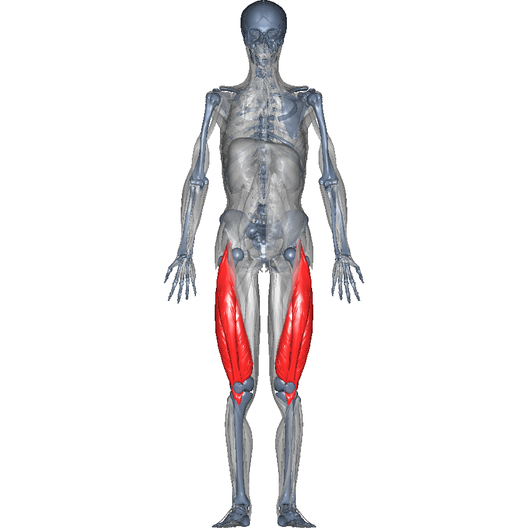</td><td><table><tbody><tr><td width="25%" valign="top"><table><tbody><tr><th>#1 杠铃深蹲 Barbell squat</th></tr><tr><td align="center"></td></tr><tr><td><b>建议：</b>3–4 组 × 5–10 <b>组间休息：</b>2–3 分钟 <b>主要：</b>Quadriceps、Glutes <b>次要：</b>Hamstrings、Calves <b>定位：</b>综合首选：稳定、易渐进且目标肌肉受力明确</td></tr></tbody></table></td><td width="25%" valign="top"><table><tbody><tr><th>#2 腿屈伸 Leg extension</th></tr><tr><td align="center"></td></tr><tr><td><b>建议：</b>2–4 组 × 10–20 <b>组间休息：</b>60–90 秒 <b>主要：</b>Quadriceps <b>次要：</b>— <b>定位：</b>优先替代：兼顾刺激与训练舒适度</td></tr></tbody></table></td><td width="25%" valign="top"><table><tbody><tr><th>#3 45° 哈克深蹲 Sled hack squat (45°)</th></tr><tr><td align="center"></td></tr><tr><td><b>建议：</b>3–4 组 × 6–12 <b>组间休息：</b>90–180 秒 <b>主要：</b>Quadriceps、Glutes <b>次要：</b>Hamstrings <b>定位：</b>器械或动作偏好不同时的可靠选择</td></tr></tbody></table></td><td width="25%" valign="top"><table><tbody><tr><th>#4 倒蹬机 Leg press</th></tr><tr><td align="center"></td></tr><tr><td><b>建议：</b>3–4 组 × 6–12 <b>组间休息：</b>90–180 秒 <b>主要：</b>Quadriceps、Glutes <b>次要：</b>Hamstrings、Calves <b>定位：</b>用于补充不同阻力曲线或训练角度</td></tr></tbody></table></td></tr></tbody></table></td></tr>
<tr><th valign="top">腘绳肌</th><td valign="top" align="center">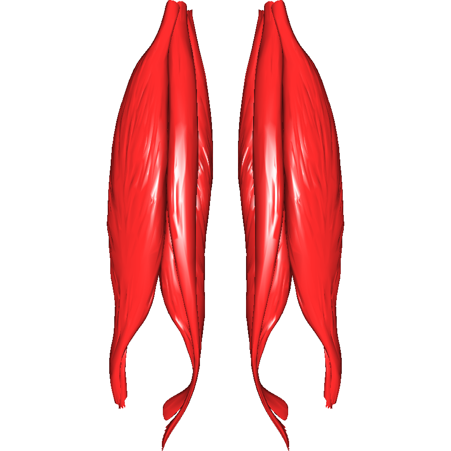</td><td><table><tbody><tr><td width="25%" valign="top"><table><tbody><tr><th>#1 坐姿腿弯举 Seated leg curl</th></tr><tr><td align="center"></td></tr><tr><td><b>建议：</b>2–4 组 × 10–20 <b>组间休息：</b>60–90 秒 <b>主要：</b>Hamstrings <b>次要：</b>Glutes <b>定位：</b>综合首选：稳定、易渐进且目标肌肉受力明确</td></tr></tbody></table></td><td width="25%" valign="top"><table><tbody><tr><th>#2 罗马尼亚硬拉 Romanian deadlift</th></tr><tr><td align="center"></td></tr><tr><td><b>建议：</b>3–4 组 × 6–10 <b>组间休息：</b>2–3 分钟 <b>主要：</b>Hamstrings、Glutes <b>次要：</b>Lower back、Forearm <b>定位：</b>优先替代：兼顾刺激与训练舒适度</td></tr></tbody></table></td><td width="25%" valign="top"><table><tbody><tr><th>#3 北欧腿弯举 Nordic hamstring curl</th></tr><tr><td align="center"></td></tr><tr><td><b>建议：</b>2–3 组 × 4–8 <b>组间休息：</b>2–3 分钟 <b>主要：</b>Hamstrings <b>次要：</b>Glutes <b>定位：</b>器械或动作偏好不同时的可靠选择</td></tr></tbody></table></td><td width="25%" valign="top"><table><tbody><tr><th>#4 俯卧腿弯举 Lying leg curl</th></tr><tr><td align="center"></td></tr><tr><td><b>建议：</b>2–4 组 × 10–20 <b>组间休息：</b>60–90 秒 <b>主要：</b>Hamstrings <b>次要：</b>Glutes <b>定位：</b>用于补充不同阻力曲线或训练角度</td></tr></tbody></table></td></tr></tbody></table></td></tr>
<tr><th valign="top">臀大肌</th><td valign="top" align="center">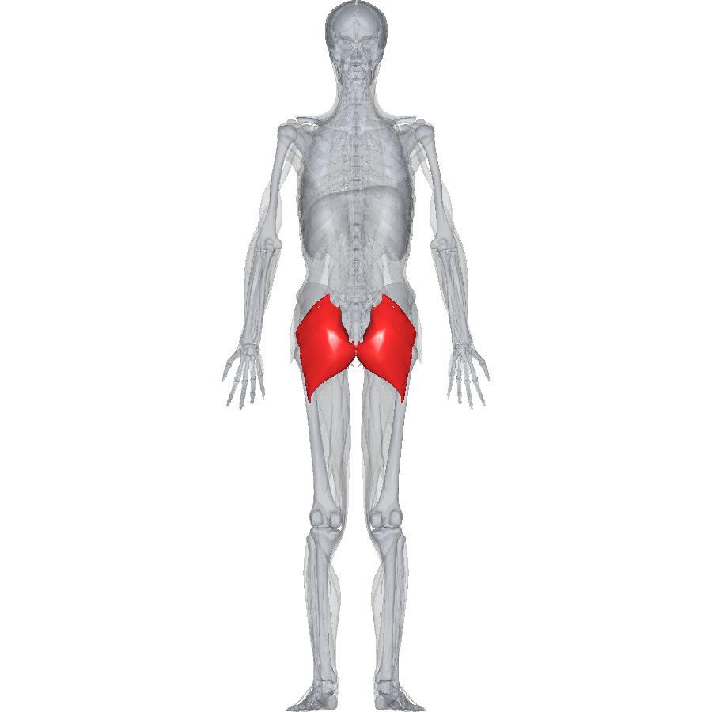</td><td><table><tbody><tr><td width="25%" valign="top"><table><tbody><tr><th>#1 杠铃臀推 Barbell hip thrust</th></tr><tr><td align="center"></td></tr><tr><td><b>建议：</b>3–4 组 × 6–12 <b>组间休息：</b>90–180 秒 <b>主要：</b>Glutes <b>次要：</b>Hamstrings <b>定位：</b>综合首选：稳定、易渐进且目标肌肉受力明确</td></tr></tbody></table></td><td width="25%" valign="top"><table><tbody><tr><th>#2 深幅杠铃深蹲 Barbell squat</th></tr><tr><td align="center"></td></tr><tr><td><b>建议：</b>3–4 组 × 5–10 <b>组间休息：</b>2–3 分钟 <b>主要：</b>Quadriceps、Glutes <b>次要：</b>Hamstrings、Calves <b>定位：</b>优先替代：兼顾刺激与训练舒适度</td></tr></tbody></table></td><td width="25%" valign="top"><table><tbody><tr><th>#3 保加利亚分腿蹲 Bulgarian split squat</th></tr><tr><td align="center"></td></tr><tr><td><b>建议：</b>3–4 组 × 6–12 <b>组间休息：</b>90–180 秒 <b>主要：</b>Quadriceps、Glutes <b>次要：</b>Hamstrings <b>定位：</b>器械或动作偏好不同时的可靠选择</td></tr></tbody></table></td><td width="25%" valign="top"><table><tbody><tr><th>#4 绳索后踢腿 Cable glute kickback</th></tr><tr><td align="center"></td></tr><tr><td><b>建议：</b>2–4 组 × 10–20 <b>组间休息：</b>60–90 秒 <b>主要：</b>Glutes <b>次要：</b>Hamstrings <b>定位：</b>用于补充不同阻力曲线或训练角度</td></tr></tbody></table></td></tr></tbody></table></td></tr>
<tr><th valign="top">臀中肌／髋外展肌群</th><td valign="top" align="center">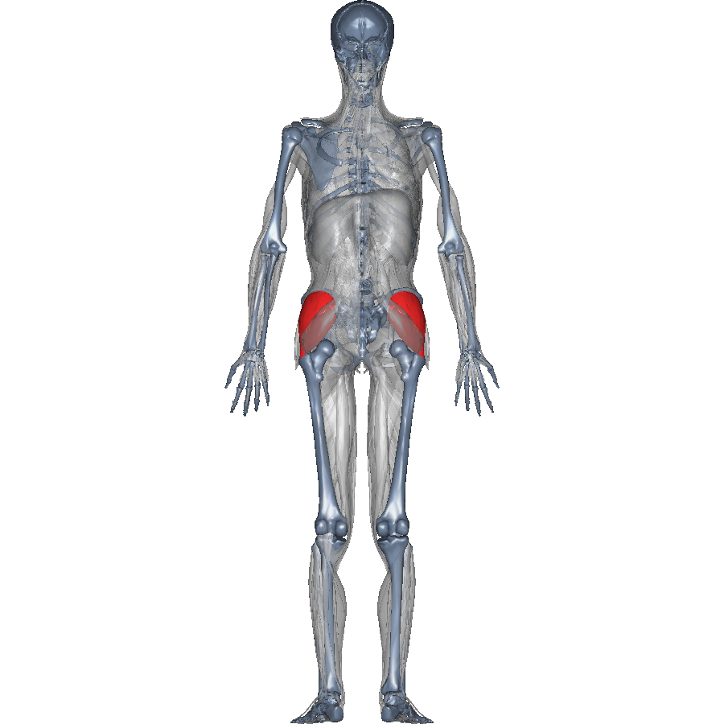</td><td><table><tbody><tr><td width="25%" valign="top"><table><tbody><tr><th>#1 绳索髋外展 Cable hip abduction</th></tr><tr><td align="center"></td></tr><tr><td><b>建议：</b>2–4 组 × 10–20 <b>组间休息：</b>60–90 秒 <b>主要：</b>Glutes <b>次要：</b>— <b>定位：</b>综合首选：稳定、易渐进且目标肌肉受力明确</td></tr></tbody></table></td><td width="25%" valign="top"><table><tbody><tr><th>#2 器械髋外展 Hip abduction machine</th></tr><tr><td align="center"></td></tr><tr><td><b>建议：</b>2–4 组 × 10–20 <b>组间休息：</b>60–90 秒 <b>主要：</b>Glutes <b>次要：</b>— <b>定位：</b>优先替代：兼顾刺激与训练舒适度</td></tr></tbody></table></td><td width="25%" valign="top"><table><tbody><tr><th>#3 保加利亚分腿蹲 Bulgarian split squat</th></tr><tr><td align="center"></td></tr><tr><td><b>建议：</b>3–4 组 × 6–12 <b>组间休息：</b>90–180 秒 <b>主要：</b>Quadriceps、Glutes <b>次要：</b>Hamstrings <b>定位：</b>器械或动作偏好不同时的可靠选择</td></tr></tbody></table></td><td width="25%" valign="top"><table><tbody><tr><th>#4 侧桥 Side plank</th></tr><tr><td align="center"></td></tr><tr><td><b>建议：</b>3 组 × 每侧 30–60 秒 <b>组间休息：</b>45–60 秒 <b>主要：</b>Obliques <b>次要：</b>Abs <b>定位：</b>用于补充不同阻力曲线或训练角度</td></tr></tbody></table></td></tr></tbody></table></td></tr>
<tr><th valign="top">髋内收肌群</th><td valign="top" align="center">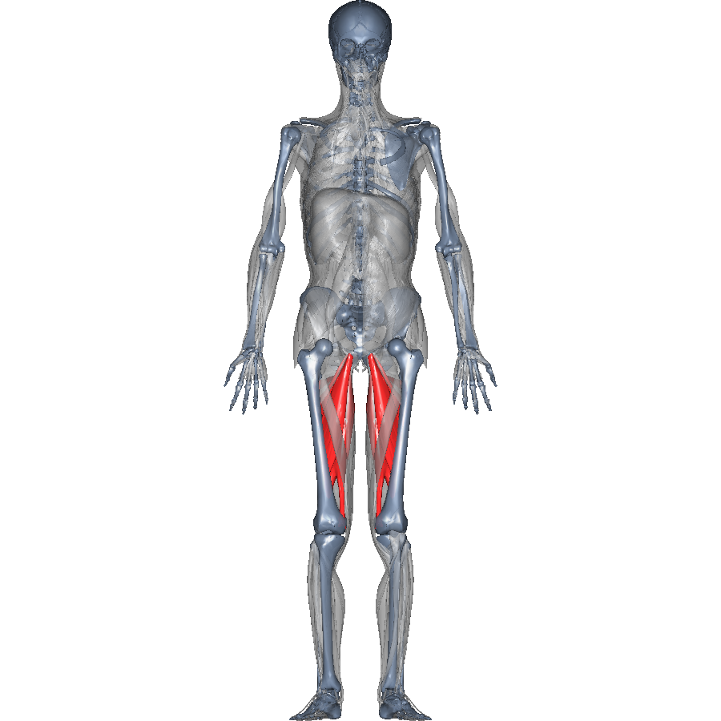</td><td><table><tbody><tr><td width="25%" valign="top"><table><tbody><tr><th>#1 器械髋内收 Hip adduction machine</th></tr><tr><td align="center"></td></tr><tr><td><b>建议：</b>2–4 组 × 10–20 <b>组间休息：</b>60–90 秒 <b>主要：</b>Adductors <b>次要：</b>— <b>定位：</b>综合首选：稳定、易渐进且目标肌肉受力明确</td></tr></tbody></table></td><td width="25%" valign="top"><table><tbody><tr><th>#2 相扑硬拉 Sumo deadlift</th></tr><tr><td align="center"></td></tr><tr><td><b>建议：</b>3–4 组 × 6–12 <b>组间休息：</b>90–180 秒 <b>主要：</b>Glutes、Hamstrings <b>次要：</b>Quadriceps、Adductors、Lower back <b>定位：</b>优先替代：兼顾刺激与训练舒适度</td></tr></tbody></table></td><td width="25%" valign="top"><table><tbody><tr><th>#3 深幅杠铃深蹲 Barbell squat</th></tr><tr><td align="center"></td></tr><tr><td><b>建议：</b>3–4 组 × 5–10 <b>组间休息：</b>2–3 分钟 <b>主要：</b>Quadriceps、Glutes <b>次要：</b>Hamstrings、Calves <b>定位：</b>器械或动作偏好不同时的可靠选择</td></tr></tbody></table></td><td width="25%" valign="top"><table><tbody><tr><th>#4 高脚杯深蹲 Goblet squat</th></tr><tr><td align="center"></td></tr><tr><td><b>建议：</b>3–4 组 × 6–12 <b>组间休息：</b>90–180 秒 <b>主要：</b>Quadriceps、Glutes <b>次要：</b>Abs、Adductors <b>定位：</b>用于补充不同阻力曲线或训练角度</td></tr></tbody></table></td></tr></tbody></table></td></tr>
<tr><th valign="top">腓肠肌</th><td valign="top" align="center">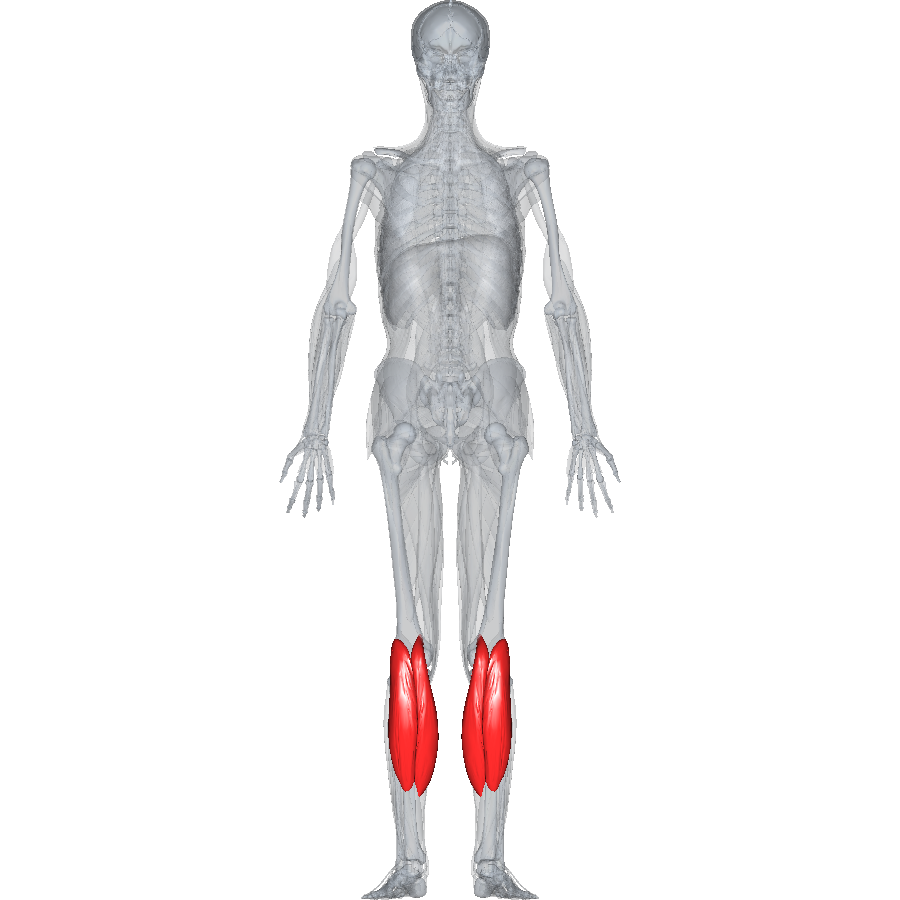</td><td><table><tbody><tr><td width="25%" valign="top"><table><tbody><tr><th>#1 站姿提踵 Standing calf raise</th></tr><tr><td align="center"></td></tr><tr><td><b>建议：</b>2–4 组 × 10–20 <b>组间休息：</b>60–90 秒 <b>主要：</b>Calves <b>次要：</b>— <b>定位：</b>综合首选：稳定、易渐进且目标肌肉受力明确</td></tr></tbody></table></td><td width="25%" valign="top"><table><tbody><tr><th>#2 跳绳 Jump rope</th></tr><tr><td align="center"></td></tr><tr><td><b>建议：</b>3 组 × 45–90 秒 <b>组间休息：</b>45–60 秒 <b>主要：</b>Calves <b>次要：</b>Quadriceps、Shoulders <b>定位：</b>优先替代：兼顾刺激与训练舒适度</td></tr></tbody></table></td><td width="25%" valign="top"><table><tbody><tr><th>#3 登阶机 Stair climber</th></tr><tr><td align="center"></td></tr><tr><td><b>建议：</b>3 组 × 60–120 秒 <b>组间休息：</b>60 秒 <b>主要：</b>Quadriceps、Glutes <b>次要：</b>Hamstrings、Calves <b>定位：</b>器械或动作偏好不同时的可靠选择</td></tr></tbody></table></td></tr></tbody></table></td></tr>
<tr><th valign="top">比目鱼肌</th><td valign="top" align="center">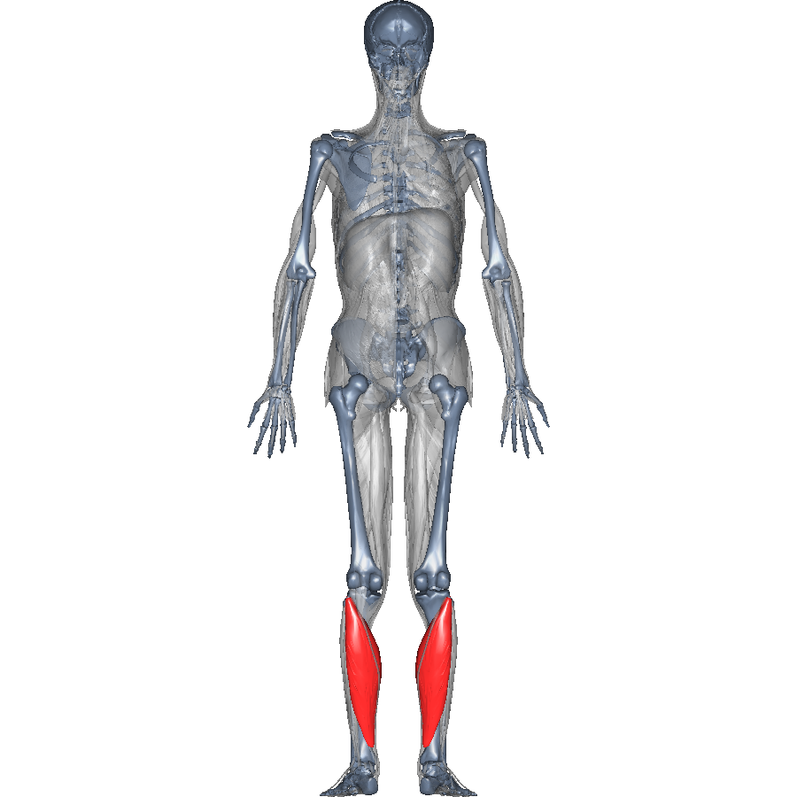</td><td><table><tbody><tr><td width="25%" valign="top"><table><tbody><tr><th>#1 坐姿提踵 Seated calf raise</th></tr><tr><td align="center"></td></tr><tr><td><b>建议：</b>2–4 组 × 10–20 <b>组间休息：</b>60–90 秒 <b>主要：</b>Calves <b>次要：</b>— <b>定位：</b>综合首选：稳定、易渐进且目标肌肉受力明确</td></tr></tbody></table></td><td width="25%" valign="top"><table><tbody><tr><th>#2 登阶机 Stair climber</th></tr><tr><td align="center"></td></tr><tr><td><b>建议：</b>3 组 × 60–120 秒 <b>组间休息：</b>60 秒 <b>主要：</b>Quadriceps、Glutes <b>次要：</b>Hamstrings、Calves <b>定位：</b>优先替代：兼顾刺激与训练舒适度</td></tr></tbody></table></td><td width="25%" valign="top"><table><tbody><tr><th>#3 靠墙小腿拉伸（辅助） Calf stretch against wall</th></tr><tr><td align="center"></td></tr><tr><td><b>建议：</b>2–4 组 × 10–20 <b>组间休息：</b>60–90 秒 <b>主要：</b>Calves <b>次要：</b>— <b>定位：</b>器械或动作偏好不同时的可靠选择</td></tr></tbody></table></td></tr></tbody></table></td></tr>
</tbody></table>

<h2>核心</h2>
<table><thead><tr><th width="12%">精确肌群</th><th width="14%">解剖定位</th><th>动作（按优先级）</th></tr></thead><tbody>
<tr><th valign="top">腹直肌</th><td valign="top" align="center"></td><td><table><tbody><tr><td width="25%" valign="top"><table><tbody><tr><th>#1 绳索卷腹 Cable crunch</th></tr><tr><td align="center"></td></tr><tr><td><b>建议：</b>2–4 组 × 10–20 <b>组间休息：</b>60–90 秒 <b>主要：</b>Abs <b>次要：</b>— <b>定位：</b>综合首选：稳定、易渐进且目标肌肉受力明确</td></tr></tbody></table></td><td width="25%" valign="top"><table><tbody><tr><th>#2 健腹轮 Ab wheel rollout</th></tr><tr><td align="center"></td></tr><tr><td><b>建议：</b>3–4 组 × 6–12 <b>组间休息：</b>90–180 秒 <b>主要：</b>Abs <b>次要：</b>Obliques <b>定位：</b>优先替代：兼顾刺激与训练舒适度</td></tr></tbody></table></td><td width="25%" valign="top"><table><tbody><tr><th>#3 悬垂举腿 Hanging leg raise</th></tr><tr><td align="center"></td></tr><tr><td><b>建议：</b>3–4 组 × 6–12 <b>组间休息：</b>90–180 秒 <b>主要：</b>Abs <b>次要：</b>Forearm、Obliques <b>定位：</b>器械或动作偏好不同时的可靠选择</td></tr></tbody></table></td><td width="25%" valign="top"><table><tbody><tr><th>#4 卷腹 Abdominal crunch</th></tr><tr><td align="center"></td></tr><tr><td><b>建议：</b>2–4 组 × 10–20 <b>组间休息：</b>60–90 秒 <b>主要：</b>Abs <b>次要：</b>— <b>定位：</b>用于补充不同阻力曲线或训练角度</td></tr></tbody></table></td></tr></tbody></table></td></tr>
<tr><th valign="top">腹斜肌／抗旋转</th><td valign="top" align="center">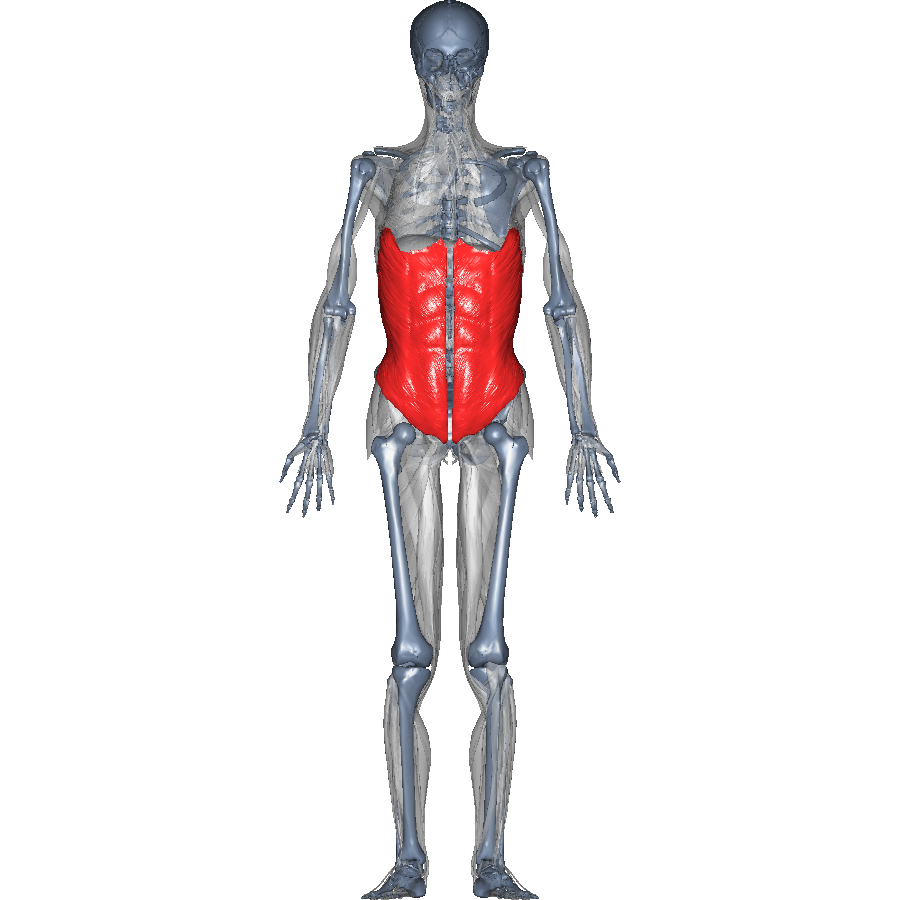</td><td><table><tbody><tr><td width="25%" valign="top"><table><tbody><tr><th>#1 Pallof press Pallof press</th></tr><tr><td align="center"></td></tr><tr><td><b>建议：</b>3 组 × 每侧 10–15 <b>组间休息：</b>45–60 秒 <b>主要：</b>Obliques <b>次要：</b>Abs、Shoulders <b>定位：</b>综合首选：稳定、易渐进且目标肌肉受力明确</td></tr></tbody></table></td><td width="25%" valign="top"><table><tbody><tr><th>#2 绳索伐木 Cable woodchopper</th></tr><tr><td align="center"></td></tr><tr><td><b>建议：</b>2–4 组 × 10–20 <b>组间休息：</b>60–90 秒 <b>主要：</b>Obliques <b>次要：</b>Abs <b>定位：</b>优先替代：兼顾刺激与训练舒适度</td></tr></tbody></table></td><td width="25%" valign="top"><table><tbody><tr><th>#3 侧桥 Side plank</th></tr><tr><td align="center"></td></tr><tr><td><b>建议：</b>3 组 × 每侧 30–60 秒 <b>组间休息：</b>45–60 秒 <b>主要：</b>Obliques <b>次要：</b>Abs <b>定位：</b>器械或动作偏好不同时的可靠选择</td></tr></tbody></table></td><td width="25%" valign="top"><table><tbody><tr><th>#4 俄罗斯转体 Russian twist</th></tr><tr><td align="center"></td></tr><tr><td><b>建议：</b>2–4 组 × 10–20 <b>组间休息：</b>60–90 秒 <b>主要：</b>Obliques、Abs <b>次要：</b>— <b>定位：</b>用于补充不同阻力曲线或训练角度</td></tr></tbody></table></td></tr></tbody></table></td></tr>
<tr><th valign="top">深层核心／抗伸展</th><td valign="top" align="center"></td><td><table><tbody><tr><td width="25%" valign="top"><table><tbody><tr><th>#1 死虫式 Dead bug</th></tr><tr><td align="center"></td></tr><tr><td><b>建议：</b>3 组 × 每侧 8–15 <b>组间休息：</b>45–60 秒 <b>主要：</b>Abs <b>次要：</b>Lower back <b>定位：</b>综合首选：稳定、易渐进且目标肌肉受力明确</td></tr></tbody></table></td><td width="25%" valign="top"><table><tbody><tr><th>#2 健腹轮 Ab wheel rollout</th></tr><tr><td align="center"></td></tr><tr><td><b>建议：</b>3–4 组 × 6–12 <b>组间休息：</b>90–180 秒 <b>主要：</b>Abs <b>次要：</b>Obliques <b>定位：</b>优先替代：兼顾刺激与训练舒适度</td></tr></tbody></table></td><td width="25%" valign="top"><table><tbody><tr><th>#3 平板支撑 Plank</th></tr><tr><td align="center"></td></tr><tr><td><b>建议：</b>3 组 × 30–60 秒 <b>组间休息：</b>45–60 秒 <b>主要：</b>Abs <b>次要：</b>Obliques、Lower back <b>定位：</b>器械或动作偏好不同时的可靠选择</td></tr></tbody></table></td><td width="25%" valign="top"><table><tbody><tr><th>#4 鸟狗式 Bird dog</th></tr><tr><td align="center"></td></tr><tr><td><b>建议：</b>3 组 × 每侧 8–15 <b>组间休息：</b>45–60 秒 <b>主要：</b>Abs <b>次要：</b>Lower back、Glutes <b>定位：</b>用于补充不同阻力曲线或训练角度</td></tr></tbody></table></td></tr></tbody></table></td></tr>
</tbody></table>

<h1>第二节：热身动作库与每日热身</h1>

热身目标是升温、活动当天关节并排练第一个主动作，不是提前练到疲劳。全程约 8–15 分钟；出现疼痛时停止并更换动作。

<table><thead><tr><th>区域／目的</th><th>动作与器械</th><th>剂量</th><th>休息与要点</th></tr></thead><tbody>
<tr><th>全身升温</th><td>自行车、划船机、椭圆机或坡度走</td><td>1 轮 × 4–6 分钟</td><td>无需休息；逐渐加速，到身体发热但仍能完整说话</td></tr>
<tr><th>肩袖</th><td>弹力带或绳索外旋</td><td>1–2 × 每侧 12–15</td><td>30–45 秒；肘部固定，不追求大重量</td></tr>
<tr><th>肩胛控制</th><td>肩胛俯卧撑、轻重量面拉</td><td>各 1 × 10–15</td><td>30–45 秒；主动完成前伸、后缩和上旋</td></tr>
<tr><th>胸肩推举</th><td>轻重量夹胸或空杆推举</td><td>1 × 12–15</td><td>约 45 秒；只用于寻找轨迹</td></tr>
<tr><th>背部拉力</th><td>轻重量直臂下压、轻重量划船</td><td>各 1 × 12–15</td><td>约 45 秒；先做肩胛动作，再屈肘</td></tr>
<tr><th>髋部</th><td>髋外展机、髋内收机、臀桥</td><td>各 1 × 12–15</td><td>30–45 秒；轻重量、完整可控幅度</td></tr>
<tr><th>膝部</th><td>轻重量腿屈伸、腿弯举、徒手深蹲</td><td>各 1 × 10–15</td><td>30–45 秒；不做到灼烧或力竭</td></tr>
<tr><th>踝部</th><td>负重踝背屈、慢速徒手提踵</td><td>各 1 × 每侧 10–15</td><td>30 秒；脚跟不离地完成踝背屈</td></tr>
<tr><th>专项递增组</th><td>当天第一个复合动作</td><td>极轻重量 10–15；40–50% × 6–8；60–70% × 3–5；需要时 75–85% × 1–3</td><td>45–120 秒；百分比按当天工作重量估算，所有组都远离力竭</td></tr>
</tbody></table>

<h2>五个训练日的热身流程</h2>
<table><thead><tr><th>训练日</th><th>顺序</th><th>完成标准</th></tr></thead><tbody>
<tr><th>Push A</th><td>自行车／椭圆机 4–5 分钟 → 绳索外旋 1–2 × 12–15／侧 → 肩胛俯卧撑 1 × 10–15 → 杠铃卧推递增 3–4 组</td><td>肩关节活动顺畅，卧推工作重量前无局部疲劳</td></tr>
<tr><th>Pull A</th><td>划船机 4–5 分钟 → 轻直臂下压 1 × 15 → 肩胛下沉 1–2 × 8–12 → 引体或下拉递增 2–3 组</td><td>能够先下沉肩胛，再开始屈肘拉动</td></tr>
<tr><th>Legs</th><td>自行车 5 分钟 → 髋内收、外展机各 1 × 15 → 轻腿弯举 1 × 15 → 踝背屈 1 × 10／侧 → 深蹲递增 3–4 组</td><td>髋、膝、踝均无卡顿，深蹲深度自然稳定</td></tr>
<tr><th>Push B</th><td>椭圆机 4–5 分钟 → 绳索外旋 1–2 × 12–15／侧 → 轻侧平举 1 × 15 → 上斜哑铃卧推递增 2–3 组</td><td>肩袖已激活但侧平举不产生灼烧感</td></tr>
<tr><th>Pull B</th><td>划船机 4–5 分钟 → 轻划船 1 × 15 → 轻面拉 1 × 15 → 中立握下拉递增 2–3 组</td><td>上背发热，正式组前握力和肱二头保持新鲜</td></tr>
</tbody></table>

<h1>第三节：五练 PPL 计划</h1>

周结构为 Push A / Pull A / Legs / 休息 / Push B / Pull B / 休息。先完成上方对应热身；下表只记录正式工作组。

<table><thead><tr><th>日程</th><th>训练</th><th>重点</th></tr></thead><tbody>
<tr><td>周一</td><td>Push A</td><td>平板卧推＋肩中束＋三头长头</td></tr><tr><td>周二</td><td>Pull A</td><td>垂直拉＋背厚＋二头</td></tr><tr><td>周三</td><td>Legs</td><td>股四、腘绳、臀、小腿完整覆盖</td></tr><tr><td>周四</td><td>休息</td><td>恢复、散步或轻度活动</td></tr><tr><td>周五</td><td>Push B</td><td>上胸＋肩推＋三头</td></tr><tr><td>周六</td><td>Pull B</td><td>背阔肌＋上背＋后束＋二头</td></tr><tr><td>周日</td><td>休息</td><td>恢复</td></tr>
</tbody></table>

<h2>Push A</h2>
<table><thead><tr><th>#</th><th>动作</th><th>正式组 × 次数</th><th>休息</th><th>RIR</th></tr></thead><tbody>
<tr><td>1</td><td>杠铃平板卧推</td><td>4 × 5–8</td><td>2–3 分钟</td><td>2</td></tr><tr><td>2</td><td>上斜哑铃卧推</td><td>3 × 8–12</td><td>2 分钟</td><td>1–2</td></tr><tr><td>3</td><td>绳索侧平举</td><td>4 × 12–20</td><td>60–90 秒</td><td>0–2</td></tr><tr><td>4</td><td>绳索过头臂屈伸</td><td>3 × 10–15</td><td>60–90 秒</td><td>0–2</td></tr><tr><td>5</td><td>绳索下压</td><td>2 × 10–15</td><td>60–90 秒</td><td>0–1</td></tr><tr><td>6</td><td>绳索卷腹</td><td>3 × 10–15</td><td>60 秒</td><td>1–2</td></tr>
</tbody></table>
<h2>Pull A</h2>
<table><thead><tr><th>#</th><th>动作</th><th>正式组 × 次数</th><th>休息</th><th>RIR</th></tr></thead><tbody>
<tr><td>1</td><td>引体向上／中立握下拉</td><td>4 × 6–10</td><td>2 分钟</td><td>1–2</td></tr><tr><td>2</td><td>胸托划船／T 杠划船</td><td>4 × 6–12</td><td>2 分钟</td><td>1–2</td></tr><tr><td>3</td><td>直臂下拉</td><td>3 × 10–15</td><td>60–90 秒</td><td>1–2</td></tr><tr><td>4</td><td>反向飞鸟</td><td>3 × 12–20</td><td>60–90 秒</td><td>0–2</td></tr><tr><td>5</td><td>牧师凳弯举</td><td>3 × 8–12</td><td>60–90 秒</td><td>0–2</td></tr><tr><td>6</td><td>锤式弯举</td><td>2 × 10–15</td><td>60–90 秒</td><td>0–2</td></tr>
</tbody></table>
<h2>Legs</h2>
<table><thead><tr><th>#</th><th>动作</th><th>正式组 × 次数</th><th>休息</th><th>RIR</th></tr></thead><tbody>
<tr><td>1</td><td>杠铃深蹲</td><td>4 × 5–8</td><td>2–3 分钟</td><td>2</td></tr><tr><td>2</td><td>罗马尼亚硬拉</td><td>3 × 6–10</td><td>2–3 分钟</td><td>1–2</td></tr><tr><td>3</td><td>腿屈伸</td><td>3 × 10–15</td><td>60–90 秒</td><td>0–2</td></tr><tr><td>4</td><td>坐姿腿弯举</td><td>3 × 8–15</td><td>60–90 秒</td><td>0–2</td></tr><tr><td>5</td><td>杠铃臀推</td><td>3 × 8–12</td><td>90–120 秒</td><td>1–2</td></tr><tr><td>6</td><td>站姿提踵</td><td>3 × 8–15</td><td>60–90 秒</td><td>0–2</td></tr><tr><td>7</td><td>坐姿提踵</td><td>3 × 12–20</td><td>60–90 秒</td><td>0–2</td></tr><tr><td>8</td><td>死虫式</td><td>2 × 每侧 8–12</td><td>45–60 秒</td><td>动作始终可控</td></tr>
</tbody></table>
<h2>Push B</h2>
<table><thead><tr><th>#</th><th>动作</th><th>正式组 × 次数</th><th>休息</th><th>RIR</th></tr></thead><tbody>
<tr><td>1</td><td>上斜哑铃卧推</td><td>4 × 6–10</td><td>2–3 分钟</td><td>1–2</td></tr><tr><td>2</td><td>坐姿哑铃推举</td><td>3 × 6–10</td><td>2 分钟</td><td>1–2</td></tr><tr><td>3</td><td>器械夹胸／绳索夹胸</td><td>3 × 10–15</td><td>60–90 秒</td><td>0–2</td></tr><tr><td>4</td><td>哑铃侧平举</td><td>4 × 12–20</td><td>60–90 秒</td><td>0–2</td></tr><tr><td>5</td><td>仰卧臂屈伸</td><td>3 × 8–12</td><td>60–90 秒</td><td>0–2</td></tr><tr><td>6</td><td>绳索下压</td><td>2 × 12–20</td><td>60 秒</td><td>0–1</td></tr>
</tbody></table>
<h2>Pull B</h2>
<table><thead><tr><th>#</th><th>动作</th><th>正式组 × 次数</th><th>休息</th><th>RIR</th></tr></thead><tbody>
<tr><td>1</td><td>中立握高位下拉</td><td>4 × 8–12</td><td>2 分钟</td><td>1–2</td></tr><tr><td>2</td><td>坐姿绳索划船</td><td>3 × 8–12</td><td>2 分钟</td><td>1–2</td></tr><tr><td>3</td><td>单臂哑铃／绳索划船</td><td>3 × 8–12</td><td>90–120 秒</td><td>1–2</td></tr><tr><td>4</td><td>绳索面拉</td><td>3 × 12–20</td><td>60–90 秒</td><td>0–2</td></tr><tr><td>5</td><td>上斜哑铃弯举</td><td>3 × 8–12</td><td>60–90 秒</td><td>0–2</td></tr><tr><td>6</td><td>锤式弯举</td><td>2 × 10–15</td><td>60–90 秒</td><td>0–2</td></tr><tr><td>7</td><td>健腹轮</td><td>3 × 6–12</td><td>60–90 秒</td><td>1–2</td></tr>
</tbody></table>

<h2>执行与优化</h2>
<ul><li><b>递增：</b>先在同一重量下把所有组做到次数上限；仍达到目标 RIR 时，再增加最小重量。加重后从次数下限重新开始。</li><li><b>训练量：</b>胸、背每周约 14–18 个直接工作组；肩和手臂还会从复合动作得到额外刺激，因此不继续盲目加组。</li><li><b>核心：</b>固定安排在 Push A、Legs、Pull B 末尾；不需要每天高量训练腹部。</li><li><b>腿日恢复：</b>一周只练一次腿，当前约 22 个腿臀小腿工作组已经足够。若训练超过 100 分钟，先删臀推 1 组以及两种提踵各 1 组。</li><li><b>时间不足：</b>始终保留当天前两个复合动作；随后优先保留侧平举／后束、手臂各一个动作。先删同功能的第二个孤立动作。</li><li><b>传统硬拉：</b>若目标包含硬拉专项力量，可在 Pull A 开头做 2–3 × 3–5，并删除当天一个划船动作；纯增肌不强制加入。</li><li><b>减量：</b>连续两周表现下降、关节持续不适或睡眠与疲劳明显恶化时，用一周把正式组减半、重量降低约 10–15%，并保留 3–4 RIR。</li><li><b>替换：</b>疼痛、器械缺失或连续 3–4 周无法渐进时，换成第一节同一肌群的下一优先级动作；不要同时增加动作数量。</li></ul>
<h2>图片与许可</h2>

动作插画与动作数据来自 <a href="https://marcmayol.com/exercise-api/">Exercise API by Marc Mayol</a>。医学解剖图由 <a href="https://lifesciencedb.jp/bp3d/">BodyParts3D / Anatomography</a> 渲染，并根据 FMA 解剖标识将目标肌肉标红；BodyParts3D © The Database Center for Life Science，按 CC BY-SA 2.1 Japan 使用。源模型暂不具备的结构保留 Exercise API 肌肉图。图片仅用于动作辨认与训练规划，不替代医疗建议或现场技术指导。

