
<b>English</b> | <a href="README.zh-CN.md">简体中文</a>

<a href="output/pdf/FIT-Training-Guide-en.pdf">Open / download the English PDF</a>

<h1 align="center">FIT: Muscle Exercise Library, Warm-ups, and 5-Day PPL</h1>

<h1 align="center">Muscles and Recommended Exercises</h1>

<h2 align="center">Shoulders</h2>
<h3 align="center">Anterior Deltoid</h3>

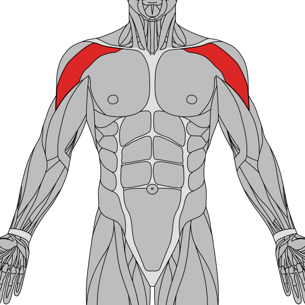

<table><tbody><tr><td width="50%" valign="top"><table><tbody><tr><th>#1 Seated dumbbell shoulder press</th></tr><tr><td align="center"></td></tr><tr><td><b>Prescription: </b>3–4 sets × 6–12 <b>Rest: </b>90–180 sec <b>Primary: </b>Shoulders <b>Secondary: </b>Triceps <b>Why: </b>Top choice: stable, easy to progress, and clear target-muscle loading</td></tr></tbody></table></td><td width="50%" valign="top"><table><tbody><tr><th>#2 Barbell overhead press</th></tr><tr><td align="center"></td></tr><tr><td><b>Prescription: </b>3–4 sets × 6–10 <b>Rest: </b>2–3 min <b>Primary: </b>Shoulders <b>Secondary: </b>Triceps <b>Why: </b>Preferred alternative: balances stimulus and comfort</td></tr></tbody></table></td></tr><tr><td width="50%" valign="top"><table><tbody><tr><th>#3 Machine shoulder press</th></tr><tr><td align="center"></td></tr><tr><td><b>Prescription: </b>3–4 sets × 6–12 <b>Rest: </b>90–180 sec <b>Primary: </b>Shoulders <b>Secondary: </b>Triceps <b>Why: </b>Reliable option when equipment or exercise preference differs</td></tr></tbody></table></td><td width="50%" valign="top"><table><tbody><tr><th>#4 Cable front raise</th></tr><tr><td align="center"></td></tr><tr><td><b>Prescription: </b>2–4 sets × 10–20 <b>Rest: </b>60–90 sec <b>Primary: </b>Shoulders <b>Secondary: </b>— <b>Why: </b>Adds a different resistance curve or training angle</td></tr></tbody></table></td></tr></tbody></table>
<h3 align="center">Lateral Deltoid</h3>

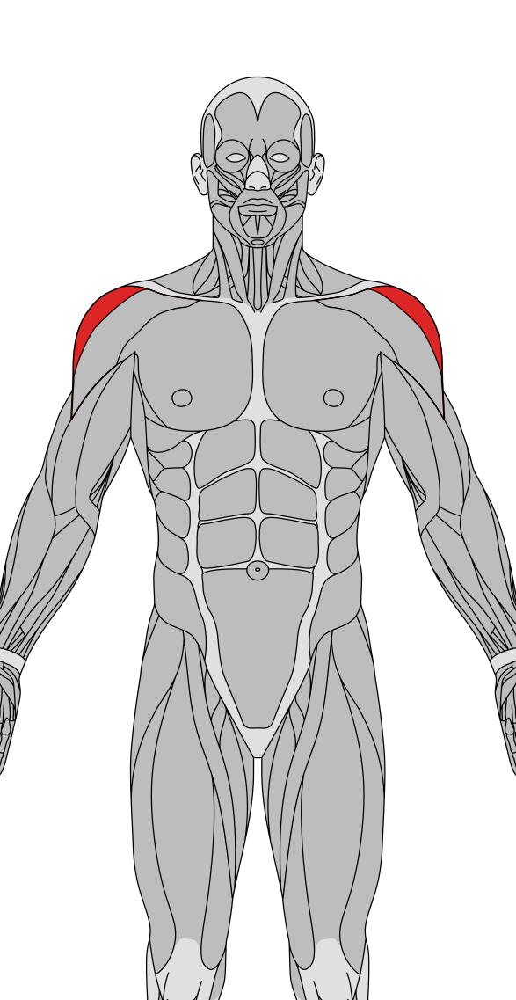

<table><tbody><tr><td width="50%" valign="top"><table><tbody><tr><th>#1 Cable lateral raises</th></tr><tr><td align="center"></td></tr><tr><td><b>Prescription: </b>2–4 sets × 10–20 <b>Rest: </b>60–90 sec <b>Primary: </b>Shoulders <b>Secondary: </b>— <b>Why: </b>Top choice: stable, easy to progress, and clear target-muscle loading</td></tr></tbody></table></td><td width="50%" valign="top"><table><tbody><tr><th>#2 Dumbbell lateral raises</th></tr><tr><td align="center"></td></tr><tr><td><b>Prescription: </b>2–4 sets × 10–20 <b>Rest: </b>60–90 sec <b>Primary: </b>Shoulders <b>Secondary: </b>— <b>Why: </b>Preferred alternative: balances stimulus and comfort</td></tr></tbody></table></td></tr><tr><td width="50%" valign="top"><table><tbody><tr><th>#3 Machine shoulder press</th></tr><tr><td align="center"></td></tr><tr><td><b>Prescription: </b>3–4 sets × 6–12 <b>Rest: </b>90–180 sec <b>Primary: </b>Shoulders <b>Secondary: </b>Triceps <b>Why: </b>Reliable option when equipment or exercise preference differs</td></tr></tbody></table></td><td width="50%" valign="top"><table><tbody><tr><th>#4 Cable upright row</th></tr><tr><td align="center"></td></tr><tr><td><b>Prescription: </b>2–4 sets × 10–20 <b>Rest: </b>60–90 sec <b>Primary: </b>Shoulders <b>Secondary: </b>Trapezius、Biceps <b>Why: </b>Adds a different resistance curve or training angle</td></tr></tbody></table></td></tr></tbody></table>
<h3 align="center">Posterior Deltoid</h3>

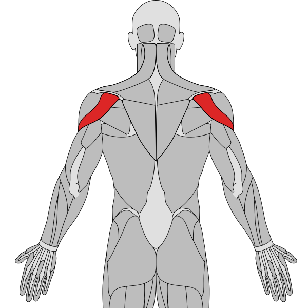

<table><tbody><tr><td width="50%" valign="top"><table><tbody><tr><th>#1 Reverse fly</th></tr><tr><td align="center"></td></tr><tr><td><b>Prescription: </b>2–4 sets × 10–20 <b>Rest: </b>60–90 sec <b>Primary: </b>Shoulders <b>Secondary: </b>Upper back、Trapezius <b>Why: </b>Top choice: stable, easy to progress, and clear target-muscle loading</td></tr></tbody></table></td><td width="50%" valign="top"><table><tbody><tr><th>#2 Face pull</th></tr><tr><td align="center"></td></tr><tr><td><b>Prescription: </b>2–4 sets × 10–20 <b>Rest: </b>60–90 sec <b>Primary: </b>Shoulders、Trapezius <b>Secondary: </b>Upper back <b>Why: </b>Preferred alternative: balances stimulus and comfort</td></tr></tbody></table></td></tr><tr><td width="50%" valign="top"><table><tbody><tr><th>#3 Y-T-W raise on incline bench</th></tr><tr><td align="center"></td></tr><tr><td><b>Prescription: </b>2–4 sets × 10–20 <b>Rest: </b>60–90 sec <b>Primary: </b>Shoulders <b>Secondary: </b>Upper back、Trapezius <b>Why: </b>Reliable option when equipment or exercise preference differs</td></tr></tbody></table></td><td width="50%" valign="top"><table><tbody><tr><th>#4 Inverted row</th></tr><tr><td align="center"></td></tr><tr><td><b>Prescription: </b>3–4 sets × 6–12 <b>Rest: </b>90–180 sec <b>Primary: </b>Upper back <b>Secondary: </b>Biceps、Forearm <b>Why: </b>Adds a different resistance curve or training angle</td></tr></tbody></table></td></tr></tbody></table>

<h2 align="center">Chest</h2>
<h3 align="center">Clavicular Pectoralis Major (Upper Chest)</h3>

<table><tbody><tr><td width="50%" valign="top"><table><tbody><tr><th>#1 Incline dumbbell press</th></tr><tr><td align="center"></td></tr><tr><td><b>Prescription: </b>3–4 sets × 6–12 <b>Rest: </b>90–180 sec <b>Primary: </b>Chest <b>Secondary: </b>Shoulders、Triceps <b>Why: </b>Top choice: stable, easy to progress, and clear target-muscle loading</td></tr></tbody></table></td><td width="50%" valign="top"><table><tbody><tr><th>#2 Incline barbell bench press</th></tr><tr><td align="center"></td></tr><tr><td><b>Prescription: </b>3–4 sets × 6–12 <b>Rest: </b>90–180 sec <b>Primary: </b>Chest <b>Secondary: </b>Shoulders、Triceps <b>Why: </b>Preferred alternative: balances stimulus and comfort</td></tr></tbody></table></td></tr><tr><td width="50%" valign="top"><table><tbody><tr><th>#3 Low cable fly (low-to-high)</th></tr><tr><td align="center"></td></tr><tr><td><b>Prescription: </b>2–4 sets × 10–20 <b>Rest: </b>60–90 sec <b>Primary: </b>Chest <b>Secondary: </b>Shoulders <b>Why: </b>Reliable option when equipment or exercise preference differs</td></tr></tbody></table></td><td width="50%" valign="top"><table><tbody><tr><th>#4 Incline chest press machine</th></tr><tr><td align="center"></td></tr><tr><td><b>Prescription: </b>3–4 sets × 6–12 <b>Rest: </b>90–180 sec <b>Primary: </b>Chest <b>Secondary: </b>Shoulders、Triceps <b>Why: </b>Adds a different resistance curve or training angle</td></tr></tbody></table></td></tr></tbody></table>
<h3 align="center">Sternocostal Pectoralis Major (Mid Chest Bias)</h3>

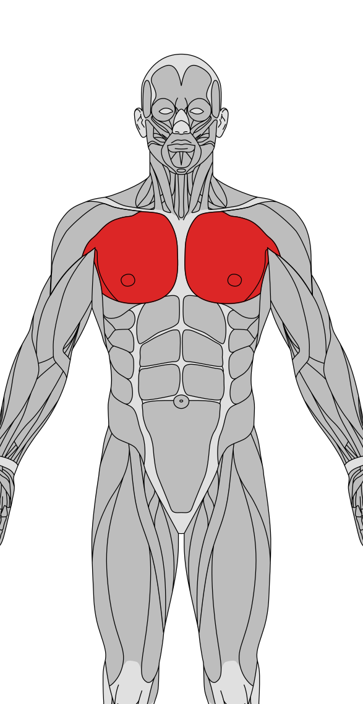

<table><tbody><tr><td width="50%" valign="top"><table><tbody><tr><th>#1 Barbell bench press</th></tr><tr><td align="center"></td></tr><tr><td><b>Prescription: </b>3–4 sets × 5–10 <b>Rest: </b>2–3 min <b>Primary: </b>Chest <b>Secondary: </b>Shoulders、Triceps <b>Why: </b>Top choice: stable, easy to progress, and clear target-muscle loading</td></tr></tbody></table></td><td width="50%" valign="top"><table><tbody><tr><th>#2 Dumbbell bench press</th></tr><tr><td align="center"></td></tr><tr><td><b>Prescription: </b>3–4 sets × 6–12 <b>Rest: </b>90–180 sec <b>Primary: </b>Chest <b>Secondary: </b>Shoulders、Triceps <b>Why: </b>Preferred alternative: balances stimulus and comfort</td></tr></tbody></table></td></tr><tr><td width="50%" valign="top"><table><tbody><tr><th>#3 Machine chest fly (pec deck)</th></tr><tr><td align="center"></td></tr><tr><td><b>Prescription: </b>2–4 sets × 10–20 <b>Rest: </b>60–90 sec <b>Primary: </b>Chest <b>Secondary: </b>Shoulders <b>Why: </b>Reliable option when equipment or exercise preference differs</td></tr></tbody></table></td><td width="50%" valign="top"><table><tbody><tr><th>#4 Cable chest press</th></tr><tr><td align="center"></td></tr><tr><td><b>Prescription: </b>3–4 sets × 6–12 <b>Rest: </b>90–180 sec <b>Primary: </b>Chest <b>Secondary: </b>Shoulders、Triceps <b>Why: </b>Adds a different resistance curve or training angle</td></tr></tbody></table></td></tr></tbody></table>
<h3 align="center">Lower Sternocostal Pectoralis Major</h3>

<table><tbody><tr><td width="50%" valign="top"><table><tbody><tr><th>#1 Chest dips</th></tr><tr><td align="center"></td></tr><tr><td><b>Prescription: </b>3–4 sets × 6–12 <b>Rest: </b>90–180 sec <b>Primary: </b>Chest <b>Secondary: </b>Triceps、Shoulders <b>Why: </b>Top choice: stable, easy to progress, and clear target-muscle loading</td></tr></tbody></table></td><td width="50%" valign="top"><table><tbody><tr><th>#2 Decline barbell bench press</th></tr><tr><td align="center"></td></tr><tr><td><b>Prescription: </b>3–4 sets × 6–12 <b>Rest: </b>90–180 sec <b>Primary: </b>Chest <b>Secondary: </b>Triceps <b>Why: </b>Preferred alternative: balances stimulus and comfort</td></tr></tbody></table></td></tr><tr><td width="50%" valign="top"><table><tbody><tr><th>#3 Cable crossover</th></tr><tr><td align="center"></td></tr><tr><td><b>Prescription: </b>2–4 sets × 10–20 <b>Rest: </b>60–90 sec <b>Primary: </b>Chest <b>Secondary: </b>Shoulders <b>Why: </b>Reliable option when equipment or exercise preference differs</td></tr></tbody></table></td><td width="50%" valign="top"><table><tbody><tr><th>#4 Push-ups</th></tr><tr><td align="center"></td></tr><tr><td><b>Prescription: </b>3–4 sets × 6–12 <b>Rest: </b>90–180 sec <b>Primary: </b>Chest <b>Secondary: </b>Shoulders、Triceps <b>Why: </b>Adds a different resistance curve or training angle</td></tr></tbody></table></td></tr></tbody></table>

<h2 align="center">Arms</h2>
<h3 align="center">Biceps Brachii</h3>

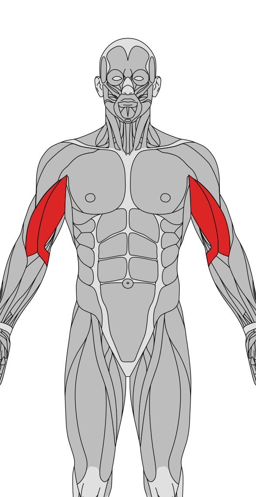

<table><tbody><tr><td width="50%" valign="top"><table><tbody><tr><th>#1 Preacher curl</th></tr><tr><td align="center"></td></tr><tr><td><b>Prescription: </b>2–4 sets × 10–20 <b>Rest: </b>60–90 sec <b>Primary: </b>Biceps <b>Secondary: </b>Forearm <b>Why: </b>Top choice: stable, easy to progress, and clear target-muscle loading</td></tr></tbody></table></td><td width="50%" valign="top"><table><tbody><tr><th>#2 Incline dumbbell curl</th></tr><tr><td align="center"></td></tr><tr><td><b>Prescription: </b>2–4 sets × 10–20 <b>Rest: </b>60–90 sec <b>Primary: </b>Biceps <b>Secondary: </b>Forearm <b>Why: </b>Preferred alternative: balances stimulus and comfort</td></tr></tbody></table></td></tr><tr><td width="50%" valign="top"><table><tbody><tr><th>#3 Cable curl</th></tr><tr><td align="center"></td></tr><tr><td><b>Prescription: </b>2–4 sets × 10–20 <b>Rest: </b>60–90 sec <b>Primary: </b>Biceps <b>Secondary: </b>Forearm <b>Why: </b>Reliable option when equipment or exercise preference differs</td></tr></tbody></table></td><td width="50%" valign="top"><table><tbody><tr><th>#4 Barbell biceps curl</th></tr><tr><td align="center"></td></tr><tr><td><b>Prescription: </b>2–4 sets × 10–20 <b>Rest: </b>60–90 sec <b>Primary: </b>Biceps <b>Secondary: </b>Forearm <b>Why: </b>Adds a different resistance curve or training angle</td></tr></tbody></table></td></tr></tbody></table>
<h3 align="center">Brachialis / Brachioradialis</h3>

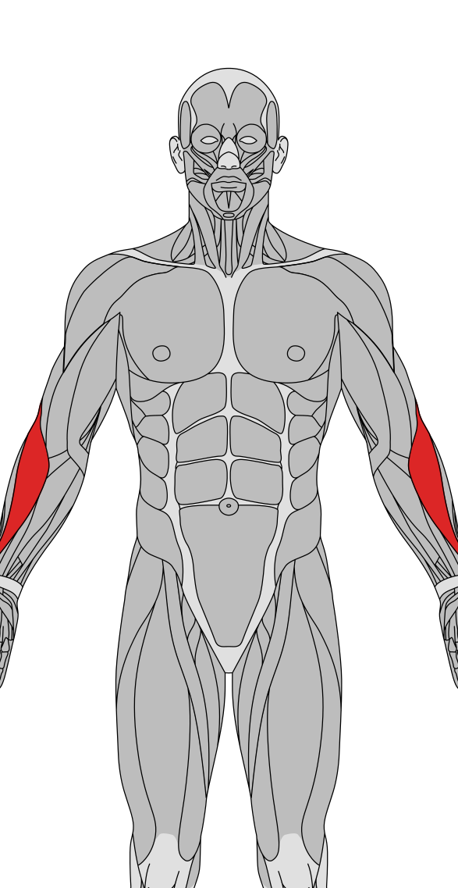

<table><tbody><tr><td width="50%" valign="top"><table><tbody><tr><th>#1 Dumbbell hammer curl</th></tr><tr><td align="center"></td></tr><tr><td><b>Prescription: </b>2–4 sets × 10–20 <b>Rest: </b>60–90 sec <b>Primary: </b>Biceps <b>Secondary: </b>Forearm <b>Why: </b>Top choice: stable, easy to progress, and clear target-muscle loading</td></tr></tbody></table></td><td width="50%" valign="top"><table><tbody><tr><th>#2 Alternating dumbbell biceps curl</th></tr><tr><td align="center"></td></tr><tr><td><b>Prescription: </b>2–4 sets × 10–20 <b>Rest: </b>60–90 sec <b>Primary: </b>Biceps <b>Secondary: </b>Forearm <b>Why: </b>Preferred alternative: balances stimulus and comfort</td></tr></tbody></table></td></tr><tr><td width="50%" valign="top"><table><tbody><tr><th>#3 Farmer's walk</th></tr><tr><td align="center"></td></tr><tr><td><b>Prescription: </b>3 sets × 30–60 sec <b>Rest: </b>90–120 sec <b>Primary: </b>Obliques <b>Secondary: </b>Trapezius、Forearm <b>Why: </b>Reliable option when equipment or exercise preference differs</td></tr></tbody></table></td><td width="50%"></td></tr></tbody></table>
<h3 align="center">Triceps Long Head</h3>

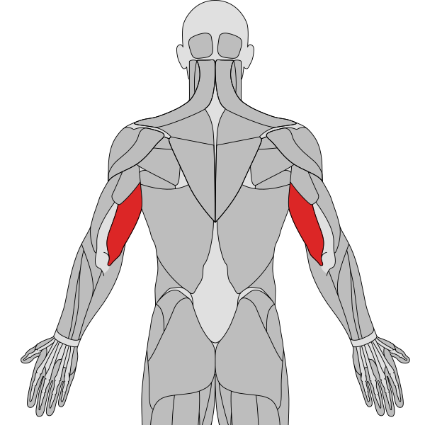

<table><tbody><tr><td width="50%" valign="top"><table><tbody><tr><th>#1 Cable overhead triceps extension</th></tr><tr><td align="center"></td></tr><tr><td><b>Prescription: </b>2–4 sets × 10–20 <b>Rest: </b>60–90 sec <b>Primary: </b>Triceps <b>Secondary: </b>— <b>Why: </b>Top choice: stable, easy to progress, and clear target-muscle loading</td></tr></tbody></table></td><td width="50%" valign="top"><table><tbody><tr><th>#2 Overhead triceps extension</th></tr><tr><td align="center"></td></tr><tr><td><b>Prescription: </b>2–4 sets × 10–20 <b>Rest: </b>60–90 sec <b>Primary: </b>Triceps <b>Secondary: </b>— <b>Why: </b>Preferred alternative: balances stimulus and comfort</td></tr></tbody></table></td></tr><tr><td width="50%" valign="top"><table><tbody><tr><th>#3 Lying triceps extension (skull crusher)</th></tr><tr><td align="center"></td></tr><tr><td><b>Prescription: </b>2–4 sets × 10–20 <b>Rest: </b>60–90 sec <b>Primary: </b>Triceps <b>Secondary: </b>— <b>Why: </b>Reliable option when equipment or exercise preference differs</td></tr></tbody></table></td><td width="50%" valign="top"><table><tbody><tr><th>#4 Close-grip bench press</th></tr><tr><td align="center"></td></tr><tr><td><b>Prescription: </b>3–4 sets × 6–12 <b>Rest: </b>90–180 sec <b>Primary: </b>Triceps <b>Secondary: </b>Chest、Shoulders <b>Why: </b>Adds a different resistance curve or training angle</td></tr></tbody></table></td></tr></tbody></table>
<h3 align="center">Triceps Lateral / Medial Heads</h3>

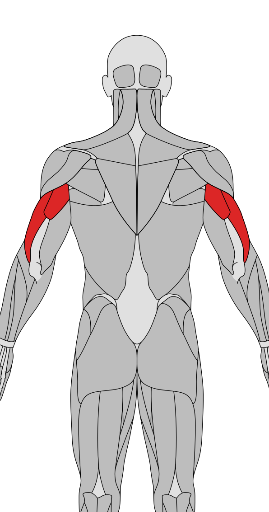

<table><tbody><tr><td width="50%" valign="top"><table><tbody><tr><th>#1 Triceps pushdown</th></tr><tr><td align="center"></td></tr><tr><td><b>Prescription: </b>2–4 sets × 10–20 <b>Rest: </b>60–90 sec <b>Primary: </b>Triceps <b>Secondary: </b>— <b>Why: </b>Top choice: stable, easy to progress, and clear target-muscle loading</td></tr></tbody></table></td><td width="50%" valign="top"><table><tbody><tr><th>#2 Close-grip bench press</th></tr><tr><td align="center"></td></tr><tr><td><b>Prescription: </b>3–4 sets × 6–12 <b>Rest: </b>90–180 sec <b>Primary: </b>Triceps <b>Secondary: </b>Chest、Shoulders <b>Why: </b>Preferred alternative: balances stimulus and comfort</td></tr></tbody></table></td></tr><tr><td width="50%" valign="top"><table><tbody><tr><th>#3 Dips machine</th></tr><tr><td align="center"></td></tr><tr><td><b>Prescription: </b>3–4 sets × 6–12 <b>Rest: </b>90–180 sec <b>Primary: </b>Triceps <b>Secondary: </b>Chest、Shoulders <b>Why: </b>Reliable option when equipment or exercise preference differs</td></tr></tbody></table></td><td width="50%" valign="top"><table><tbody><tr><th>#4 Diamond push-up</th></tr><tr><td align="center"></td></tr><tr><td><b>Prescription: </b>3–4 sets × 6–12 <b>Rest: </b>90–180 sec <b>Primary: </b>Triceps <b>Secondary: </b>Chest、Shoulders <b>Why: </b>Adds a different resistance curve or training angle</td></tr></tbody></table></td></tr></tbody></table>

<h2 align="center">Back</h2>
<h3 align="center">Latissimus Dorsi / Teres Major (Back Width)</h3>

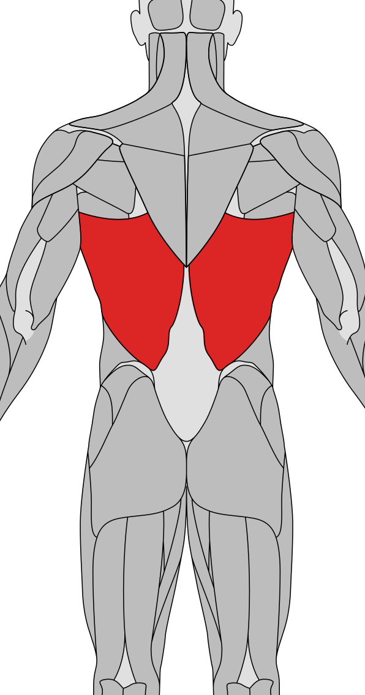

<table><tbody><tr><td width="50%" valign="top"><table><tbody><tr><th>#1 Pull-ups</th></tr><tr><td align="center"></td></tr><tr><td><b>Prescription: </b>3–4 sets × 6–12 <b>Rest: </b>90–180 sec <b>Primary: </b>Upper back <b>Secondary: </b>Biceps、Forearm <b>Why: </b>Top choice: stable, easy to progress, and clear target-muscle loading</td></tr></tbody></table></td><td width="50%" valign="top"><table><tbody><tr><th>#2 Neutral-grip lat pulldown</th></tr><tr><td align="center"></td></tr><tr><td><b>Prescription: </b>3–4 sets × 6–12 <b>Rest: </b>90–180 sec <b>Primary: </b>Upper back <b>Secondary: </b>Biceps <b>Why: </b>Preferred alternative: balances stimulus and comfort</td></tr></tbody></table></td></tr><tr><td width="50%" valign="top"><table><tbody><tr><th>#3 Straight-arm pulldown</th></tr><tr><td align="center"></td></tr><tr><td><b>Prescription: </b>2–4 sets × 10–20 <b>Rest: </b>60–90 sec <b>Primary: </b>Upper back <b>Secondary: </b>Triceps <b>Why: </b>Reliable option when equipment or exercise preference differs</td></tr></tbody></table></td><td width="50%" valign="top"><table><tbody><tr><th>#4 Cable pullover</th></tr><tr><td align="center"></td></tr><tr><td><b>Prescription: </b>2–4 sets × 10–20 <b>Rest: </b>60–90 sec <b>Primary: </b>Upper back <b>Secondary: </b>Chest、Triceps <b>Why: </b>Adds a different resistance curve or training angle</td></tr></tbody></table></td></tr></tbody></table>
<h3 align="center">Mid-Lower Trapezius / Rhomboids (Back Thickness)</h3>

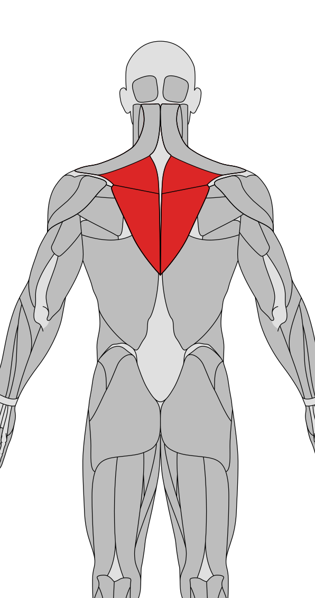

<table><tbody><tr><td width="50%" valign="top"><table><tbody><tr><th>#1 Seated cable row</th></tr><tr><td align="center"></td></tr><tr><td><b>Prescription: </b>3–4 sets × 6–12 <b>Rest: </b>90–180 sec <b>Primary: </b>Upper back、Trapezius <b>Secondary: </b>Biceps <b>Why: </b>Top choice: stable, easy to progress, and clear target-muscle loading</td></tr></tbody></table></td><td width="50%" valign="top"><table><tbody><tr><th>#2 T-bar row</th></tr><tr><td align="center"></td></tr><tr><td><b>Prescription: </b>3–4 sets × 6–12 <b>Rest: </b>90–180 sec <b>Primary: </b>Upper back <b>Secondary: </b>Biceps、Forearm、Trapezius <b>Why: </b>Preferred alternative: balances stimulus and comfort</td></tr></tbody></table></td></tr><tr><td width="50%" valign="top"><table><tbody><tr><th>#3 Seated row machine</th></tr><tr><td align="center"></td></tr><tr><td><b>Prescription: </b>3–4 sets × 6–12 <b>Rest: </b>90–180 sec <b>Primary: </b>Upper back、Trapezius <b>Secondary: </b>Biceps <b>Why: </b>Reliable option when equipment or exercise preference differs</td></tr></tbody></table></td><td width="50%" valign="top"><table><tbody><tr><th>#4 Bent-over barbell row</th></tr><tr><td align="center"></td></tr><tr><td><b>Prescription: </b>3–4 sets × 6–12 <b>Rest: </b>90–180 sec <b>Primary: </b>Upper back、Trapezius <b>Secondary: </b>Biceps <b>Why: </b>Adds a different resistance curve or training angle</td></tr></tbody></table></td></tr></tbody></table>
<h3 align="center">Upper Trapezius</h3>

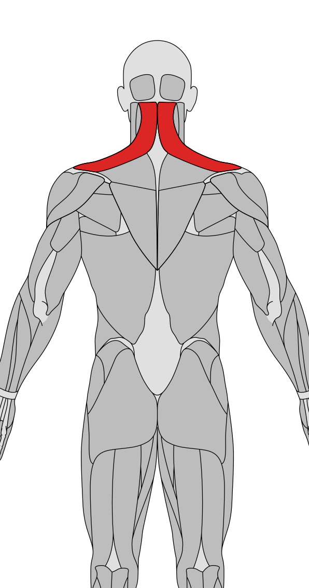

<table><tbody><tr><td width="50%" valign="top"><table><tbody><tr><th>#1 Dumbbell shrug</th></tr><tr><td align="center"></td></tr><tr><td><b>Prescription: </b>2–4 sets × 10–20 <b>Rest: </b>60–90 sec <b>Primary: </b>Trapezius <b>Secondary: </b>Shoulders <b>Why: </b>Top choice: stable, easy to progress, and clear target-muscle loading</td></tr></tbody></table></td><td width="50%" valign="top"><table><tbody><tr><th>#2 Barbell shrug</th></tr><tr><td align="center"></td></tr><tr><td><b>Prescription: </b>2–4 sets × 10–20 <b>Rest: </b>60–90 sec <b>Primary: </b>Trapezius <b>Secondary: </b>Forearm <b>Why: </b>Preferred alternative: balances stimulus and comfort</td></tr></tbody></table></td></tr><tr><td width="50%" valign="top"><table><tbody><tr><th>#3 Farmer's walk</th></tr><tr><td align="center"></td></tr><tr><td><b>Prescription: </b>3 sets × 30–60 sec <b>Rest: </b>90–120 sec <b>Primary: </b>Obliques <b>Secondary: </b>Trapezius、Forearm <b>Why: </b>Reliable option when equipment or exercise preference differs</td></tr></tbody></table></td><td width="50%" valign="top"><table><tbody><tr><th>#4 Deadlift</th></tr><tr><td align="center"></td></tr><tr><td><b>Prescription: </b>2–3 sets × 3–6 <b>Rest: </b>3–4 min <b>Primary: </b>Glutes、Hamstrings、Lower back <b>Secondary: </b>Quadriceps、Trapezius、Upper back、Forearm <b>Why: </b>Adds a different resistance curve or training angle</td></tr></tbody></table></td></tr></tbody></table>
<h3 align="center">Erector Spinae / Lumbar Stabilizers</h3>

<table><tbody><tr><td width="50%" valign="top"><table><tbody><tr><th>#1 Romanian deadlift</th></tr><tr><td align="center"></td></tr><tr><td><b>Prescription: </b>3–4 sets × 6–10 <b>Rest: </b>2–3 min <b>Primary: </b>Hamstrings、Glutes <b>Secondary: </b>Lower back、Forearm <b>Why: </b>Top choice: stable, easy to progress, and clear target-muscle loading</td></tr></tbody></table></td><td width="50%" valign="top"><table><tbody><tr><th>#2 Back extension</th></tr><tr><td align="center"></td></tr><tr><td><b>Prescription: </b>2–4 sets × 10–20 <b>Rest: </b>60–90 sec <b>Primary: </b>Lower back <b>Secondary: </b>Glutes、Hamstrings <b>Why: </b>Preferred alternative: balances stimulus and comfort</td></tr></tbody></table></td></tr><tr><td width="50%" valign="top"><table><tbody><tr><th>#3 Good morning</th></tr><tr><td align="center"></td></tr><tr><td><b>Prescription: </b>3–4 sets × 6–12 <b>Rest: </b>90–180 sec <b>Primary: </b>Hamstrings <b>Secondary: </b>Glutes、Lower back <b>Why: </b>Reliable option when equipment or exercise preference differs</td></tr></tbody></table></td><td width="50%" valign="top"><table><tbody><tr><th>#4 Deadlift</th></tr><tr><td align="center"></td></tr><tr><td><b>Prescription: </b>2–3 sets × 3–6 <b>Rest: </b>3–4 min <b>Primary: </b>Glutes、Hamstrings、Lower back <b>Secondary: </b>Quadriceps、Trapezius、Upper back、Forearm <b>Why: </b>Adds a different resistance curve or training angle</td></tr></tbody></table></td></tr></tbody></table>

<h2 align="center">Legs and Glutes</h2>
<h3 align="center">Quadriceps</h3>

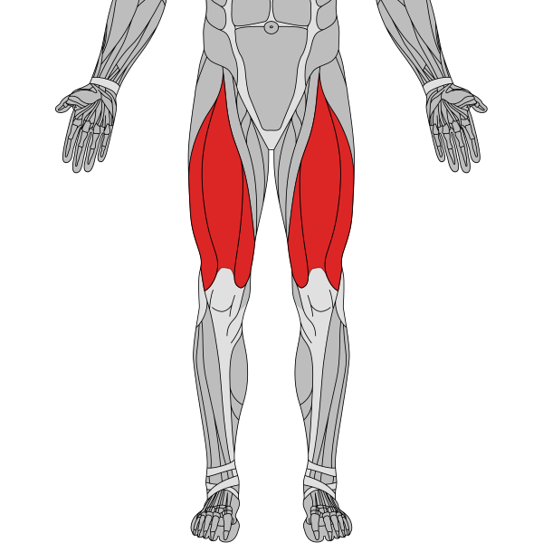

<table><tbody><tr><td width="50%" valign="top"><table><tbody><tr><th>#1 Barbell squat</th></tr><tr><td align="center"></td></tr><tr><td><b>Prescription: </b>3–4 sets × 5–10 <b>Rest: </b>2–3 min <b>Primary: </b>Quadriceps、Glutes <b>Secondary: </b>Hamstrings、Calves <b>Why: </b>Top choice: stable, easy to progress, and clear target-muscle loading</td></tr></tbody></table></td><td width="50%" valign="top"><table><tbody><tr><th>#2 Leg extension</th></tr><tr><td align="center"></td></tr><tr><td><b>Prescription: </b>2–4 sets × 10–20 <b>Rest: </b>60–90 sec <b>Primary: </b>Quadriceps <b>Secondary: </b>— <b>Why: </b>Preferred alternative: balances stimulus and comfort</td></tr></tbody></table></td></tr><tr><td width="50%" valign="top"><table><tbody><tr><th>#3 Sled hack squat (45°)</th></tr><tr><td align="center"></td></tr><tr><td><b>Prescription: </b>3–4 sets × 6–12 <b>Rest: </b>90–180 sec <b>Primary: </b>Quadriceps、Glutes <b>Secondary: </b>Hamstrings <b>Why: </b>Reliable option when equipment or exercise preference differs</td></tr></tbody></table></td><td width="50%" valign="top"><table><tbody><tr><th>#4 Leg press</th></tr><tr><td align="center"></td></tr><tr><td><b>Prescription: </b>3–4 sets × 6–12 <b>Rest: </b>90–180 sec <b>Primary: </b>Quadriceps、Glutes <b>Secondary: </b>Hamstrings、Calves <b>Why: </b>Adds a different resistance curve or training angle</td></tr></tbody></table></td></tr></tbody></table>
<h3 align="center">Hamstrings</h3>

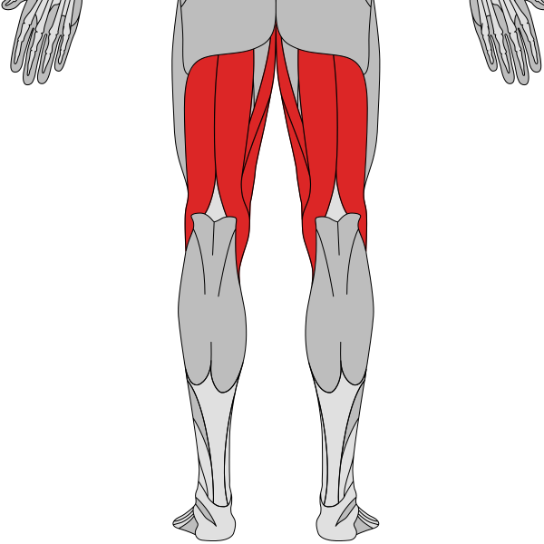

<table><tbody><tr><td width="50%" valign="top"><table><tbody><tr><th>#1 Seated leg curl</th></tr><tr><td align="center"></td></tr><tr><td><b>Prescription: </b>2–4 sets × 10–20 <b>Rest: </b>60–90 sec <b>Primary: </b>Hamstrings <b>Secondary: </b>Glutes <b>Why: </b>Top choice: stable, easy to progress, and clear target-muscle loading</td></tr></tbody></table></td><td width="50%" valign="top"><table><tbody><tr><th>#2 Romanian deadlift</th></tr><tr><td align="center"></td></tr><tr><td><b>Prescription: </b>3–4 sets × 6–10 <b>Rest: </b>2–3 min <b>Primary: </b>Hamstrings、Glutes <b>Secondary: </b>Lower back、Forearm <b>Why: </b>Preferred alternative: balances stimulus and comfort</td></tr></tbody></table></td></tr><tr><td width="50%" valign="top"><table><tbody><tr><th>#3 Nordic hamstring curl</th></tr><tr><td align="center"></td></tr><tr><td><b>Prescription: </b>2–3 sets × 4–8 <b>Rest: </b>2–3 min <b>Primary: </b>Hamstrings <b>Secondary: </b>Glutes <b>Why: </b>Reliable option when equipment or exercise preference differs</td></tr></tbody></table></td><td width="50%" valign="top"><table><tbody><tr><th>#4 Lying leg curl</th></tr><tr><td align="center"></td></tr><tr><td><b>Prescription: </b>2–4 sets × 10–20 <b>Rest: </b>60–90 sec <b>Primary: </b>Hamstrings <b>Secondary: </b>Glutes <b>Why: </b>Adds a different resistance curve or training angle</td></tr></tbody></table></td></tr></tbody></table>
<h3 align="center">Gluteus Maximus</h3>

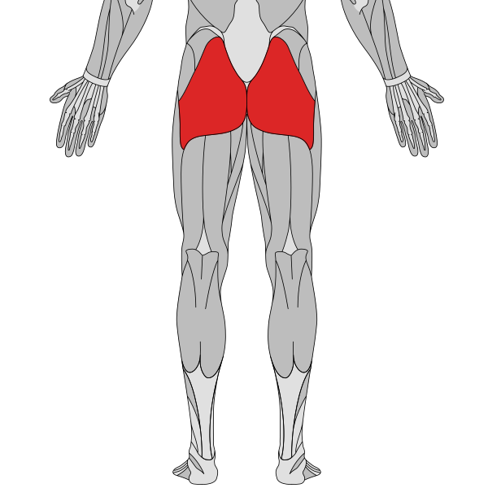

<table><tbody><tr><td width="50%" valign="top"><table><tbody><tr><th>#1 Barbell hip thrust</th></tr><tr><td align="center"></td></tr><tr><td><b>Prescription: </b>3–4 sets × 6–12 <b>Rest: </b>90–180 sec <b>Primary: </b>Glutes <b>Secondary: </b>Hamstrings <b>Why: </b>Top choice: stable, easy to progress, and clear target-muscle loading</td></tr></tbody></table></td><td width="50%" valign="top"><table><tbody><tr><th>#2 Barbell squat</th></tr><tr><td align="center"></td></tr><tr><td><b>Prescription: </b>3–4 sets × 5–10 <b>Rest: </b>2–3 min <b>Primary: </b>Quadriceps、Glutes <b>Secondary: </b>Hamstrings、Calves <b>Why: </b>Preferred alternative: balances stimulus and comfort</td></tr></tbody></table></td></tr><tr><td width="50%" valign="top"><table><tbody><tr><th>#3 Bulgarian split squat</th></tr><tr><td align="center"></td></tr><tr><td><b>Prescription: </b>3–4 sets × 6–12 <b>Rest: </b>90–180 sec <b>Primary: </b>Quadriceps、Glutes <b>Secondary: </b>Hamstrings <b>Why: </b>Reliable option when equipment or exercise preference differs</td></tr></tbody></table></td><td width="50%" valign="top"><table><tbody><tr><th>#4 Cable glute kickback</th></tr><tr><td align="center"></td></tr><tr><td><b>Prescription: </b>2–4 sets × 10–20 <b>Rest: </b>60–90 sec <b>Primary: </b>Glutes <b>Secondary: </b>Hamstrings <b>Why: </b>Adds a different resistance curve or training angle</td></tr></tbody></table></td></tr></tbody></table>
<h3 align="center">Gluteus Medius / Hip Abductors</h3>

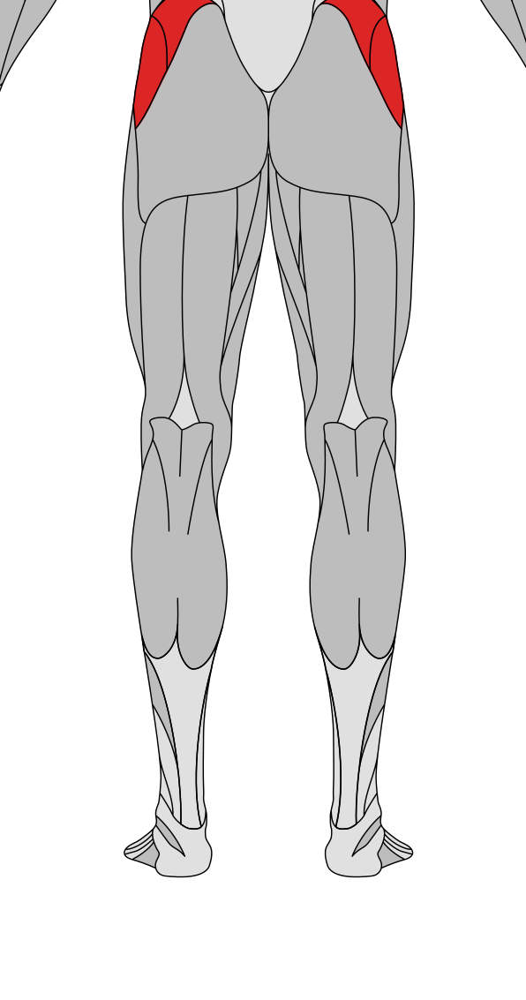

<table><tbody><tr><td width="50%" valign="top"><table><tbody><tr><th>#1 Cable hip abduction</th></tr><tr><td align="center"></td></tr><tr><td><b>Prescription: </b>2–4 sets × 10–20 <b>Rest: </b>60–90 sec <b>Primary: </b>Glutes <b>Secondary: </b>— <b>Why: </b>Top choice: stable, easy to progress, and clear target-muscle loading</td></tr></tbody></table></td><td width="50%" valign="top"><table><tbody><tr><th>#2 Hip abduction machine</th></tr><tr><td align="center"></td></tr><tr><td><b>Prescription: </b>2–4 sets × 10–20 <b>Rest: </b>60–90 sec <b>Primary: </b>Glutes <b>Secondary: </b>— <b>Why: </b>Preferred alternative: balances stimulus and comfort</td></tr></tbody></table></td></tr><tr><td width="50%" valign="top"><table><tbody><tr><th>#3 Bulgarian split squat</th></tr><tr><td align="center"></td></tr><tr><td><b>Prescription: </b>3–4 sets × 6–12 <b>Rest: </b>90–180 sec <b>Primary: </b>Quadriceps、Glutes <b>Secondary: </b>Hamstrings <b>Why: </b>Reliable option when equipment or exercise preference differs</td></tr></tbody></table></td><td width="50%" valign="top"><table><tbody><tr><th>#4 Side plank</th></tr><tr><td align="center"></td></tr><tr><td><b>Prescription: </b>3 sets × each side 30–60 sec <b>Rest: </b>45–60 sec <b>Primary: </b>Obliques <b>Secondary: </b>Abs <b>Why: </b>Adds a different resistance curve or training angle</td></tr></tbody></table></td></tr></tbody></table>
<h3 align="center">Hip Adductors</h3>

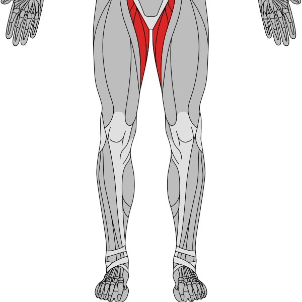

<table><tbody><tr><td width="50%" valign="top"><table><tbody><tr><th>#1 Hip adduction machine</th></tr><tr><td align="center"></td></tr><tr><td><b>Prescription: </b>2–4 sets × 10–20 <b>Rest: </b>60–90 sec <b>Primary: </b>Adductors <b>Secondary: </b>— <b>Why: </b>Top choice: stable, easy to progress, and clear target-muscle loading</td></tr></tbody></table></td><td width="50%" valign="top"><table><tbody><tr><th>#2 Sumo deadlift</th></tr><tr><td align="center"></td></tr><tr><td><b>Prescription: </b>3–4 sets × 6–12 <b>Rest: </b>90–180 sec <b>Primary: </b>Glutes、Hamstrings <b>Secondary: </b>Quadriceps、Adductors、Lower back <b>Why: </b>Preferred alternative: balances stimulus and comfort</td></tr></tbody></table></td></tr><tr><td width="50%" valign="top"><table><tbody><tr><th>#3 Barbell squat</th></tr><tr><td align="center"></td></tr><tr><td><b>Prescription: </b>3–4 sets × 5–10 <b>Rest: </b>2–3 min <b>Primary: </b>Quadriceps、Glutes <b>Secondary: </b>Hamstrings、Calves <b>Why: </b>Reliable option when equipment or exercise preference differs</td></tr></tbody></table></td><td width="50%" valign="top"><table><tbody><tr><th>#4 Goblet squat</th></tr><tr><td align="center"></td></tr><tr><td><b>Prescription: </b>3–4 sets × 6–12 <b>Rest: </b>90–180 sec <b>Primary: </b>Quadriceps、Glutes <b>Secondary: </b>Abs、Adductors <b>Why: </b>Adds a different resistance curve or training angle</td></tr></tbody></table></td></tr></tbody></table>
<h3 align="center">Gastrocnemius</h3>

<table><tbody><tr><td width="50%" valign="top"><table><tbody><tr><th>#1 Standing calf raise</th></tr><tr><td align="center"></td></tr><tr><td><b>Prescription: </b>2–4 sets × 10–20 <b>Rest: </b>60–90 sec <b>Primary: </b>Calves <b>Secondary: </b>— <b>Why: </b>Top choice: stable, easy to progress, and clear target-muscle loading</td></tr></tbody></table></td><td width="50%" valign="top"><table><tbody><tr><th>#2 Jump rope</th></tr><tr><td align="center"></td></tr><tr><td><b>Prescription: </b>3 sets × 45–90 sec <b>Rest: </b>45–60 sec <b>Primary: </b>Calves <b>Secondary: </b>Quadriceps、Shoulders <b>Why: </b>Preferred alternative: balances stimulus and comfort</td></tr></tbody></table></td></tr><tr><td width="50%" valign="top"><table><tbody><tr><th>#3 Stair climber</th></tr><tr><td align="center"></td></tr><tr><td><b>Prescription: </b>3 sets × 60–120 sec <b>Rest: </b>60 sec <b>Primary: </b>Quadriceps、Glutes <b>Secondary: </b>Hamstrings、Calves <b>Why: </b>Reliable option when equipment or exercise preference differs</td></tr></tbody></table></td><td width="50%"></td></tr></tbody></table>
<h3 align="center">Soleus</h3>

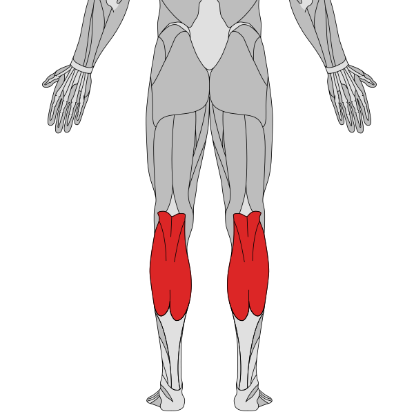

<table><tbody><tr><td width="50%" valign="top"><table><tbody><tr><th>#1 Seated calf raise</th></tr><tr><td align="center"></td></tr><tr><td><b>Prescription: </b>2–4 sets × 10–20 <b>Rest: </b>60–90 sec <b>Primary: </b>Calves <b>Secondary: </b>— <b>Why: </b>Top choice: stable, easy to progress, and clear target-muscle loading</td></tr></tbody></table></td><td width="50%" valign="top"><table><tbody><tr><th>#2 Stair climber</th></tr><tr><td align="center"></td></tr><tr><td><b>Prescription: </b>3 sets × 60–120 sec <b>Rest: </b>60 sec <b>Primary: </b>Quadriceps、Glutes <b>Secondary: </b>Hamstrings、Calves <b>Why: </b>Preferred alternative: balances stimulus and comfort</td></tr></tbody></table></td></tr><tr><td width="50%" valign="top"><table><tbody><tr><th>#3 Calf stretch against wall</th></tr><tr><td align="center"></td></tr><tr><td><b>Prescription: </b>2–4 sets × 10–20 <b>Rest: </b>60–90 sec <b>Primary: </b>Calves <b>Secondary: </b>— <b>Why: </b>Reliable option when equipment or exercise preference differs</td></tr></tbody></table></td><td width="50%"></td></tr></tbody></table>

<h2 align="center">Core</h2>
<h3 align="center">Rectus Abdominis</h3>

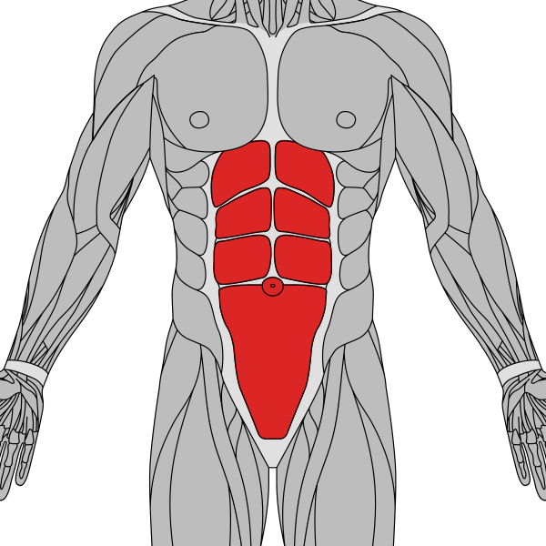

<table><tbody><tr><td width="50%" valign="top"><table><tbody><tr><th>#1 Cable crunch</th></tr><tr><td align="center"></td></tr><tr><td><b>Prescription: </b>2–4 sets × 10–20 <b>Rest: </b>60–90 sec <b>Primary: </b>Abs <b>Secondary: </b>— <b>Why: </b>Top choice: stable, easy to progress, and clear target-muscle loading</td></tr></tbody></table></td><td width="50%" valign="top"><table><tbody><tr><th>#2 Ab wheel rollout</th></tr><tr><td align="center"></td></tr><tr><td><b>Prescription: </b>3–4 sets × 6–12 <b>Rest: </b>90–180 sec <b>Primary: </b>Abs <b>Secondary: </b>Obliques <b>Why: </b>Preferred alternative: balances stimulus and comfort</td></tr></tbody></table></td></tr><tr><td width="50%" valign="top"><table><tbody><tr><th>#3 Hanging leg raise</th></tr><tr><td align="center"></td></tr><tr><td><b>Prescription: </b>3–4 sets × 6–12 <b>Rest: </b>90–180 sec <b>Primary: </b>Abs <b>Secondary: </b>Forearm、Obliques <b>Why: </b>Reliable option when equipment or exercise preference differs</td></tr></tbody></table></td><td width="50%" valign="top"><table><tbody><tr><th>#4 Abdominal crunch</th></tr><tr><td align="center"></td></tr><tr><td><b>Prescription: </b>2–4 sets × 10–20 <b>Rest: </b>60–90 sec <b>Primary: </b>Abs <b>Secondary: </b>— <b>Why: </b>Adds a different resistance curve or training angle</td></tr></tbody></table></td></tr></tbody></table>
<h3 align="center">Obliques / Anti-Rotation</h3>

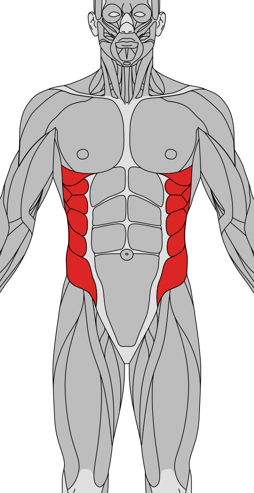

<table><tbody><tr><td width="50%" valign="top"><table><tbody><tr><th>#1 Pallof press</th></tr><tr><td align="center"></td></tr><tr><td><b>Prescription: </b>3 sets × each side 10–15 <b>Rest: </b>45–60 sec <b>Primary: </b>Obliques <b>Secondary: </b>Abs、Shoulders <b>Why: </b>Top choice: stable, easy to progress, and clear target-muscle loading</td></tr></tbody></table></td><td width="50%" valign="top"><table><tbody><tr><th>#2 Cable woodchopper</th></tr><tr><td align="center"></td></tr><tr><td><b>Prescription: </b>2–4 sets × 10–20 <b>Rest: </b>60–90 sec <b>Primary: </b>Obliques <b>Secondary: </b>Abs <b>Why: </b>Preferred alternative: balances stimulus and comfort</td></tr></tbody></table></td></tr><tr><td width="50%" valign="top"><table><tbody><tr><th>#3 Side plank</th></tr><tr><td align="center"></td></tr><tr><td><b>Prescription: </b>3 sets × each side 30–60 sec <b>Rest: </b>45–60 sec <b>Primary: </b>Obliques <b>Secondary: </b>Abs <b>Why: </b>Reliable option when equipment or exercise preference differs</td></tr></tbody></table></td><td width="50%" valign="top"><table><tbody><tr><th>#4 Russian twist</th></tr><tr><td align="center"></td></tr><tr><td><b>Prescription: </b>2–4 sets × 10–20 <b>Rest: </b>60–90 sec <b>Primary: </b>Obliques、Abs <b>Secondary: </b>— <b>Why: </b>Adds a different resistance curve or training angle</td></tr></tbody></table></td></tr></tbody></table>
<h3 align="center">Deep Core / Anti-Extension</h3>

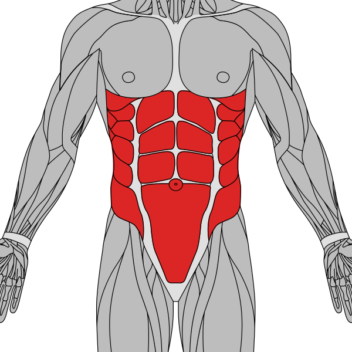

<table><tbody><tr><td width="50%" valign="top"><table><tbody><tr><th>#1 Dead bug</th></tr><tr><td align="center"></td></tr><tr><td><b>Prescription: </b>3 sets × each side 8–15 <b>Rest: </b>45–60 sec <b>Primary: </b>Abs <b>Secondary: </b>Lower back <b>Why: </b>Top choice: stable, easy to progress, and clear target-muscle loading</td></tr></tbody></table></td><td width="50%" valign="top"><table><tbody><tr><th>#2 Ab wheel rollout</th></tr><tr><td align="center"></td></tr><tr><td><b>Prescription: </b>3–4 sets × 6–12 <b>Rest: </b>90–180 sec <b>Primary: </b>Abs <b>Secondary: </b>Obliques <b>Why: </b>Preferred alternative: balances stimulus and comfort</td></tr></tbody></table></td></tr><tr><td width="50%" valign="top"><table><tbody><tr><th>#3 Plank</th></tr><tr><td align="center"></td></tr><tr><td><b>Prescription: </b>3 sets × 30–60 sec <b>Rest: </b>45–60 sec <b>Primary: </b>Abs <b>Secondary: </b>Obliques、Lower back <b>Why: </b>Reliable option when equipment or exercise preference differs</td></tr></tbody></table></td><td width="50%" valign="top"><table><tbody><tr><th>#4 Bird dog</th></tr><tr><td align="center"></td></tr><tr><td><b>Prescription: </b>3 sets × each side 8–15 <b>Rest: </b>45–60 sec <b>Primary: </b>Abs <b>Secondary: </b>Lower back、Glutes <b>Why: </b>Adds a different resistance curve or training angle</td></tr></tbody></table></td></tr></tbody></table>

<h1 align="center">Section 2: Targeted Warm-up Library</h1>

Use this section to find warm-ups by region. It prioritizes mat-based dynamic work, foam rollers or massage balls, bands, single-plate cable work, and empty-bar drills. Select only a few relevant movements per session.

<h3 align="center">Thoracic Spine / Upper Back</h3>

<table><tbody><tr><td width="50%" valign="top"><table><tbody><tr><th>#1 Thoracic extension over bench</th></tr><tr><td align="center"></td></tr><tr><td><b>Equipment: </b>Exercise mat / bench <b>Dose: </b>1–2 × 8–12 <b>Intensity: </b>Keep it easy; no failure or significant burn <b>Purpose: </b>Improve mobility, control, or movement feel in this region</td></tr></tbody></table></td><td width="50%" valign="top"><table><tbody><tr><th>#2 Open book stretch</th></tr><tr><td align="center"></td></tr><tr><td><b>Equipment: </b>Exercise mat <b>Dose: </b>1 × each side 8–12 <b>Intensity: </b>Keep it easy; no failure or significant burn <b>Purpose: </b>Improve mobility, control, or movement feel in this region</td></tr></tbody></table></td></tr><tr><td width="50%" valign="top"><table><tbody><tr><th>#3 Quadruped thoracic rotation</th></tr><tr><td align="center"></td></tr><tr><td><b>Equipment: </b>Exercise mat <b>Dose: </b>1 × each side 8–12 <b>Intensity: </b>Keep it easy; no failure or significant burn <b>Purpose: </b>Improve mobility, control, or movement feel in this region</td></tr></tbody></table></td><td width="50%" valign="top"><table><tbody><tr><th>#4 Cat-cow</th></tr><tr><td align="center"></td></tr><tr><td><b>Equipment: </b>Exercise mat <b>Dose: </b>1 × 8–12 <b>Intensity: </b>Keep it easy; no failure or significant burn <b>Purpose: </b>Improve mobility, control, or movement feel in this region</td></tr></tbody></table></td></tr></tbody></table>
<h3 align="center">Scapula / Rotator Cuff</h3>

<table><tbody><tr><td width="50%" valign="top"><table><tbody><tr><th>#1 Face pull</th></tr><tr><td align="center"></td></tr><tr><td><b>Equipment: </b>Cable station <b>Dose: </b>1–2 × 12–20 <b>Intensity: </b>Keep it easy; no failure or significant burn <b>Purpose: </b>Improve mobility, control, or movement feel in this region</td></tr></tbody></table></td><td width="50%" valign="top"><table><tbody><tr><th>#2 Y-T-W raise on incline bench</th></tr><tr><td align="center"></td></tr><tr><td><b>Equipment: </b>Exercise mat / incline bench <b>Dose: </b>1 x 6-10 per position <b>Intensity: </b>Keep it easy; no failure or significant burn <b>Purpose: </b>Improve mobility, control, or movement feel in this region</td></tr></tbody></table></td></tr><tr><td width="50%" valign="top"><table><tbody><tr><th>#3 Reverse fly</th></tr><tr><td align="center"></td></tr><tr><td><b>Equipment: </b>Cable station / reverse pec deck <b>Dose: </b>1 × 12–20 <b>Intensity: </b>Keep it easy; no failure or significant burn <b>Purpose: </b>Improve mobility, control, or movement feel in this region</td></tr></tbody></table></td><td width="50%" valign="top"><table><tbody><tr><th>#4 Cable lateral raises</th></tr><tr><td align="center"></td></tr><tr><td><b>Equipment: </b>Cable station <b>Dose: </b>1 × each side 12–15 <b>Intensity: </b>Keep it easy; no failure or significant burn <b>Purpose: </b>Improve mobility, control, or movement feel in this region</td></tr></tbody></table></td></tr></tbody></table>
<h3 align="center">Anterior Chest / Shoulder</h3>

<table><tbody><tr><td width="50%" valign="top"><table><tbody><tr><th>#1 Doorway chest stretch</th></tr><tr><td align="center"></td></tr><tr><td><b>Equipment: </b>Doorframe / upright <b>Dose: </b>1 × each side 8–12 <b>Intensity: </b>Keep it easy; no failure or significant burn <b>Purpose: </b>Improve mobility, control, or movement feel in this region</td></tr></tbody></table></td><td width="50%" valign="top"><table><tbody><tr><th>#2 Low cable fly (low-to-high)</th></tr><tr><td align="center"></td></tr><tr><td><b>Equipment: </b>Cable station <b>Dose: </b>1 × 12–15 <b>Intensity: </b>Keep it easy; no failure or significant burn <b>Purpose: </b>Improve mobility, control, or movement feel in this region</td></tr></tbody></table></td></tr><tr><td width="50%" valign="top"><table><tbody><tr><th>#3 Cable shoulder press</th></tr><tr><td align="center"></td></tr><tr><td><b>Equipment: </b>Cable station <b>Dose: </b>1 × 10–15 <b>Intensity: </b>Keep it easy; no failure or significant burn <b>Purpose: </b>Improve mobility, control, or movement feel in this region</td></tr></tbody></table></td><td width="50%" valign="top"><table><tbody><tr><th>#4 Push-ups</th></tr><tr><td align="center"></td></tr><tr><td><b>Equipment: </b>Exercise mat <b>Dose: </b>1 × 6–12 <b>Intensity: </b>Keep it easy; no failure or significant burn <b>Purpose: </b>Improve mobility, control, or movement feel in this region</td></tr></tbody></table></td></tr></tbody></table>
<h3 align="center">Lats / Scapular Depression</h3>

<table><tbody><tr><td width="50%" valign="top"><table><tbody><tr><th>#1 Straight-arm pulldown</th></tr><tr><td align="center"></td></tr><tr><td><b>Equipment: </b>Cable station <b>Dose: </b>1–2 × 12–15 <b>Intensity: </b>Keep it easy; no failure or significant burn <b>Purpose: </b>Improve mobility, control, or movement feel in this region</td></tr></tbody></table></td><td width="50%" valign="top"><table><tbody><tr><th>#2 Cable pullover</th></tr><tr><td align="center"></td></tr><tr><td><b>Equipment: </b>Cable station <b>Dose: </b>1 × 12–15 <b>Intensity: </b>Keep it easy; no failure or significant burn <b>Purpose: </b>Improve mobility, control, or movement feel in this region</td></tr></tbody></table></td></tr><tr><td width="50%" valign="top"><table><tbody><tr><th>#3 Neutral-grip lat pulldown</th></tr><tr><td align="center"></td></tr><tr><td><b>Equipment: </b>Lat pulldown machine <b>Dose: </b>1 × 10–12 <b>Intensity: </b>Keep it easy; no failure or significant burn <b>Purpose: </b>Improve mobility, control, or movement feel in this region</td></tr></tbody></table></td><td width="50%" valign="top"><table><tbody><tr><th>#4 Seated cable row</th></tr><tr><td align="center"></td></tr><tr><td><b>Equipment: </b>Cable station <b>Dose: </b>1 × 12–15 <b>Intensity: </b>Keep it easy; no failure or significant burn <b>Purpose: </b>Improve mobility, control, or movement feel in this region</td></tr></tbody></table></td></tr></tbody></table>
<h3 align="center">Hips / Glutes</h3>

<table><tbody><tr><td width="50%" valign="top"><table><tbody><tr><th>#1 90/90 hip switch</th></tr><tr><td align="center"></td></tr><tr><td><b>Equipment: </b>Exercise mat <b>Dose: </b>1 × each side 6–10 <b>Intensity: </b>Keep it easy; no failure or significant burn <b>Purpose: </b>Improve mobility, control, or movement feel in this region</td></tr></tbody></table></td><td width="50%" valign="top"><table><tbody><tr><th>#2 Figure-4 glute stretch</th></tr><tr><td align="center"></td></tr><tr><td><b>Equipment: </b>Exercise mat <b>Dose: </b>1 × each side 8–12 <b>Intensity: </b>Keep it easy; no failure or significant burn <b>Purpose: </b>Improve mobility, control, or movement feel in this region</td></tr></tbody></table></td></tr><tr><td width="50%" valign="top"><table><tbody><tr><th>#3 Glute bridge</th></tr><tr><td align="center"></td></tr><tr><td><b>Equipment: </b>Exercise mat / resistance band <b>Dose: </b>1–2 × 10–15 <b>Intensity: </b>Keep it easy; no failure or significant burn <b>Purpose: </b>Improve mobility, control, or movement feel in this region</td></tr></tbody></table></td><td width="50%" valign="top"><table><tbody><tr><th>#4 Cable hip abduction</th></tr><tr><td align="center"></td></tr><tr><td><b>Equipment: </b>Cable station <b>Dose: </b>1 × each side 12–15 <b>Intensity: </b>Keep it easy; no failure or significant burn <b>Purpose: </b>Improve mobility, control, or movement feel in this region</td></tr></tbody></table></td></tr></tbody></table>
<h3 align="center">Quadriceps / Knees</h3>

<table><tbody><tr><td width="50%" valign="top"><table><tbody><tr><th>#1 Foam-roll quadriceps</th></tr><tr><td align="center">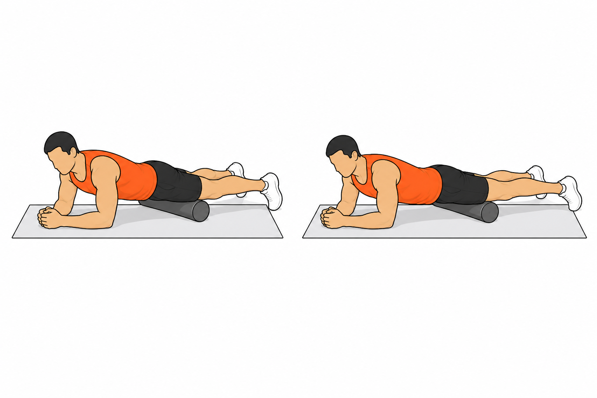</td></tr><tr><td><b>Equipment: </b>Foam roller + exercise mat <b>Dose: </b>each side 30–45 sec <b>Intensity: </b>Keep it easy; no failure or significant burn <b>Purpose: </b>Improve mobility, control, or movement feel in this region</td></tr></tbody></table></td><td width="50%" valign="top"><table><tbody><tr><th>#2 Leg extension</th></tr><tr><td align="center"></td></tr><tr><td><b>Equipment: </b>Leg extension machine <b>Dose: </b>1 × 12–15 <b>Intensity: </b>Keep it easy; no failure or significant burn <b>Purpose: </b>Improve mobility, control, or movement feel in this region</td></tr></tbody></table></td></tr><tr><td width="50%" valign="top"><table><tbody><tr><th>#3 Goblet squat</th></tr><tr><td align="center"></td></tr><tr><td><b>Equipment: </b>Dumbbell / kettlebell <b>Dose: </b>1 × 8–12 <b>Intensity: </b>Keep it easy; no failure or significant burn <b>Purpose: </b>Improve mobility, control, or movement feel in this region</td></tr></tbody></table></td><td width="50%" valign="top"><table><tbody><tr><th>#4 Barbell squat</th></tr><tr><td align="center"></td></tr><tr><td><b>Equipment: </b>Squat rack <b>Dose: </b>1 × 8–12 <b>Intensity: </b>Keep it easy; no failure or significant burn <b>Purpose: </b>Improve mobility, control, or movement feel in this region</td></tr></tbody></table></td></tr></tbody></table>
<h3 align="center">Hamstrings / Hip Hinge</h3>

<table><tbody><tr><td width="50%" valign="top"><table><tbody><tr><th>#1 Supine hamstring stretch</th></tr><tr><td align="center"></td></tr><tr><td><b>Equipment: </b>Exercise mat / resistance band <b>Dose: </b>1 × each side 8–12 <b>Intensity: </b>Keep it easy; no failure or significant burn <b>Purpose: </b>Improve mobility, control, or movement feel in this region</td></tr></tbody></table></td><td width="50%" valign="top"><table><tbody><tr><th>#2 Hip hinge with dowel</th></tr><tr><td align="center"></td></tr><tr><td><b>Equipment: </b>Dowel / PVC pipe <b>Dose: </b>1 × 8–12 <b>Intensity: </b>Keep it easy; no failure or significant burn <b>Purpose: </b>Improve mobility, control, or movement feel in this region</td></tr></tbody></table></td></tr><tr><td width="50%" valign="top"><table><tbody><tr><th>#3 Seated leg curl</th></tr><tr><td align="center"></td></tr><tr><td><b>Equipment: </b>Leg curl machine <b>Dose: </b>1 × 12–15 <b>Intensity: </b>Keep it easy; no failure or significant burn <b>Purpose: </b>Improve mobility, control, or movement feel in this region</td></tr></tbody></table></td><td width="50%" valign="top"><table><tbody><tr><th>#4 Romanian deadlift</th></tr><tr><td align="center"></td></tr><tr><td><b>Equipment: </b>Empty bar <b>Dose: </b>1 × 8–10 <b>Intensity: </b>Keep it easy; no failure or significant burn <b>Purpose: </b>Improve mobility, control, or movement feel in this region</td></tr></tbody></table></td></tr></tbody></table>
<h3 align="center">Ankles / Calves</h3>

<table><tbody><tr><td width="50%" valign="top"><table><tbody><tr><th>#1 Ankle dorsiflexion at wall</th></tr><tr><td align="center"></td></tr><tr><td><b>Equipment: </b>Wall / resistance band <b>Dose: </b>1 × each side 10–15 <b>Intensity: </b>Keep it easy; no failure or significant burn <b>Purpose: </b>Improve mobility, control, or movement feel in this region</td></tr></tbody></table></td><td width="50%" valign="top"><table><tbody><tr><th>#2 Calf stretch against wall</th></tr><tr><td align="center"></td></tr><tr><td><b>Equipment: </b>Wall <b>Dose: </b>1 × each side 8–12 <b>Intensity: </b>Keep it easy; no failure or significant burn <b>Purpose: </b>Improve mobility, control, or movement feel in this region</td></tr></tbody></table></td></tr><tr><td width="50%" valign="top"><table><tbody><tr><th>#3 Standing calf raise</th></tr><tr><td align="center"></td></tr><tr><td><b>Equipment: </b>Step / floor <b>Dose: </b>1 × 12–15 <b>Intensity: </b>Keep it easy; no failure or significant burn <b>Purpose: </b>Improve mobility, control, or movement feel in this region</td></tr></tbody></table></td><td width="50%" valign="top"><table><tbody><tr><th>#4 Massage-ball plantar fascia roll</th></tr><tr><td align="center">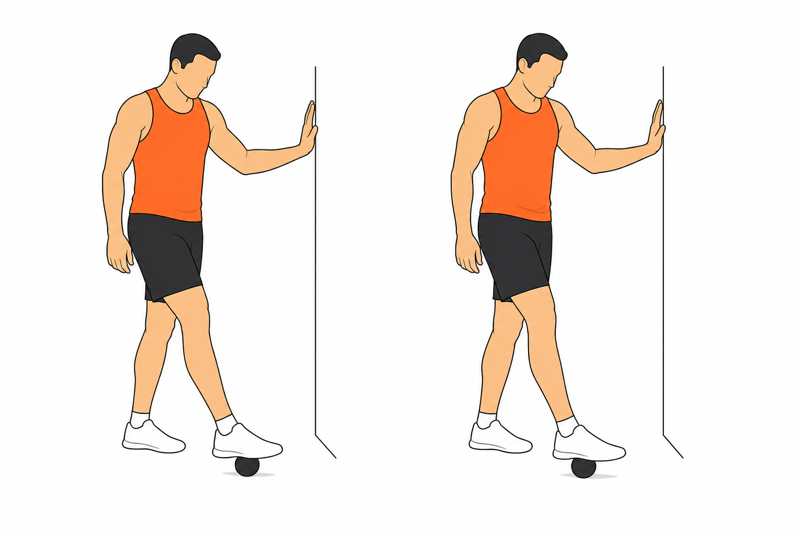</td></tr><tr><td><b>Equipment: </b>Massage ball / tennis ball <b>Dose: </b>each side 30–45 sec <b>Intensity: </b>Keep it easy; no failure or significant burn <b>Purpose: </b>Improve mobility, control, or movement feel in this region</td></tr></tbody></table></td></tr></tbody></table>
<h3 align="center">Core / Lumbar Stability</h3>

<table><tbody><tr><td width="50%" valign="top"><table><tbody><tr><th>#1 Dead bug</th></tr><tr><td align="center"></td></tr><tr><td><b>Equipment: </b>Exercise mat <b>Dose: </b>1 × each side 6–10 <b>Intensity: </b>Keep it easy; no failure or significant burn <b>Purpose: </b>Improve mobility, control, or movement feel in this region</td></tr></tbody></table></td><td width="50%" valign="top"><table><tbody><tr><th>#2 Bird dog</th></tr><tr><td align="center"></td></tr><tr><td><b>Equipment: </b>Exercise mat <b>Dose: </b>1 × each side 6–10 <b>Intensity: </b>Keep it easy; no failure or significant burn <b>Purpose: </b>Improve mobility, control, or movement feel in this region</td></tr></tbody></table></td></tr><tr><td width="50%" valign="top"><table><tbody><tr><th>#3 Pallof press</th></tr><tr><td align="center"></td></tr><tr><td><b>Equipment: </b>Cable station / resistance band <b>Dose: </b>1 × each side 8–12 <b>Intensity: </b>Keep it easy; no failure or significant burn <b>Purpose: </b>Improve mobility, control, or movement feel in this region</td></tr></tbody></table></td><td width="50%" valign="top"><table><tbody><tr><th>#4 Plank</th></tr><tr><td align="center"></td></tr><tr><td><b>Equipment: </b>Exercise mat <b>Dose: </b>1 × 20–30 sec <b>Intensity: </b>Keep it easy; no failure or significant burn <b>Purpose: </b>Improve mobility, control, or movement feel in this region</td></tr></tbody></table></td></tr></tbody></table>
<h1 align="center">Section 3: 5-Day PPL Plan</h1>

Weekly structure: Push A / Pull A / Legs / Rest / Push B / Pull B / Rest. The two Push and Pull sessions intentionally retain productive overlap instead of forcing unnecessary variation.

<table><thead><tr><th>Day</th><th>Training</th><th>Focus</th></tr></thead><tbody>
<tr><td>Monday</td><td>Push A</td><td>Flat bench press + lateral delts + triceps long head</td></tr><tr><td>Tuesday</td><td>Pull A</td><td>Vertical pull + back thickness + biceps</td></tr><tr><td>Wednesday</td><td>Legs</td><td>Complete quadriceps, hamstring, glute, and calf coverage</td></tr><tr><td>Thursday</td><td>Rest</td><td>Recovery, walking, or light activity</td></tr><tr><td>Friday</td><td>Push B</td><td>Upper chest + shoulder press + triceps</td></tr><tr><td>Saturday</td><td>Pull B</td><td>Lats + upper back + rear delts + biceps</td></tr><tr><td>Sunday</td><td>Rest</td><td>Recovery</td></tr>
</tbody></table>

<h2 align="center">Ab / Core Finisher Rotation</h2>

Train core after the strength work on all five training days. Use one emphasis per session to avoid turning ab work into a high-fatigue block that interferes with compound-lift recovery.

<table><thead><tr><th>Training Day</th><th>Core Exercise</th><th>Training Emphasis</th><th>Prescription</th></tr></thead><tbody>
<tr><td>Push A</td><td>Cable crunch</td><td align="center"></td><td>Loaded spinal flexion</td><td>3 × 10–15</td></tr>
<tr><td>Pull A</td><td>Pallof press</td><td align="center"></td><td>Anti-rotation</td><td>3 × each side 10–15</td></tr>
<tr><td>Legs</td><td>Dead bug</td><td align="center"></td><td>Low-fatigue anti-extension</td><td>2 × each side 8–12</td></tr>
<tr><td>Push B</td><td>Hanging leg raise</td><td align="center"></td><td>Posterior pelvic tilt / hip-flexion control</td><td>3 × 8–15</td></tr>
<tr><td>Pull B</td><td>Ab wheel rollout</td><td align="center"></td><td>High-tension anti-extension</td><td>3 × 6–12</td></tr>
</tbody></table>

<h2 align="center">Push A</h2>
<table><thead><tr><th colspan="5">Targeted warm-up (about 8-12 min)</th></tr><tr><th>#</th><th>Exercise</th><th>Illustration</th><th>Dose</th><th>Purpose</th></tr></thead><tbody><tr><td>1</td><td>Thoracic extension over bench</td><td align="center"></td><td>1 × 8–12</td><td>Open thoracic extension</td></tr><tr><td>2</td><td>Face pull</td><td align="center"></td><td>1 × 15–20</td><td>Rotator-cuff and scapular control</td></tr><tr><td>3</td><td>Low cable fly (low-to-high)</td><td align="center"></td><td>1 × 12–15</td><td>Establish chest contraction</td></tr><tr><td>4</td><td>Barbell bench press</td><td align="center"></td><td>Empty bar 10-15; 50% x 6-8; 70% x 3-5; if needed, 80% x 1-3</td><td>Practice the working movement well away from failure</td></tr></tbody></table>
<table><thead><tr><th>#</th><th>Exercise</th><th>Illustration</th><th>Working Sets x Reps</th><th>Rest</th><th>RIR</th></tr></thead><tbody>
<tr><td>1</td><td>Barbell bench press</td><td align="center"></td><td>4 × 5–8</td><td>2–3 min</td><td>2</td></tr><tr><td>2</td><td>Incline dumbbell press</td><td align="center"></td><td>3 × 8–12</td><td>2 min</td><td>1–2</td></tr><tr><td>3</td><td>Cable lateral raises</td><td align="center"></td><td>4 × 12–20</td><td>60–90 sec</td><td>0–2</td></tr><tr><td>4</td><td>Cable overhead triceps extension</td><td align="center"></td><td>3 × 10–15</td><td>60–90 sec</td><td>0–2</td></tr><tr><td>5</td><td>Triceps pushdown</td><td align="center"></td><td>2 × 10–15</td><td>60–90 sec</td><td>0–1</td></tr><tr><td>6</td><td>Cable crunch</td><td align="center"></td><td>3 × 10–15</td><td>60 sec</td><td>1–2</td></tr>
</tbody></table>
<h2 align="center">Pull A</h2>
<table><thead><tr><th colspan="5">Targeted warm-up (about 8-12 min)</th></tr><tr><th>#</th><th>Exercise</th><th>Illustration</th><th>Dose</th><th>Purpose</th></tr></thead><tbody><tr><td>1</td><td>Quadruped thoracic rotation</td><td align="center"></td><td>1 × each side 8–10</td><td>Restore thoracic rotation</td></tr><tr><td>2</td><td>Straight-arm pulldown</td><td align="center"></td><td>1 × 12–15</td><td>Lat engagement and scapular depression</td></tr><tr><td>3</td><td>Seated cable row</td><td align="center"></td><td>1 × 12–15</td><td>Upper-back retraction control</td></tr><tr><td>4</td><td>Neutral-grip lat pulldown</td><td align="center"></td><td>Light load x 12; about 60% x 6-8; about 75% x 3-5</td><td>Keep biceps and grip fresh before working sets</td></tr></tbody></table>
<table><thead><tr><th>#</th><th>Exercise</th><th>Illustration</th><th>Working Sets x Reps</th><th>Rest</th><th>RIR</th></tr></thead><tbody>
<tr><td>1</td><td>Pull-ups</td><td align="center"></td><td>4 × 6–10</td><td>2 min</td><td>1–2</td></tr><tr><td>2</td><td>T-bar row</td><td align="center"></td><td>4 × 6–12</td><td>2 min</td><td>1–2</td></tr><tr><td>3</td><td>Straight-arm pulldown</td><td align="center"></td><td>3 × 10–15</td><td>60–90 sec</td><td>1–2</td></tr><tr><td>4</td><td>Reverse fly</td><td align="center"></td><td>3 × 12–20</td><td>60–90 sec</td><td>0–2</td></tr><tr><td>5</td><td>Preacher curl</td><td align="center"></td><td>3 × 8–12</td><td>60–90 sec</td><td>0–2</td></tr><tr><td>6</td><td>Dumbbell hammer curl</td><td align="center"></td><td>2 × 10–15</td><td>60–90 sec</td><td>0–2</td></tr><tr><td>7</td><td>Pallof press</td><td align="center"></td><td>3 × each side 10–15</td><td>45–60 sec</td><td>2</td></tr>
</tbody></table>
<h2 align="center">Legs</h2>
<table><thead><tr><th colspan="5">Targeted warm-up (about 10-15 min)</th></tr><tr><th>#</th><th>Exercise</th><th>Illustration</th><th>Dose</th><th>Purpose</th></tr></thead><tbody><tr><td>1</td><td>Foam-roll quadriceps</td><td align="center"></td><td>each side 30–45 sec</td><td>Address only clearly tight areas; do not roll for long periods</td></tr><tr><td>2</td><td>90/90 hip switch</td><td align="center"></td><td>1 × each side 6–10</td><td>Prepare hip internal and external rotation</td></tr><tr><td>3</td><td>Ankle dorsiflexion at wall</td><td align="center"></td><td>1 × each side 10–15</td><td>Prepare ankle mobility for squat depth</td></tr><tr><td>4</td><td>Seated leg curl</td><td align="center"></td><td>1 × 12–15</td><td>Warm the hamstrings and posterior knee</td></tr><tr><td>5</td><td>Barbell squat</td><td align="center"></td><td>Empty bar 10-15; 50% x 6-8; 70% x 3-5; if needed, 80% x 1-3</td><td>Practice stance, depth, and bracing</td></tr></tbody></table>
<table><thead><tr><th>#</th><th>Exercise</th><th>Illustration</th><th>Working Sets x Reps</th><th>Rest</th><th>RIR</th></tr></thead><tbody>
<tr><td>1</td><td>Barbell squat</td><td align="center"></td><td>4 × 5–8</td><td>2–3 min</td><td>2</td></tr><tr><td>2</td><td>Romanian deadlift</td><td align="center"></td><td>3 × 6–10</td><td>2–3 min</td><td>1–2</td></tr><tr><td>3</td><td>Leg extension</td><td align="center"></td><td>3 × 10–15</td><td>60–90 sec</td><td>0–2</td></tr><tr><td>4</td><td>Seated leg curl</td><td align="center"></td><td>3 × 8–15</td><td>60–90 sec</td><td>0–2</td></tr><tr><td>5</td><td>Barbell hip thrust</td><td align="center"></td><td>3 × 8–12</td><td>90–120 sec</td><td>1–2</td></tr><tr><td>6</td><td>Standing calf raise</td><td align="center"></td><td>3 × 8–15</td><td>60–90 sec</td><td>0–2</td></tr><tr><td>7</td><td>Seated calf raise</td><td align="center"></td><td>3 × 12–20</td><td>60–90 sec</td><td>0–2</td></tr><tr><td>8</td><td>Dead bug</td><td align="center"></td><td>2 × each side 8–12</td><td>45–60 sec</td><td>Keep every rep controlled</td></tr>
</tbody></table>
<h2 align="center">Push B</h2>
<table><thead><tr><th colspan="5">Targeted warm-up (about 8-12 min)</th></tr><tr><th>#</th><th>Exercise</th><th>Illustration</th><th>Dose</th><th>Purpose</th></tr></thead><tbody><tr><td>1</td><td>Open book stretch</td><td align="center"></td><td>1 × each side 8–10</td><td>Mobilize the thoracic spine and anterior chest/shoulder</td></tr><tr><td>2</td><td>Y-T-W raise on incline bench</td><td align="center"></td><td>1 x 6-8 per position</td><td>Prepare lower traps, rear delts, and rotator cuff</td></tr><tr><td>3</td><td>Cable shoulder press</td><td align="center"></td><td>1 × 10–15</td><td>Find a smooth scapular upward-rotation path under light load</td></tr><tr><td>4</td><td>Incline dumbbell press</td><td align="center"></td><td>Light dumbbells x 10-12; about 60% x 6-8; about 75% x 3-5</td><td>Practice the first working exercise</td></tr></tbody></table>
<table><thead><tr><th>#</th><th>Exercise</th><th>Illustration</th><th>Working Sets x Reps</th><th>Rest</th><th>RIR</th></tr></thead><tbody>
<tr><td>1</td><td>Incline dumbbell press</td><td align="center"></td><td>4 × 6–10</td><td>2–3 min</td><td>1–2</td></tr><tr><td>2</td><td>Seated dumbbell shoulder press</td><td align="center"></td><td>3 × 6–10</td><td>2 min</td><td>1–2</td></tr><tr><td>3</td><td>Machine chest fly (pec deck)</td><td align="center"></td><td>3 × 10–15</td><td>60–90 sec</td><td>0–2</td></tr><tr><td>4</td><td>Dumbbell lateral raises</td><td align="center"></td><td>4 × 12–20</td><td>60–90 sec</td><td>0–2</td></tr><tr><td>5</td><td>Lying triceps extension (skull crusher)</td><td align="center"></td><td>3 × 8–12</td><td>60–90 sec</td><td>0–2</td></tr><tr><td>6</td><td>Triceps pushdown</td><td align="center"></td><td>2 × 12–20</td><td>60 sec</td><td>0–1</td></tr><tr><td>7</td><td>Hanging leg raise</td><td align="center"></td><td>3 × 8–15</td><td>60–90 sec</td><td>1–2</td></tr>
</tbody></table>
<h2 align="center">Pull B</h2>
<table><thead><tr><th colspan="5">Targeted warm-up (about 8-12 min)</th></tr><tr><th>#</th><th>Exercise</th><th>Illustration</th><th>Dose</th><th>Purpose</th></tr></thead><tbody><tr><td>1</td><td>Cat-cow</td><td align="center"></td><td>1 × 8–12</td><td>Segmental spinal mobility</td></tr><tr><td>2</td><td>Face pull</td><td align="center"></td><td>1 × 15–20</td><td>Prepare rear delts, rotator cuff, and upper back</td></tr><tr><td>3</td><td>Straight-arm pulldown</td><td align="center"></td><td>1 × 12–15</td><td>Establish lat engagement</td></tr><tr><td>4</td><td>Neutral-grip lat pulldown</td><td align="center"></td><td>Light load x 12; about 60% x 6-8; about 75% x 3-5</td><td>Keep grip and biceps fresh before working sets</td></tr></tbody></table>
<table><thead><tr><th>#</th><th>Exercise</th><th>Illustration</th><th>Working Sets x Reps</th><th>Rest</th><th>RIR</th></tr></thead><tbody>
<tr><td>1</td><td>Neutral-grip lat pulldown</td><td align="center"></td><td>4 × 8–12</td><td>2 min</td><td>1–2</td></tr><tr><td>2</td><td>Seated cable row</td><td align="center"></td><td>3 × 8–12</td><td>2 min</td><td>1–2</td></tr><tr><td>3</td><td>Bent-over dumbbell row</td><td align="center"></td><td>3 × 8–12</td><td>90–120 sec</td><td>1–2</td></tr><tr><td>4</td><td>Face pull</td><td align="center"></td><td>3 × 12–20</td><td>60–90 sec</td><td>0–2</td></tr><tr><td>5</td><td>Incline dumbbell curl</td><td align="center"></td><td>3 × 8–12</td><td>60–90 sec</td><td>0–2</td></tr><tr><td>6</td><td>Dumbbell hammer curl</td><td align="center"></td><td>2 × 10–15</td><td>60–90 sec</td><td>0–2</td></tr><tr><td>7</td><td>Ab wheel rollout</td><td align="center"></td><td>3 × 6–12</td><td>60–90 sec</td><td>1–2</td></tr>
</tbody></table>

<h2 align="center">Execution and Progression</h2>
<ul><li><b>Progression:</b>First reach the top of the rep range on every set at the same load. If you still meet the target RIR, add the smallest available increment and restart at the bottom of the range.</li><li><b>Training volume:</b>Chest and back receive about 14-18 direct working sets per week. Shoulders and arms also receive compound-exercise stimulus, so do not add volume blindly.</li><li><b>Core:</b>Finish all five training days with 2-3 core sets, rotating flexion, anti-rotation, anti-extension, and hip-flexion patterns.</li><li><b>Leg-day recovery:</b>With one leg day per week, about 22 current leg, glute, and calf sets are enough. If the session exceeds 100 minutes, remove one hip-thrust set and one set from each calf exercise.</li><li><b>When short on time:</b>Always retain the first two compound exercises. Then keep one lateral-delt or rear-delt movement and one arm movement. Remove the second isolation exercise with the same function first, but keep the final core exercise.</li><li><b>Conventional deadlift:</b>For deadlift-specific strength, perform 2-3 x 3-5 at the start of Pull A and remove one rowing exercise that day. It is optional for a hypertrophy-only goal.</li><li><b>Deload:</b>After two weeks of declining performance, persistent joint discomfort, or clearly worse sleep and fatigue, take one week at half the working sets, about 10-15% less load, and 3-4 RIR.</li><li><b>Substitutions:</b>When pain, unavailable equipment, or 3-4 weeks without progression occurs, switch to the next-ranked exercise for the same muscle in the exercise library. Do not increase the number of exercises at the same time.</li></ul>
<h2 align="center">Images and Licensing</h2>

Exercise illustrations and exercise data primarily come from <a href="https://marcmayol.com/exercise-api/">Exercise API by Marc Mayol</a>. Missing foam-roller and massage-ball illustrations were added locally using the same visual conventions. Anatomy maps are consistently based on Ryan Graves' <a href="https://github.com/kit-g/flutter-body-atlas">flutter_body_atlas</a> high-detail SVG muscle atlas under CC BY 4.0; this project changes only framing, grayscale treatment, and target-muscle highlighting. Images support exercise recognition and planning and do not replace medical advice or in-person coaching.

