# 三分化训练计划（Push / Pull / Legs + 每日腹部）

> `⭐` = 推荐指数（1–5），全部动作均附 GIF 动画示范。

---

# 📅 周训练安排

```
周一        周二        周三        周四        周五        周六        周日
推日        拉日        腿日        休息        推日        拉日        休息
Push        Pull        Legs        Rest        Push        Pull        Rest
+腹         +腹         +腹                     +腹         +腹
```

| 参数 | 说明 |
|------|------|
| 训练频率 | **5 练 / 周**（PPL → 休 → PP → 休） |
| 腿训频率 | **1 次 / 周**（单次容量更高） |
| 推 / 拉频率 | **2 次 / 周**（两次内容相同） |
| 腹部频率 | **每次训练日都练**（5 次 / 周，每次 4 个动作） |
| 每节课量 | 推/拉日约 7 个动作，腿日约 9–10 个动作 |

---

# 🔥 热身 & 活动度（Warm-up & Mobility）— ⭐⭐⭐⭐⭐

> 每次训练前 **5–8 分钟通用热身 + 2 组专项轻重量**。弹力带问你健身房前台有没有，通常都有的。

## 通用热身（每次训练前）

| # | 动作 | 时长/次数 | 目的 |
|---|------|-----------|------|
| 1 | **肩关节环绕（Arm Circles）** | 10 次/方向 | 润滑肩关节囊 |
|   | 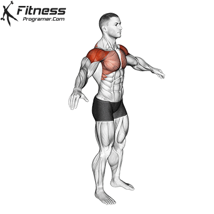 | | |
| 2 | **弹力带肩外旋（Band External Rotation）** | 15 次/侧 | 激活肩袖 — 肩关节健康核心 |
|   | 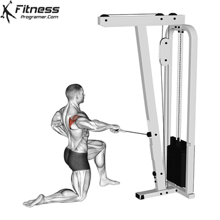 | | |
| 3 | **弹力带拉开（Band Pull-Apart）** | 15 次 | 激活后束 + 菱形肌 |
|   | 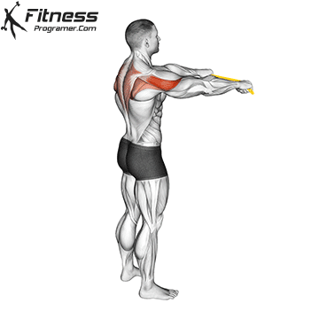 | | |
| 4 | **上胸/肩前侧拉伸（Dynamic Chest Stretch）** | 10 次 | 打开肩胸，准备推类动作 |
|   | 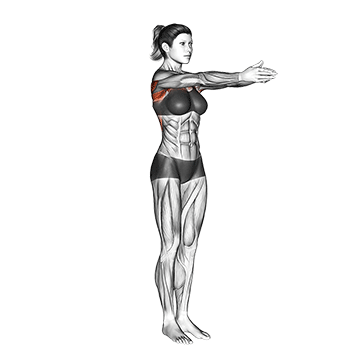 | | |
| 5 | **站立髋关节环绕（Standing Hip Circles）** | 10 次/方向 | 髋关节润滑 — 腿日必做 |
|   | 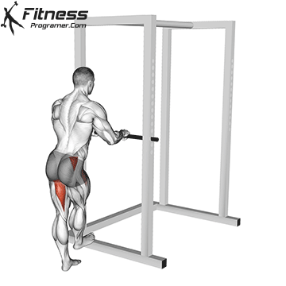 | | |
| 6 | **世界最伟大拉伸（World's Greatest Stretch）** | 5 次/侧 | 髋+胸椎+肩联动 |
|   | 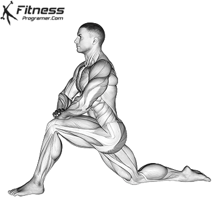 | | |
| 7 | **颈部拉伸（Chin to Chest Stretch）** | 15s×2 | 释放颈部紧张 |
|   | 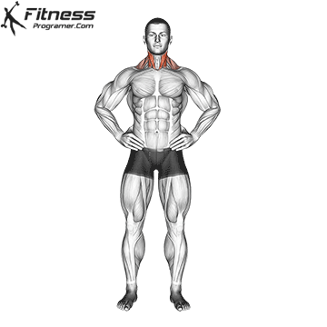 | | |

## 训练后放松（选做）

| # | 动作 | 时长 | 目的 |
|---|------|------|------|
| 8 | **婴儿式（Child's Pose）** | 30–60s | 放松下背+背阔肌 |
|   | 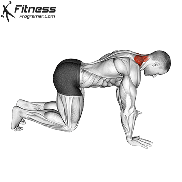 | | |

## 专项热身（第一个正式动作前）

用 **空杆 / 最轻哑铃** 做 2–3 组金字塔递增：空杆 × 10 → 40% × 6 → 60% × 4 → 正式组。

---

# 推日（Push Day）— 胸 + 肩前中束 + 肱三头

> 核心主线：**卧推** → **推举** → **侧平举** → **三头**

---

## 1. 胸肌（Chest / Pectoralis）

### 1.1 上胸（Upper Chest）

| # | 动作 | 推荐 | 组数 | 次数 | 间隔 |
|---|------|:----:|------|------|------|
| 1 | **上斜杠铃卧推（Incline Barbell Bench Press）** | ⭐⭐⭐⭐⭐ | 4 组 | 8–12 次 | 90s |
|   | 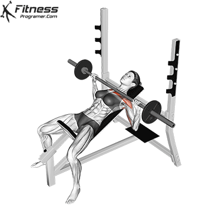 | | | | |
| 2 | **上斜哑铃卧推（Incline Dumbbell Press）** | ⭐⭐⭐⭐⭐ | 4 组 | 8–12 次 | 90s |
|   | 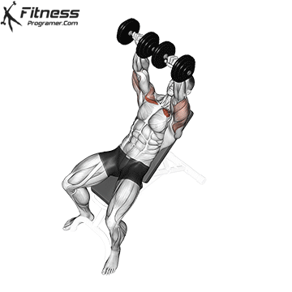 | | | | |
| 3 | **上斜哑铃飞鸟（Incline Dumbbell Flyes）** | ⭐⭐⭐ | 3 组 | 12–15 次 | 60s |
|   | 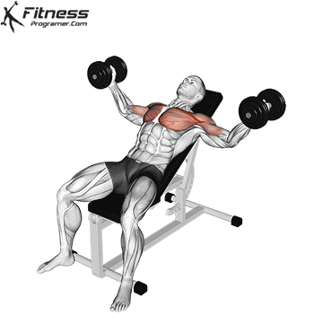 | | | | |

> 💡 第 1、2 **二选一**：杠铃更能上重量，哑铃拉伸幅度更大。

### 1.2 中胸（Middle Chest）

| # | 动作 | 推荐 | 组数 | 次数 | 间隔 |
|---|------|:----:|------|------|------|
| 4 | **平板杠铃卧推（Flat Barbell Bench Press）** | ⭐⭐⭐⭐⭐ | 4 组 | 8–12 次 | 90s |
|   |  | | | | |
| 5 | **平板哑铃卧推（Flat Dumbbell Bench Press）** | ⭐⭐⭐⭐⭐ | 4 组 | 8–12 次 | 90s |
|   | 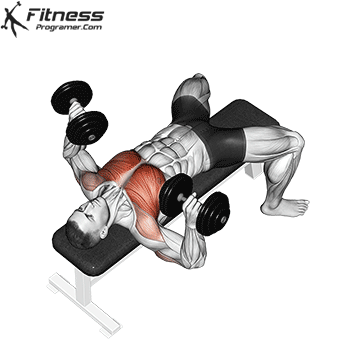 | | | | |
| 6 | **蝴蝶机夹胸（Pec Deck Butterfly）** | ⭐⭐⭐⭐ | 3 组 | 12–15 次 | 60s |
|   | 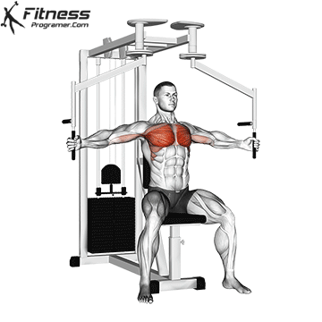 | | | | |
| 7 | **绳索大飞鸟（Cable Crossover）** | ⭐⭐⭐⭐ | 3 组 | 12–15 次 | 60s |
|   | 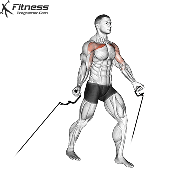 | | | | |
| 8 | **挂片式坐式推胸（Plate-Loaded Seated Chest Press）** | ⭐⭐⭐ | 3 组 | 10–12 次 | 60s |
|   | 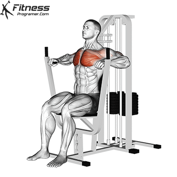 | | | | |

> 💡 第 4、5 **二选一**。夹胸类选蝴蝶机或绳索飞鸟。器械推胸可选做——自由重量优先。

### 1.3 下胸（Lower Chest）

| # | 动作 | 推荐 | 组数 | 次数 | 间隔 |
|---|------|:----:|------|------|------|
| 9 | **凳上臂屈伸（Bench Dips）** | ⭐⭐⭐⭐ | 3 组 | 10–15 次 | 90s |
|   | 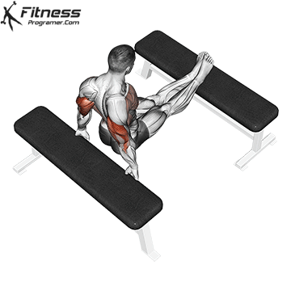 | | | | |
| 10 | **下斜杠铃卧推（Decline Barbell Bench Press）** | ⭐⭐⭐ | 4 组 | 8–12 次 | 90s |
|    | 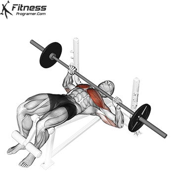 | | | | |

> 💡 没有双杠架，用凳上臂屈伸替代。下斜卧推做备选。

---

## 2. 肩部（Shoulders / Deltoids）

### 2.1 前束（Front Delts）

| # | 动作 | 推荐 | 组数 | 次数 | 间隔 |
|---|------|:----:|------|------|------|
| 11 | **坐姿哑铃推举（Seated Dumbbell Shoulder Press）** | ⭐⭐⭐⭐⭐ | 4 组 | 8–12 次 | 90s |
|    | 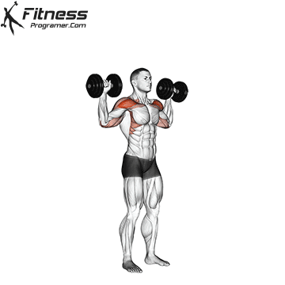 | | | | |
| 12 | **杠铃站姿推举（Standing Barbell Military Press）** | ⭐⭐⭐⭐⭐ | 4 组 | 8–12 次 | 90s |
|    | 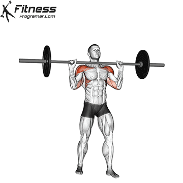 | | | | |
| 13 | **分动式坐姿肩推机（Seated Shoulder Press Machine）** | ⭐⭐⭐ | 3 组 | 10–12 次 | 90s |
|    | 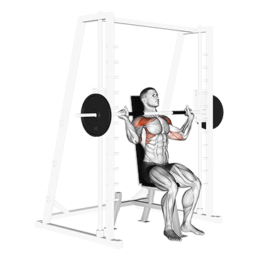 | | | | |
| 14 | **阿诺德推举（Arnold Dumbbell Press）** | ⭐⭐⭐ | 3 组 | 10–12 次 | 90s |
|    | 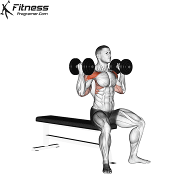 | | | | |
| 15 | **哑铃前平举（Front Dumbbell Raise）** | ⭐⭐ | 3 组 | 12–15 次 | 60s |
|    | 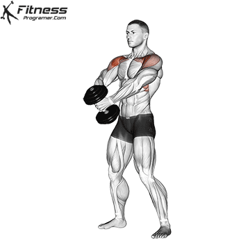 | | | | |

> 💡 第 11、12 **二选一**。器械推举和哑铃推举轮换做。前束在卧推中已大量参与，前平举可选。

### 2.2 中束（Side Delts）— 肩宽的关键

| # | 动作 | 推荐 | 组数 | 次数 | 间隔 |
|---|------|:----:|------|------|------|
| 16 | **哑铃侧平举（Dumbbell Side Lateral Raise）** | ⭐⭐⭐⭐⭐ | 4 组 | 12–15 次 | 60s |
|    | 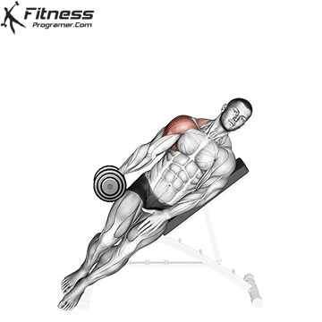 | | | | |
| 17 | **站姿侧平举机（Standing Lateral Raise Machine）** | ⭐⭐⭐⭐ | 3 组 | 12–15 次 | 60s |
|    | 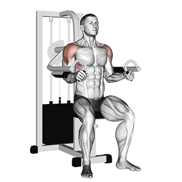 | | | | |
| 18 | **绳索单侧平举（Cable Lateral Raise）** | ⭐⭐⭐⭐ | 3 组 | 12–15 次 | 60s |
|    | 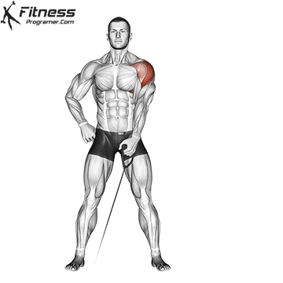 | | | | |

> 💡 中束是肩宽的**决定性因素**。每次推日必做侧平举。三种方式轮换——哑铃最基础、器械稳定、绳索恒定张力。

> ⚠️ **后束（Rear Delts）安排在拉日**，与上背部协同训练。

---

## 3. 肱三头（Triceps / Triceps Brachii）

| # | 动作 | 推荐 | 组数 | 次数 | 间隔 |
|---|------|:----:|------|------|------|
| 19 | **窄距杠铃卧推（Close-Grip Barbell Bench Press）** | ⭐⭐⭐⭐⭐ | 3 组 | 8–12 次 | 90s |
|    | 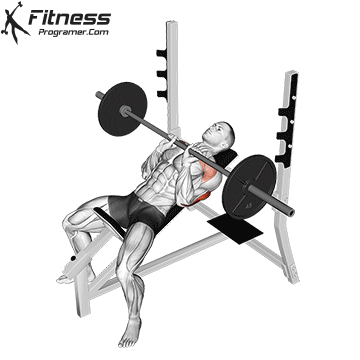 | | | | |
| 20 | **仰卧杠铃臂屈伸 / 碎颅者（EZ-Bar Skullcrusher）** | ⭐⭐⭐⭐⭐ | 3 组 | 10–12 次 | 60s |
|    | 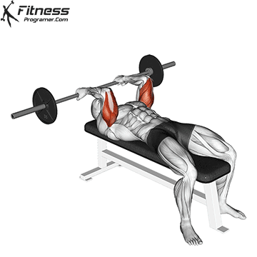 | | | | |
| 21 | **颈后杠铃臂屈伸（Overhead Barbell Triceps Extension）** | ⭐⭐⭐⭐ | 3 组 | 10–12 次 | 60s |
|    | 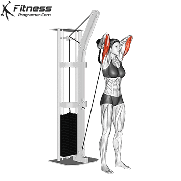 | | | | |
| 22 | **绳索下压（Triceps Rope Pushdown）** | ⭐⭐⭐⭐ | 3 组 | 12–15 次 | 45s |
|    | 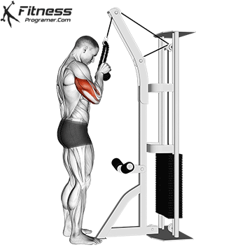 | | | | |

> 💡 **窄距卧推是三头最高效的增肌动作**（EMG 研究证实）。碎颅者/颈后臂屈伸侧重长头拉伸，绳索下压收尾泵感。

---

## 📋 推日实战菜单（每节选 7 个动作）

| 顺序 | 动作 | 组数 | 备注 |
|------|------|------|------|
| 1 | 上斜卧推（杠铃或哑铃） | 4 | 必做 |
| 2 | 平板卧推（杠铃或哑铃） | 4 | 必做 |
| 3 | 凳上臂屈伸 | 3 | 必做（替代双杠） |
| 4 | 蝴蝶机夹胸 或 绳索大飞鸟 | 3 | 必做 |
| 5 | 推举（哑铃/杠铃/器械） | 4 | 必做 |
| 6 | 侧平举（哑铃/器械/绳索） | 4 | 必做 |
| 7 | 窄距杠铃卧推 | 3 | 必做 |
| 8 | 碎颅者 或 绳索下压 | 3 | 选做 |

---

# 拉日（Pull Day）— 背 + 肩后束 + 肱二头

> 核心主线：**硬拉** → **引体/下拉** → **划船** → **面拉** → **弯举**

---

## 1. 背部（Back）

### 1.1 背阔肌（Lats）— 背部宽度

| # | 动作 | 推荐 | 组数 | 次数 | 间隔 |
|---|------|:----:|------|------|------|
| 23 | **正手引体向上（Pull-ups）** + 助力引体机 | ⭐⭐⭐⭐⭐ | 4 组 | 8–12 次 | 90s |
|    | 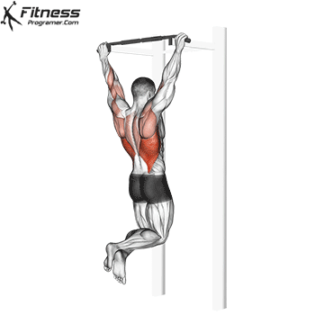 | | | | |
| 24 | **高位下拉（Wide-Grip Lat Pulldown）** | ⭐⭐⭐⭐⭐ | 4 组 | 8–12 次 | 90s |
|    | 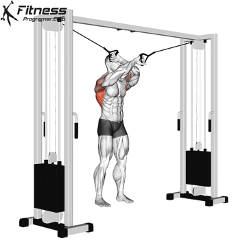 | | | | |
| 25 | **直臂下压（Straight-Arm Pulldown）** | ⭐⭐⭐⭐ | 3 组 | 12–15 次 | 60s |
|    | 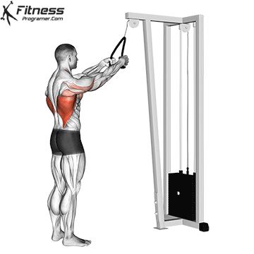 | | | | |
| 26 | **单臂哑铃划船（One-Arm Dumbbell Row）** | ⭐⭐⭐⭐⭐ | 4 组 | 8–12 次 | 90s |
|    | 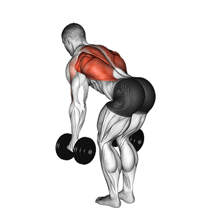 | | | | |

> 💡 引体向上是背部宽度之王。做不了 8 个就用助力引体机辅助。第 23、24 **二选一**。

### 1.2 上背中部（Mid/Upper Back）— 背部厚度

| # | 动作 | 推荐 | 组数 | 次数 | 间隔 |
|---|------|:----:|------|------|------|
| 27 | **T杠划船（T-Bar Row）** | ⭐⭐⭐⭐⭐ | 4 组 | 8–12 次 | 90s |
|    | 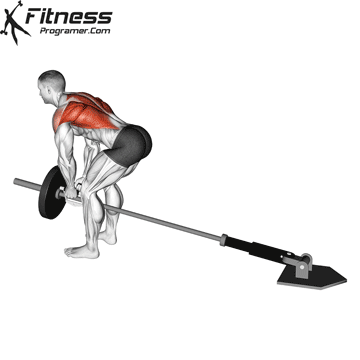 | | | | |
| 28 | **剪刀拉背 / 坐姿划船（Seated Cable Row）** | ⭐⭐⭐⭐ | 4 组 | 8–12 次 | 90s |
|    | 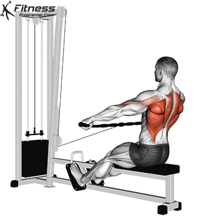 | | | | |
| 29 | **俯身Y字前平举（Prone Y Raise）** | ⭐⭐⭐ | 3 组 | 12–15 次 | 60s |
|    | 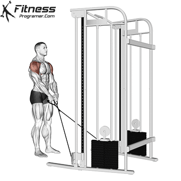 | | | | |

> 💡 **T杠划船和剪刀拉背你都有**，这是背部厚度最有效的两个动作。Y字前平举用哑铃在凳上做。

### 1.3 上背外侧：后束 + 肩袖（Rear Delts + Rotator Cuff）

| # | 动作 | 推荐 | 组数 | 次数 | 间隔 |
|---|------|:----:|------|------|------|
| 30 | **绳索面拉（Face Pull）** | ⭐⭐⭐⭐⭐ | 3 组 | 12–15 次 | 60s |
|    | 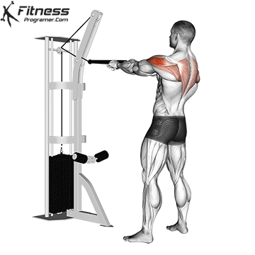 | | | | |
| 31 | **宽握高位下拉（Wide-Grip Lat Pulldown）** | ⭐⭐⭐⭐ | 4 组 | 8–12 次 | 90s |
|    |  | | | | |
| 32 | **俯身哑铃侧平举（Bent-Over Rear Delt Raise）** | ⭐⭐⭐⭐ | 3 组 | 12–15 次 | 60s |
|    | 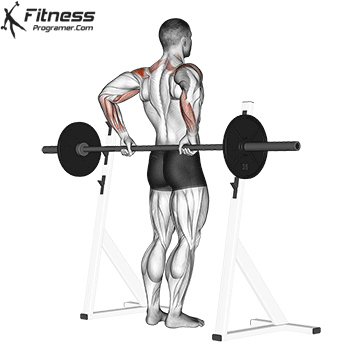 | | | | |

> 💡 **绳索面拉是必做动作**——肩袖健康 + 后束 + 上背三位一体。

### 1.4 下背部（Lower Back / Erector Spinae）

| # | 动作 | 推荐 | 组数 | 次数 | 间隔 |
|---|------|:----:|------|------|------|
| 33 | **传统硬拉（Conventional Deadlift）** | ⭐⭐⭐⭐⭐ | 3–4 组 | 5–8 次 | 120–180s |
|    | 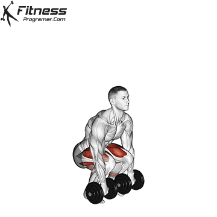 | | | | |
| 34 | **早安式体前屈（Good Morning）** | ⭐⭐⭐⭐ | 3 组 | 10–12 次 | 60s |
|    | 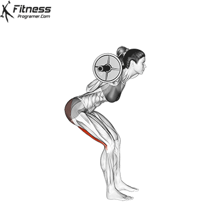 |
| 35 | **屈腿硬拉（Stiff-Legged Barbell Deadlift）** | ⭐⭐⭐⭐ | 3 组 | 8–12 次 | 90–120s |
|    | 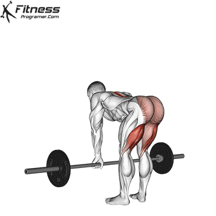 | | | | |

> 💡 没有山羊挺身架，用**早安式体前屈**替代。传统硬拉训练日放在开头做。

### 1.5 背部扩展

| # | 动作 | 推荐 | 组数 | 次数 | 间隔 |
|---|------|:----:|------|------|------|
| 36 | **哑铃仰卧屈臂上拉（Dumbbell Pullover）** | ⭐⭐⭐⭐ | 3 组 | 10–15 次 | 60s |
|    | 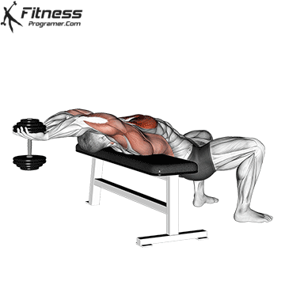 | | | | |

> 💡 经典扩胸动作，拉伸背阔肌 + 胸廓。放在末尾。

---

## 2. 肱二头（Biceps / Biceps Brachii）

### 2.1 短头（Short Head）

| # | 动作 | 推荐 | 组数 | 次数 | 间隔 |
|---|------|:----:|------|------|------|
| 37 | **集中弯举（Concentration Curl）** | ⭐⭐⭐⭐ | 3 组 | 10–15 次 | 45s |
|    | 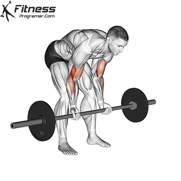 | | | | |
| 38 | **宽距杠铃弯举（Wide-Grip Barbell Curl）** | ⭐⭐⭐⭐ | 3 组 | 10–15 次 | 60s |
|    | 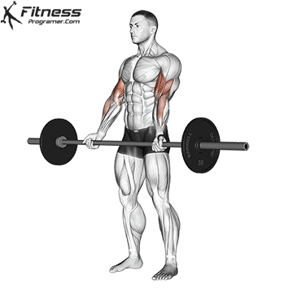 | | | | |

> 💡 没有牧师凳，用集中弯举替代（肘顶大腿内侧，同样消除借力）。

### 2.2 长头（Long Head）

| # | 动作 | 推荐 | 组数 | 次数 | 间隔 |
|---|------|:----:|------|------|------|
| 39 | **上斜哑铃弯举（Incline Dumbbell Curl）** | ⭐⭐⭐⭐⭐ | 3 组 | 10–15 次 | 60s |
|    | 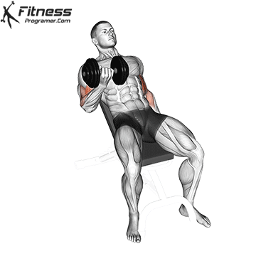 | | | | |
| 40 | **窄距直杆弯举（Close-Grip Barbell Curl）** | ⭐⭐⭐⭐ | 3 组 | 10–15 次 | 60s |
|    | 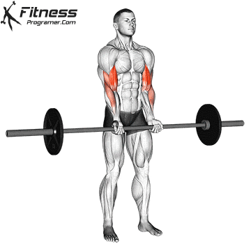 | | | | |
| 41 | **高位绳索弯举（Overhead Cable Curl）** | ⭐⭐⭐ | 3 组 | 12–15 次 | 60s |
|    | 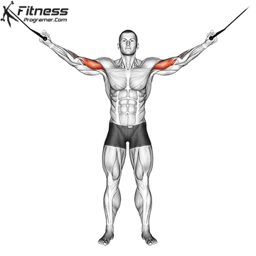 | | | | |

> 💡 上斜哑铃弯举让长头在**最大拉伸位**发力，是长头最佳动作。

### 2.3 肱桡肌（Brachioradialis）

| # | 动作 | 推荐 | 组数 | 次数 | 间隔 |
|---|------|:----:|------|------|------|
| 42 | **哑铃锤式弯举（Hammer Curl）** | ⭐⭐⭐⭐⭐ | 3 组 | 10–15 次 | 60s |
|    | 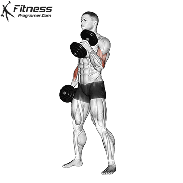 | | | | |
| 43 | **反握杠铃弯举（Reverse Barbell Curl）** | ⭐⭐⭐⭐ | 3 组 | 10–15 次 | 60s |
|    | 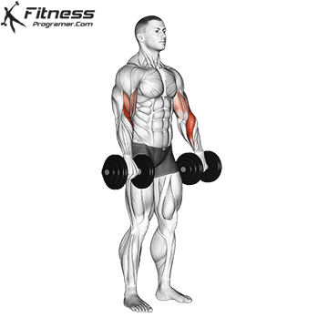 | | | | |

---

## 📋 拉日实战菜单（每节选 7 个动作）

| 顺序 | 动作 | 组数 | 备注 |
|------|------|------|------|
| 1 | 传统硬拉 | 3–4 | 必做 |
| 2 | 引体向上（或高位下拉） | 4 | 必做 |
| 3 | T杠划船（或剪刀拉背） | 4 | 必做 |
| 4 | 单臂哑铃划船 | 3 | 必做 |
| 5 | 绳索面拉 | 3 | 必做 |
| 6 | 俯身哑铃侧平举 | 3 | 选做 |
| 7 | 下背补充（早安式 / 屈腿硬拉） | 3 | 选做 |
| 8 | 上斜哑铃弯举 | 3 | 必做 |
| 9 | 锤式弯举 或 集中弯举 | 3 | 必做 |

---

# 腿日（Leg Day）— 大腿 + 臀 + 小腿

> ⚠️ 一周只练一次腿，**容量必须拉满**（约 9–10 个动作，26–30 组）。

---

## 1. 股四头肌（Quadriceps）

| # | 动作 | 推荐 | 组数 | 次数 | 间隔 |
|---|------|:----:|------|------|------|
| 44 | **杠铃深蹲（Barbell Squat）** | ⭐⭐⭐⭐⭐ | 4–5 组 | 8–12 次 | 120s |
|    | 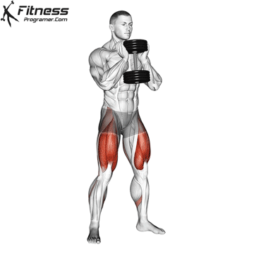 | | | | |
| 45 | **45度倒蹬机（Leg Press）** | ⭐⭐⭐⭐⭐ | 4 组 | 8–12 次 | 90–120s |
|    |  | | | | |
| 46 | **坐姿腿屈伸（Leg Extension）** | ⭐⭐⭐⭐ | 4 组 | 12–15 次 | 60–90s |
|    |  | | | | |
| 47 | **杠铃前蹲（Front Squat）** | ⭐⭐⭐⭐ | 4 组 | 8–12 次 | 90–120s |
|    |  |

> 💡 深蹲 + 倒蹬机是股四头黄金组合。没有哈克机，用**杠铃前蹲**替代——对股四头的刺激反而更强。

---

## 2. 腘绳肌（Hamstrings）

| # | 动作 | 推荐 | 组数 | 次数 | 间隔 |
|---|------|:----:|------|------|------|
| 48 | **罗马尼亚硬拉（Romanian Deadlift）** | ⭐⭐⭐⭐⭐ | 3–4 组 | 8–12 次 | 90–120s |
|    |  | | | | |
| 49 | **俯卧腿弯举（Lying Leg Curl）** | ⭐⭐⭐⭐ | 4 组 | 12–15 次 | 60–90s |
|    |  | | | | |

> 💡 没有坐姿腿弯举机，但**俯卧腿弯举已经足够**——罗马尼亚硬拉 + 俯卧腿弯举覆盖了腘绳肌的全部功能。

---

## 3. 内收肌群（Adductors）

| # | 动作 | 推荐 | 组数 | 次数 | 间隔 |
|---|------|:----:|------|------|------|
| 50 | **坐姿夹腿机（Seated Hip Adduction）** | ⭐⭐⭐⭐ | 3 组 | 12–15 次 | 60s |
|    |  | | | | |
| 51 | **宽距相扑硬拉（Sumo Deadlift）** | ⭐⭐⭐⭐ | 3 组 | 8–12 次 | 90–120s |
|    |  | | | | |

---

## 4. 单侧功能性训练

| # | 动作 | 推荐 | 组数 | 次数 | 间隔 |
|---|------|:----:|------|------|------|
| 52 | **杠铃登阶（Barbell Step Ups）** | ⭐⭐⭐⭐ | 3 组 | 10–12 次/腿 | 90s |
|    |  | | | | |
| 53 | **哑铃弓步走（Dumbbell Walking Lunges）** | ⭐⭐⭐⭐ | 3 组 | 10–12 步/腿 | 90s |
|    |  | | | | |

> 💡 **两者选一**，放在深蹲之后做。登阶侧重股四+臀，弓步走侧重功能性+核心。

---

## 5. 臀部（Glutes）

| # | 动作 | 推荐 | 组数 | 次数 | 间隔 |
|---|------|:----:|------|------|------|
| 54 | **杠铃臀推（Barbell Hip Thrust）** | ⭐⭐⭐⭐⭐ | 4 组 | 10–15 次 | 60–90s |
|    |  | | | | |
| 55 | **坐姿髋外展（Seated Hip Abduction）** | ⭐⭐⭐⭐ | 3 组 | 15–20 次 | 45–60s |
|    |  | | | | |
| 56 | **保加利亚剪蹲（Bulgarian Split Squat）** | ⭐⭐⭐⭐ | 3 组 | 10–12 次/腿 | 90s |
|    |  | | | | |

> 💡 臀推是臀部增肌**王牌**。髋外展练臀中肌——臀中肌弱会导致深蹲膝内扣。你**内收外展一体机都有**，非常方便。

---

## 6. 小腿（Calves）

| # | 动作 | 推荐 | 组数 | 次数 | 间隔 |
|---|------|:----:|------|------|------|
| 57 | **站姿提踵（Standing Calf Raise）** | ⭐⭐⭐⭐⭐ | 4–5 组 | 15–20 次 | 45–60s |
|    |  | | | | |
| 58 | **坐姿提踵（Seated Calf Raise）** | ⭐⭐⭐⭐⭐ | 4–5 组 | 15–20 次 | 45–60s |
|    |  | | | | |

> 💡 杠铃放斜方肌上 + 脚踩杠铃片边缘 = 站姿提踵。哑铃压膝盖上方 + 脚踩杠铃片 = 坐姿提踵。

---

## 📋 腿日实战菜单（1次/周）

| 顺序 | 动作 | 组数 | 设备 |
|------|------|------|------|
| 1 | 杠铃深蹲 | 4–5 | 杠铃+深蹲架 |
| 2 | 45度倒蹬机 | 4 | |
| 3 | 杠铃登阶 或 弓步走 | 3 | 哑铃/杠铃 |
| 4 | 坐姿腿屈伸 | 4 | |
| 5 | 罗马尼亚硬拉 | 3–4 | 杠铃 |
| 6 | 俯卧腿弯举 | 4 | |
| 7 | 坐姿夹腿机 | 3 | |
| 8 | 杠铃臀推 | 4 | 杠铃+凳 |
| 9 | 坐姿髋外展 | 3 | |
| 10 | 保加利亚剪蹲 | 3 | 哑铃+凳 |
| 11 | 站姿提踵 + 坐姿提踵 | 各 4 | 杠铃/哑铃 |
| **总组数** | | **~26–30 组** | |

---

# 腹部（Abdominals）— 每次训练日都练

> 腹部恢复快、耐受力强。**5 个训练日每天都做**，每次 4 个动作，10–15 分钟。

---

## 1. 腹直肌（Rectus Abdominis）

### 1.1 上部（Upper Abs）

| # | 动作 | 推荐 | 组数 | 次数 | 间隔 |
|---|------|:----:|------|------|------|
| 59 | **绳索跪姿卷腹（Kneeling Cable Crunch）** | ⭐⭐⭐⭐⭐ | 3–4 组 | 12–15 次 | 45s |
|    |  | | | | |
| 60 | **基础卷腹（Basic Crunch）** | ⭐⭐⭐ | 3–4 组 | 15–20 次 | 30s |
|    |  | | | | |

### 1.2 下部（Lower Abs）

| # | 动作 | 推荐 | 组数 | 次数 | 间隔 |
|---|------|:----:|------|------|------|
| 61 | **悬垂举腿（Hanging Leg Raise）** | ⭐⭐⭐⭐⭐ | 3 组 | 10–15 次 | 60s |
|    |  | | | | |
| 62 | **反向卷腹（Reverse Crunch）** | ⭐⭐⭐⭐ | 3 组 | 15–20 次 | 30s |
|    |  | | | | |

---

## 2. 腹斜肌（Obliques）

| # | 动作 | 推荐 | 组数 | 次数 | 间隔 |
|---|------|:----:|------|------|------|
| 63 | **俄罗斯转体（Russian Twist）** | ⭐⭐⭐⭐ | 3 组 | 15–20 次/侧 | 30s |
|    |  | | | | |
| 64 | **侧撑（Side Bridge / Side Plank）** | ⭐⭐⭐⭐ | 3 组 | 30–60s 保持 | 30s |
|    |  | | | | |
| 65 | **站姿绳索伐木（Standing Cable Wood Chop）** | ⭐⭐⭐⭐ | 3 组 | 12–15 次/侧 | 45s |
|    |  | | | | |

---

## 3. 腹横肌 & 核心稳定性（Core Stability）

| # | 动作 | 推荐 | 组数 | 次数 | 间隔 |
|---|------|:----:|------|------|------|
| 66 | **健腹轮（Ab Wheel Rollout）** | ⭐⭐⭐⭐⭐ | 3 组 | 8–12 次 | 60s |
|    |  | | | | |
| 67 | **死虫式（Dead Bug）** | ⭐⭐⭐⭐ | 3 组 | 10 次/侧 | 30s |
|    |  | | | | |
| 68 | **平板支撑（Plank）** | ⭐⭐⭐⭐ | 3–4 组 | 45–90s 保持 | 30–45s |
|    |  | | | | |
| 69 | **登山者（Mountain Climbers）** | ⭐⭐⭐ | 3 组 | 20–30 次/侧 | 30s |
|    |  | | | | |
| 70 | **真空腹训练（Stomach Vacuum）** | ⭐⭐⭐ | 3–4 组 | 15–30s 保持 | 30s |
|    |  | | | | |

> 💡 **健腹轮是腹部 S 级动作**（EMG 研究证实远超普通卷腹）。问健身房前台有没有，没有就自己买一个（几十块钱）。**死虫式**保护腰椎。

---

## 📋 腹部每日轮换方案（5天/周，每次4个）

| 训练日 | 上腹 | 下腹 | 腹斜肌 | 腹横肌/核心 |
|--------|------|------|--------|-------------|
| 推日 1 | 绳索卷腹 | 悬垂举腿 | 俄罗斯转体 | 健腹轮 |
| 拉日 1 | 基础卷腹 | 反向卷腹 | 侧撑 | 死虫式 |
| 腿日 | 绳索卷腹 | 悬垂举腿 | 绳索伐木 | 平板支撑 |
| 推日 2 | 绳索卷腹 | 反向卷腹 | 俄罗斯转体 | 健腹轮 |
| 拉日 2 | 基础卷腹 | 悬垂举腿 | 侧撑 | 登山者+真空腹 |

> 💡 每次 4 个动作 × 3 组 ≈ 12 组，10–15 分钟内完成。

---

# ⭐ 推荐指数总览

## ⭐⭐⭐⭐⭐ 必做（S-Tier）

| 肌群 | 动作 | 你的设备 |
|------|------|:----:|
| 上胸 | 上斜杠铃/哑铃卧推 | |
| 中胸 | 平板杠铃/哑铃卧推 | |
| 肩前束 | 坐姿哑铃推举 / 杠铃站姿推举 | |
| 肩中束 | 哑铃侧平举 | |
| 肱三头 | 窄距杠铃卧推、碎颅者 | |
| 背阔肌宽度 | 引体向上、高位下拉 | |
| 背阔肌厚度 | 单臂哑铃划船、T杠划船 | |
| 上背外侧 | 绳索面拉 | |
| 下背 | 传统硬拉 | |
| 股四头 | 杠铃深蹲、45度倒蹬机 | |
| 腘绳肌 | 罗马尼亚硬拉 | |
| 臀 | 杠铃臀推 | |
| 小腿 | 站姿提踵、坐姿提踵 | |
| 腹上 | 绳索跪姿卷腹 | |
| 腹下 | 悬垂举腿 | |
| 腹横肌 | 健腹轮 | |

## ⭐⭐⭐⭐ 强烈推荐（A-Tier）

蝴蝶机夹胸、绳索大飞鸟、绳索单侧平举、绳索下压、直臂下压、站姿侧平举机、剪刀拉背、宽握高位下拉、俯身侧平举、早安式体前屈、屈腿硬拉、坐姿腿屈伸、杠铃前蹲、俯卧腿弯举、坐姿夹腿机、宽距相扑硬拉、杠铃登阶、弓步走、坐姿髋外展、保加利亚剪蹲、集中弯举、宽距杠铃弯举、窄距直杆弯举、锤式弯举、反握杠铃弯举、哑铃屈臂上拉、反向卷腹、俄罗斯转体、侧撑、绳索伐木、死虫式、平板支撑

## ⭐⭐⭐ 推荐（B-Tier）

上斜哑铃飞鸟、下斜杠铃卧推、阿诺德推举、器械推胸、器械推举、高位绳索弯举、Y字前平举、基础卷腹、登山者、真空腹

---

# 🧠 核心原则

| 原则 | 说明 |
|------|------|
| **渐进超负荷** | 每周增加重量（+1.25–2.5kg）或次数（+1–2 次）。记录每次训练数据。 |
| **动作规范优先** | 全程幅度 > 大重量半程。宁可减重也要做全程。 |
| **腿日不妥协** | 一周一次，别划水。深蹲至少大腿平行地面。 |
| **腹部高频低时** | 每天 10–15 分钟，重在持续张力 + 渐进负重。 |
| **睡眠 > 训练** | 肌肉在休息时生长。7–8 小时睡眠是增肌基础。 |
| **热身 = 保险** | 5–8 分钟热身 = 预防数月伤病。 |

---

# ⏱ 组间休息速查

| 动作类型 | 休息 | 原因 |
|----------|------|------|
| 大重量复合（深蹲、硬拉、卧推） | 120–180s | ATP-CP 恢复 |
| 中重量复合（划船、推举、倒蹬） | 90s | 力量+代谢平衡 |
| 孤立动作（弯举、侧平举、腿屈伸） | 45–60s | 最大化代谢压力 |
| 腹部 | 30–45s | 持续张力 |
| 小腿 | 45–60s | 高次数+短间歇 |
